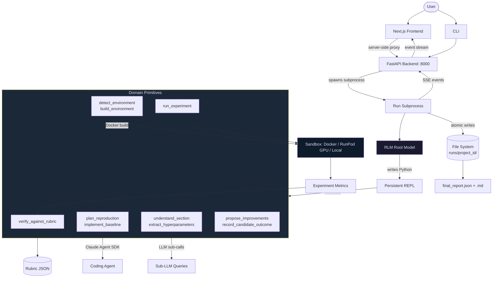

<!-- doc-meta: status=current; last-verified=2026-06-09 -->
# OpenResearch

> **Doc status:** Current · last verified 2026-06-09 against `backend/` + `CLAUDE.md`.
> This README is the public front door (source-of-truth tier 3): it must not claim
> anything the code, [`system_overview.md`](system_overview.md), or
> [`CLAUDE.md`](CLAUDE.md) don't back. Freshness is enforced by `make docs-check`
> — see [Documentation](#documentation). There is no `prd.md`; the closest
> spec is [`docs/design/project-rebuild-spec.md`](docs/design/project-rebuild-spec.md).

Automated research paper reproduction. Given a paper (arXiv link or PDF), OpenResearch ingests it, builds a compute environment, implements and runs the experiments, scores the reproduction against a rubric, and outputs a benchmark report.

> **Status (2026-06-03):** Single-user, locally-run research tool — not a hosted
> product. End-to-end reproduction works on arXiv IDs and PDFs (see
> [`best_runs/`](best_runs/README.md) for scored reproductions). Multi-tenant
> auth, hosted deployment, and a stable public API are **not** built. See
> [Current Limitations](#current-limitations).

Built on the [Recursive Language Model](https://arxiv.org/abs/2512.24601) (RLM) paradigm. The paper is offloaded as a REPL variable; an LLM root model writes Python to orchestrate the reproduction through domain-specific primitives. There is no fixed pipeline -- the model decides what to call and when.

## Architecture



**How the pieces connect:**

- The **frontend** is a pure renderer. It never talks to the backend directly from the browser -- all requests route through Next.js server-side proxy routes (`/api/demo/*`). No CORS layer.
- Each **run** is a long-lived subprocess. The backend HTTP layer is stateless: it spawns processes and reads their output files.
- **Run state is file-backed**, not a service. `runs/<project_id>/` holds the status snapshot, checkpoints, event log, cost ledger, reproduced code, and final report.
- The **SSE event stream** is append-only (`dashboard_events.jsonl`). Clients can reconnect and replay the full history.
- The **paper corpus never reaches the frontend**. A single egress chokepoint (`sse_bridge.sanitize_iteration`) strips REPL locals and bounds output to metadata-only summaries.

## Reproduction Workflow

1. **Ingest** -- Parse the paper (HTML > PDF > OCR cascade via `ResolvingParser`). The winning parse becomes `parsed_full_text.txt`.
2. **Understand** -- The RLM root calls `understand_section` and `extract_hyperparameters` to map the paper's claims, methods, and training recipes.
3. **Environment** -- `detect_environment` reads framework/package clues; `build_environment` creates and repairs a Docker image.
4. **Plan & Implement** -- `plan_reproduction` defines the reproduction contract; `implement_baseline` dispatches a coding agent (Claude Sonnet via `claude-agent-sdk`) to write the code.
5. **Execute** -- `run_experiment` runs the code inside a sandboxed environment (Docker, RunPod GPU pod, or local process).
6. **Score** -- `verify_against_rubric` grades the reproduction against a PaperBench-style rubric.
7. **Improve** -- `propose_improvements` generates hypotheses; the root evaluates them and iterates. The loop continues until the rubric target is met or budget is exhausted.
8. **Report** -- `final_report.json` and `final_report.md` with verdict, rubric scores, cost breakdown, and model metadata.

## Tech Stack

| Layer | Technology |
|---|---|
| Backend | Python 3.14, FastAPI, SQLite (event store) |
| Frontend | Next.js 16, React 19, TypeScript, Tailwind CSS |
| RLM Engine | [`rlms`](https://pypi.org/project/rlms/) library (Algorithm 1 reference implementation) |
| Sub-agents | Claude Agent SDK (Sonnet) |
| Root models | GPT-5, Claude (API or OAuth), Qwen3-Coder, Azure OpenAI |
| Sandbox | Docker (CPU), RunPod (GPU), local process |
| PDF Parsing | PyMuPDF, BeautifulSoup (arXiv HTML), Tesseract OCR |
| Evaluation | PaperBench rubric framework |

## Quick Start

### Prerequisites

- Python >= 3.11
- Node.js >= 20.19 (< 21) or >= 22.12
- At least one LLM API key (`OPENAI_API_KEY` or `ANTHROPIC_API_KEY`), or `claude login` for OAuth
- A Docker daemon (Docker Desktop / OrbStack) — required only for the
  `docker`/`auto` sandboxes (`local` and `runpod` build no local image; the
  pod boots its own). No Docker yet? `local` and `runpod` work without it —
  `.env.example` ships `OPENRESEARCH_DEFAULT_SANDBOX=local`.

### Setup

```bash
# Backend
python3 -m venv .venv && source .venv/bin/activate
pip install -r backend/requirements.txt
pip install -r backend/requirements-dev.txt  # pytest + parallel runners

# Frontend
cd frontend && npm ci && cd ..

# Environment
cp .env.example .env
# Edit .env: set at least one API key. The example pins
# OPENRESEARCH_DEFAULT_SANDBOX=local (no Docker/RunPod needed);
# switch to runpod/docker once credentials + a daemon are in place.
```

### Run

```bash
# Terminal 1: backend
.venv/bin/uvicorn backend.app:create_app --factory --reload --port 8000

# Terminal 2: frontend
cd frontend
export OPENRESEARCH_BACKEND_URL=http://127.0.0.1:8000
npm run dev
# Open http://localhost:3000
```

Or start the **backend only** via the preflight-aware launcher (Terminal 2 is
still needed for the UI):

```bash
./start.sh  # sandbox default: shell env > .env > runpod; checks RunPod creds
            # (runpod) + the Docker daemon (any non-local sandbox) up front
```

### CLI

```bash
python -m backend.cli reproduce paper.pdf --sandbox docker
python -m backend.cli reproduce 2605.15155 --sandbox runpod
python -m backend.cli ingest 2512.24601  # ingest only
```

**Flags:** `--mode {rlm,rdr,rlm-pure}`, `--provider {anthropic,openai}`, `--sandbox {auto,local,docker,runpod}`, `--model {gpt-5,claude,claude-oauth,qwen3-coder,azure}`, `--max-usd`, `--max-wall-clock`, `--vram-gb`

### Docker

```bash
cp .env.example .env  # set API keys
docker compose up --build
```

## Environment Variables

| Variable | Required | Description |
|---|---|---|
| `OPENAI_API_KEY` | One auth path | Root model when `--model gpt-5` (the default root). |
| `ANTHROPIC_API_KEY` | Optional | Sub-agents (Sonnet) and `--model claude`. **Leave empty to use Claude CLI OAuth** (`claude login`). A no-credit key does *not* fall back to OAuth — it hard-fails; see `CLAUDE.md` → "RLM auth". |
| `OPENRESEARCH_DEFAULT_SANDBOX` | No | `auto` / `local` / `docker` / `runpod` / `azure` |
| `OPENRESEARCH_AZURE_*` | For Azure | AKS GPU sandbox (cluster, storage, base image) — see the [Azure guide](docs/guides/azure-kubernetes-gpu-setup.md) |
| `OPENRESEARCH_RUNPOD_API_KEY` | For RunPod | RunPod GPU sandbox |
| `OPENRESEARCH_RUNPOD_SSH_KEY_PATH` | For RunPod | SSH key for pod access |
| `OPENRESEARCH_DEMO_SECRET` | No | Gate run-start endpoints with a shared secret |
| `OPENRESEARCH_DYNAMIC_GPU` | No | `true` (default): auto-select GPU SKU per paper |
| `OPENRESEARCH_MAX_RUN_GPU_USD` | No | Per-run GPU spend cap (float, default 10.0) |

See `.env.example` for the full list.

> **Env-var rename (2026-06):** the prefix was renamed `REPROLAB_` → `OPENRESEARCH_`.
> A backward-compat shim (`backend/config.py::_apply_legacy_env_aliases`) still reads
> the old `REPROLAB_*` names, so existing deployments and shells keep working
> unchanged; new setups should use `OPENRESEARCH_*`. The SQLite default likewise
> moved `reprolab.db` → `openresearch.db` but falls back to an existing `reprolab.db`.
> One exception with no auto-fallback: if you use the Codex sub-agent and have a
> `reprolab-readwrite` profile in `~/.codex/`, rename it to `openresearch-readwrite`
> or set `OPENRESEARCH_CODEX_PROFILE=reprolab-readwrite`.

## UI Pages

| Route | Description |
|---|---|
| `/` | Landing page |
| `/lab` | Live run viewer -- exploration tree, rubric climb, primitive history, steering chat |
| `/lab?projectId=<id>` | View a specific run |
| `/leaderboard` | Ranked completed runs across models and papers |
| `/library` | Browse all runs |

## Testing

```bash
# Backend tests
.venv/bin/python -m pytest tests/ -n auto       # all (~340 files / ~4,400 tests, <1 min parallel)
.venv/bin/python -m pytest tests/rlm/            # RLM tests only

# Frontend
cd frontend
npx tsc --noEmit      # type check
npm test              # vitest run (non-watch)
npm run lint          # eslint

# E2E
cd frontend && npx playwright install chromium   # one-time browser download
cd frontend && npx playwright test               # needs the backend on :8000
```

## Project Structure

```
backend/
  agents/
    rlm/              # RLM orchestrator: primitives, binding, system prompt, SSE bridge
    rdr/              # Rubric-driven harness (--mode rdr)
    runtime/          # LLM runtime resolution (Claude, OpenAI, Azure)
    resilience/       # Budget, cost tracking, failure classification
  services/
    ingestion/        # Paper parsing: PDF, HTML, OCR, arXiv fetcher
    runtime/          # Sandbox backends: Docker, RunPod, local, GPU catalog
    events/           # SSE event stream, run lifecycle
  evals/              # PaperBench scoring, leaf scorer, A/B testing
  routes/             # HTTP routes: leaderboard, messages, reports
  app.py              # FastAPI application factory
  cli.py              # CLI entry point
  config.py           # Settings (pydantic-settings)

frontend/
  src/
    app/              # Next.js pages: lab, leaderboard, library, landing
    components/
      lab/rlm/        # Lab UI: exploration canvas, rubric strip, steering chat, sidebar
      landing/        # Landing page
      library/        # Run browser
    hooks/            # React hooks: useRlmRun, useSteeringChat, useRdrArtifacts
    lib/              # Shared utilities, event types, auth

tests/                # ~3,600 backend tests (pytest)
scripts/              # Dev tools: RunPod preflight, PaperBench runners, monitoring
third_party/          # Vendored PaperBench bundles (rubrics + paper markdown)
docs/                 # Design docs, runbooks, setup guides
```

## Execution Modes

| Mode | Flag | Description |
|---|---|---|
| **RLM (hybrid)** | `--mode rlm` (default) | RDR Phase 1 (rubric decomposition without repair) + RLM adaptive repair on weak clusters |
| **RDR** | `--mode rdr` | Pure rubric-driven controller. Decomposes rubric into work-clusters, dispatches one coding agent per cluster, repairs weak clusters in a capped loop. No LLM in the control flow. |
| **RLM-pure** | `--mode rlm-pure` | Direct RLM root loop without the hybrid RDR phase. The pre-hybrid path. |

## Dynamic GPU Selection

When `OPENRESEARCH_DYNAMIC_GPU=true` (default), the root model estimates VRAM requirements from the paper and the system selects the cheapest matching RunPod SKU from a static catalog (8 GPUs, RTX 4090 through H200). On CUDA OOM, the system auto-escalates to the next tier (up to 2 escalations). Override with `--vram-gb <n>`.

## LLM Auth Model

Two independent auth surfaces:

1. **Root model** (RLM library) -- raw HTTP. Pick one: `--model gpt-5` (OpenAI), `--model claude` (Anthropic API key), `--model claude-oauth` (Claude CLI subscription), `--model azure` (Azure OpenAI).
2. **Sub-agents** (Claude Sonnet via `claude-agent-sdk`) -- uses `ANTHROPIC_API_KEY` if set and funded, otherwise falls back to Claude CLI OAuth (free on subscription).

For local development: use OpenAI for the root (~$1/run), OAuth for sub-agents ($0).

## Current Limitations

- Single-user local deployment. No multi-tenant auth or distributed state.
- Cost ledger reports $0 for OAuth runs (SDK doesn't surface token counts).
- No GPU sandbox without RunPod account and API key.
- Frontend engines: Node >=20.19 <21 or >=22.12 (enforced via package.json `engines`).

## Documentation

| Document | Purpose | Tier |
|---|---|---|
| [system_overview.md](system_overview.md) | Architecture rationale — the "why" and how the pieces fit | 1 |
| [docs/design/rlm-pivot-brief.md](docs/design/rlm-pivot-brief.md) | Canonical RLM-as-orchestrator architecture reference | 1 |
| [docs/design/project-rebuild-spec.md](docs/design/project-rebuild-spec.md) | Closest thing to a PRD: the *what*/*why*, framework-agnostic | 1 |
| [CLAUDE.md](CLAUDE.md) | Developer reference: commands, conventions, gotchas, invariants | 2 |
| [docs/reproduction.md](docs/reproduction.md) | Fresh-clone reproduction path, smoke checks, expected outputs | 2 |
| [docs/architecture.md](docs/architecture.md) | Current backend/frontend/RLM topology and artifact model | 2 |
| [docs/infra.md](docs/infra.md) | Docker, compose, persistence, RunPod, Azure/Kubernetes status | 2 |
| [docs/troubleshooting.md](docs/troubleshooting.md) | Common install, auth, Docker, SQLite, RunPod, and port failures | 2 |
| [docs/guides/setup-guide.md](docs/guides/setup-guide.md) | Detailed setup instructions | 3 |
| [docs/guides/deployment.md](docs/guides/deployment.md) | Deployment guide | 3 |
| [docs/runbooks/e2e-testing.md](docs/runbooks/e2e-testing.md) | End-to-end testing runbook | 3 |
| [docs/policies/documentation.md](docs/policies/documentation.md) | **Source-of-truth hierarchy + freshness policy** | — |

### Source of truth

There is no `prd.md`. Authority runs **code → `system_overview.md` / design docs →
`CLAUDE.md` → `README.md`**. When docs disagree, the higher tier wins; when a doc
disagrees with the code, the **code wins** and the doc is a bug. Full hierarchy
and the rules for not creating stale docs:
[`docs/policies/documentation.md`](docs/policies/documentation.md).

Historical material (engineering journals, old run logs, superseded notes) lives
in [`docs/archive/`](docs/archive/) and under dated `docs/runbooks/` /
`docs/superpowers/` files — each carries its date or an `ARCHIVED` banner and is
**never** presented as current.

### Generated artifacts

These are **outputs of runs**, not hand-written docs. They reflect the run that
produced them and are not regenerated by a docs command (regenerating means
re-running an expensive reproduction):

| Artifact | What it is |
|---|---|
| [`best_runs/`](best_runs/README.md) | Point-in-time scored reproductions (Adam, All-CNN, VAE + the SDAR campaign) with full sidecars |
| `runs/<project_id>/` | Live per-run state: `final_report.{json,md}`, event log, cost ledger, reproduced `code/` (gitignored) |
| `docs/runbooks/artifacts/<id>/` | A committed reference run captured for a runbook |

Tracked PDFs (`paperbench1.pdf`, `demo_paper.pdf`) are **input fixtures** — the
papers being reproduced. Papers don't go stale; they are not generated output.

### Documentation freshness

Current-state docs carry a machine-readable marker
(`<!-- doc-meta: status=current; last-verified=YYYY-MM-DD -->`). A checker enforces
it — run before pushing docs changes, and in CI on every PR:

```bash
make docs-check                      # or: python scripts/docs_freshness_check.py
```

It fails on tracked PDFs in the wrong place, current-state docs missing a freshness
marker, broken internal links, README references to missing files, or a working-note
file reappearing at the repo root. See the policy doc for the rules.
