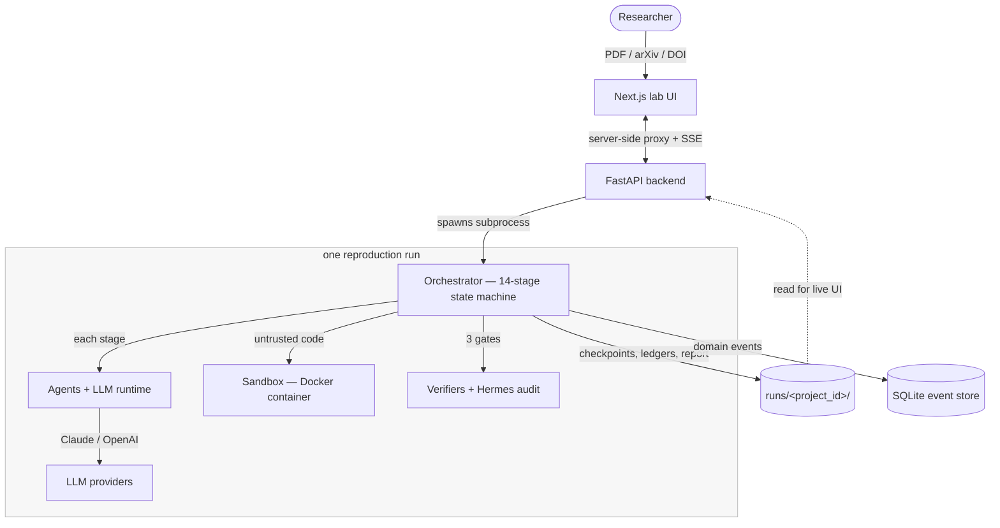

> **ReproLab Explainer** · [Index](./00-start-here.md) · [Next ›](./02-the-pipeline.md)

# 01 — What ReproLab Is & Why

*ReproLab turns a research paper into a running, verified reproduction — and an honest scorecard of how close it got.*

## In one paragraph

ReproLab is an **autonomous agent pipeline that reproduces machine-learning papers**. You give it a paper — a PDF upload, an arXiv ID, or a DOI — and it does what a graduate student would do over a week of work: read the paper, track down the code and datasets it cites, reconstruct the software environment, re-implement the core algorithm, run the experiment in a sandbox, check the numbers against the paper's claims, try a few improvements, and write a report. Under the hood it is a **14-stage state machine** — the *pipeline* — where each stage is one or more **LLM agents** doing a bounded, strongly-typed unit of work. Three **verification gates** decide whether a run has earned the right to continue; an independent **audit chain** records whether each verdict was actually grounded in evidence. The system runs as two processes — a FastAPI backend and a Next.js "lab" UI — and writes every byte of its state to disk, so a crashed run resumes exactly where it stopped.

## Why this exists

Reproducing an ML paper is famously hard. The paper describes its method in prose. The code, if it is released at all, may be partial, undocumented, or pinned to dependencies that no longer install. The exact seeds, hyperparameters, and data splits are often missing. And "just run it and see if you get the same number" can mean days of environment surgery before the first training epoch even starts. This is the **reproducibility crisis** in miniature — and most of it is pure, expensive, manual toil.

ReproLab's bet is that this toil is now automatable. A modern LLM agent can read a paper about as well as a junior researcher, write plausible code, and debug a broken `pip install`. What an agent *cannot* be trusted to do is **judge its own work** — left alone, it will cheerfully declare success on a reproduction that never ran. So ReproLab is not merely "an agent that writes code." It is a pipeline with the skepticism built in: every claim passes through a gate, every gate is independently audited, and the deliverable is a *measured comparison* — here is what the paper claimed, here is what we got, here is the gap — never a bare thumbs-up.

## The mental model

Five ideas explain most of the codebase. Hold these and the rest reads easily.

1. **Python drives; the LLM reasons.** The 14-stage sequence, the gates, the budgets, the checkpoints — all ordinary, deterministic Python. The LLM is called only for the parts that genuinely need judgment (understand the paper, write the code, score the rubric), and it always returns typed JSON validated against a schema. This division runs through every file.
2. **A run is a directory.** Everything about one reproduction lives under `runs/<project_id>/` — the checkpoint, the reconstructed code, the logs, the cost ledger, the audit trail, the final report. Kill the process at any instant and that directory is enough to resume.
3. **The pipeline never grows past 14 stages.** When the system needs to loop — repair a broken environment, or iterate on improvements toward a score target — it loops *inside* a stage. The state machine stays a fixed 14 states, which is exactly what keeps "where is this run?" always answerable.
4. **Trust is a first-class subsystem, not a feature.** The gates, the verifier family, the weighted rubric, and the Hermes audit chain together are roughly a third of the backend. ReproLab treats "is this result actually real?" as the hard problem — because it is.
5. **Everything is opt-in and fail-soft.** New behavior ships behind a config flag and degrades cleanly when a key or dependency is absent. A run reaching `COMPLETE` with an honest *partial* verdict is the common case; a hard crash is rare by design.

## One run, end to end

Here is a single reproduction, start to finish. Each step names the chapter that covers it in depth.

1. **You start a run.** You drop a PDF (or paste an arXiv link) into the lab UI. The UI posts it to the backend, which spawns the pipeline as a long-lived subprocess and opens a live event stream so the UI can watch it work. → **[08](./08-frontend-and-ops.md)**
2. **The paper is ingested.** PyMuPDF extracts the text; a Claude-vision pass enriches scanned pages and figures; a scan pulls out every link to code and datasets. Output: clean `full_text`, structured sections, and a list of discovered artifacts. → **[06](./06-ingestion.md)**
3. **The paper is understood.** The `paper-understanding` agent reads it and produces a `PaperClaimMap` — the claims, the target metrics, the datasets, the training recipe. `artifact-discovery` chases down the repositories and weights. → **[03](./03-agents-and-runtime.md)**
4. **The environment is rebuilt.** `environment-detective` infers the software stack and writes a `Dockerfile`. The sandbox layer builds that image immediately — and if the build breaks, it feeds the error back and repairs it, up to three attempts. → **[05](./05-sandboxes-and-environments.md)**
5. **The plan is gated.** `reproduction-planner` writes the formal reproduction contract. **Gate 1** checks the plan is coherent *before* any expensive compute is spent. An incoherent plan stops the run here. → **[04](./04-verification-and-trust.md)**
6. **The baseline runs.** `baseline-implementation` writes the code; `experiment-runner` executes it inside the sandbox — isolated, network off, resource-capped. **Gate 2** checks the baseline actually ran and its numbers are credible. → **[02](./02-the-pipeline.md)**
7. **Improvements are explored.** `improvement-orchestrator` proposes a few hypotheses for doing better; each runs in parallel in its own git worktree. **Gate 3** reviews them. If the rubric score is below target, the pipeline loops and tries again — inside the same stage. → **[02](./02-the-pipeline.md)**
8. **The result is scored and audited.** The `rubric-verifier` scores the reproduction against a PaperBench-style weighted rubric; the **Hermes audit chain** records, gate by gate, whether each verdict was grounded in real evidence. → **[04](./04-verification-and-trust.md)**
9. **The report is written.** The pipeline emits the final report — paper claims vs. reproduction results, the rubric breakdown, promising directions and dead ends — reaches `COMPLETE`, and the UI swaps in the report.
10. **All of it was persisted as it happened** — every checkpoint, ledger, and audit file written to `runs/<project_id>/` and mirrored into the SQLite event store. → **[07](./07-state-events-persistence.md)**

## The architecture in one picture

ReproLab ships as **one Docker image running two processes**: the FastAPI backend (`:8000`, internal) and the Next.js lab UI (`:3000` / `$PORT`, public). The browser never talks to the backend directly — every call is brokered server-side through Next.js proxy routes, so there is no CORS surface. Each reproduction runs as a **subprocess** the backend spawns and tails.

The system is **layered** — each layer has one job and a typed interface to the next:

| Layer | Responsibility | Chapter |
|---|---|---|
| **Pipeline** | Sequence the 14 stages; checkpoint; enforce gates | [02](./02-the-pipeline.md) |
| **Agents & runtime** | Turn a stage into an LLM call; stay on budget; survive failures | [03](./03-agents-and-runtime.md) |
| **Verification** | Decide whether the result is real; score it; audit the verdict | [04](./04-verification-and-trust.md) |
| **Sandbox** | Run untrusted, LLM-written code safely; rebuild the environment | [05](./05-sandboxes-and-environments.md) |
| **Ingestion** | Turn a raw paper into structured, queryable knowledge | [06](./06-ingestion.md) |
| **State** | Persist everything; event-source it; let agents query it | [07](./07-state-events-persistence.md) |
| **Frontend & ops** | Show the run live; configure, run, and deploy the system | [08](./08-frontend-and-ops.md) |

## Map of the codebase

Where things live, and which chapter explains them:

| Path | What's there |
|---|---|
| `backend/agents/orchestrator.py` | The 14-stage state machine — the spine ([02](./02-the-pipeline.md)) |
| `backend/agents/` *(runtime, resilience, registry, stage agents)* | The agents and the LLM runtime ([03](./03-agents-and-runtime.md)) |
| `backend/agents/verification.py`, `backend/hermes_audit/`, `backend/evals/` | Gates, verifiers, audit chain, offline scoring ([04](./04-verification-and-trust.md)) |
| `backend/services/runtime/` | The sandbox backends ([05](./05-sandboxes-and-environments.md)) |
| `backend/services/ingestion/` | Paper fetch, parse, and artifact discovery ([06](./06-ingestion.md)) |
| `backend/eventstore/`, `backend/messaging/`, `backend/persistence/`, `backend/services/context/` | Event store, CQRS, the knowledge layer ([07](./07-state-events-persistence.md)) |
| `frontend/`, `backend/app.py`, `backend/services/events/live_runs.py`, `backend/config.py` | The lab UI, the live bridge, configuration ([08](./08-frontend-and-ops.md)) |
| `runs/<project_id>/` | Per-run artifacts: checkpoint, code, logs, report, audit trail |
| `tests/` | ~80 test files — unit, integration, and a guard test that polices the state machine |

## How it connects

This chapter is the map; every subsystem above gets its own chapter. The recommended path is simply to read them in order — each builds on the last:

- **[02 — The 14-Stage Pipeline](./02-the-pipeline.md)** — the state machine that drives everything else.
- **[03 — Agents & the LLM Runtime](./03-agents-and-runtime.md)** — what actually happens inside one stage.
- **[04 — Verification, Scoring & Trust](./04-verification-and-trust.md)** — how a result earns belief.
- **[05 — Sandboxes & Environment Reconstruction](./05-sandboxes-and-environments.md)** — how untrusted code runs safely.
- **[06 — Ingestion](./06-ingestion.md)** — how a paper becomes structured knowledge.
- **[07 — State, Events & Persistence](./07-state-events-persistence.md)** — how the system remembers.
- **[08 — Frontend & Operations](./08-frontend-and-ops.md)** — the UI, the bridge, and deployment.

## Production Hardening

ReproLab today is a **working demo with production-grade bones**. The architecture — event sourcing, typed interfaces, fail-soft everywhere — is sound; the gaps are mostly operational, and each later chapter ends with a detailed, file-anchored list. The system-level themes:

- **It is a single-replica system.** Run state is a local directory (`runs/<project_id>/`) and `railway.json` pins `numReplicas: 1`. Horizontal scale requires moving run state to a shared store (object storage plus a database) and replacing the file-backed live-run service. This is the main architectural gate between the demo and a multi-tenant product. → [08](./08-frontend-and-ops.md)
- **The Docker sandbox shares the host daemon socket** — root-equivalent on the host. Fine for local development, unsafe for running other people's papers on shared infrastructure. RunPod, the intended production GPU path, is implemented but currently force-disabled in `config.py`. → [05](./05-sandboxes-and-environments.md)
- **Some demo surfaces are hardcoded.** `live_runs.py` writes a fixed `paperbench_comparison.json` with canned scores for fixture runs — convenient for a demo, a genuine hazard if mistaken for real output. Productionizing means separating demo fixtures from live pipeline output unambiguously. → [08](./08-frontend-and-ops.md)
- **The rubric score is uncalibrated.** "Meets target" (0.70) is a heuristic on the verifier's own 0–1 scale, explicitly *not* calibrated against PaperBench's real judge. A headline reproduction number needs a calibration study before it can be quoted. → [04](./04-verification-and-trust.md)
- **Cost accounting can silently under-count.** The model pricing table is hardcoded with a cutoff date; any model not in it costs `$0` against the budget cap. → [03](./03-agents-and-runtime.md)
- **The reference docs are stubs.** Most of `docs/agents/*.md` are `TODO` placeholders — this Explainer series is now the real documentation, and keeping it (and `system_overview.md`) current is part of the contract.

Each of these is a concrete, bounded piece of work — which is exactly what makes ReproLab a strong base to *productionize* rather than a prototype to rewrite.

---

**The ReproLab Explainer** — jump to any chapter:

[**00 · Start Here**](./00-start-here.md)  ·  ▸ **01 · Overview**  ·  [**02 · The Pipeline**](./02-the-pipeline.md)  ·  [**03 · Agents & Runtime**](./03-agents-and-runtime.md)  ·  [**04 · Verification & Trust**](./04-verification-and-trust.md)  ·  [**05 · Sandboxes**](./05-sandboxes-and-environments.md)  ·  [**06 · Ingestion**](./06-ingestion.md)  ·  [**07 · State & Events**](./07-state-events-persistence.md)  ·  [**08 · Frontend & Ops**](./08-frontend-and-ops.md)

‹ [**00 · Start Here**](./00-start-here.md)  ·  [**02 · The Pipeline**](./02-the-pipeline.md) ›
