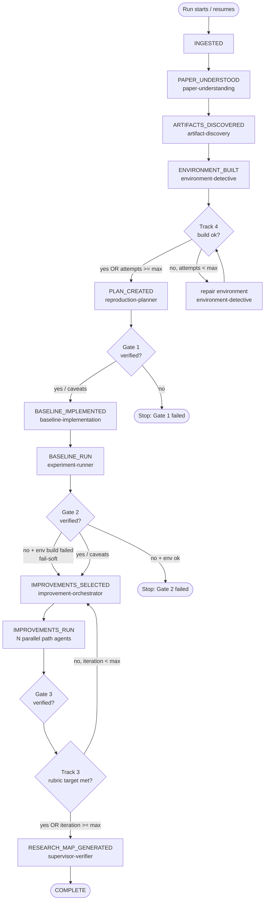

> **ReproLab Explainer** · [Index](./00-start-here.md) · [‹ Prev](./01-overview.md) · [Next ›](./03-agents-and-runtime.md)

# 02 — The 14-Stage Pipeline

*The orchestrator is ReproLab's spine: a 14-stage state machine that drives every agent call, checkpoints after each transition, enforces three verification gates, and loops inside stages without ever changing the enum.*

## In one paragraph

`ReproLabOrchestrator` (`backend/agents/orchestrator.py`) runs a linear 14-stage state machine. Each stage fires one or more agents, collects structured output, and calls `state.advance_stage()` — the only sanctioned way to move forward. That method atomically rewrites `runs/<project_id>/pipeline_state.json`, so a crashed run always resumes from its last completed stage. Three verification **gates** act as hard checkpoints: failing Gate 1 (plan) or Gate 2 (baseline) stops the run immediately; Gate 3 (improvements) is fail-soft. Two sub-loops run entirely *inside* existing stages: **Track 4** rebuilds a broken Docker environment up to N times while the pipeline stays at `ENVIRONMENT_BUILT`, and **Track 3** re-runs the improvement + gate-3 cycle until a rubric target is met or an iteration cap is hit. Both loops are design choices — by keeping the enum at exactly 14 values they avoid making the state machine topology depend on paper-specific behaviour.

## Why this exists

Without a state machine, a reproduction run is a brittle script: one agent crashes and all prior work is lost. ReproLab's pipeline gives you three concrete guarantees:

1. **Resumability.** Every stage transition is written to disk before the next agent starts. A run interrupted mid-stage or mid-loop resumes from the most recent good checkpoint, not from zero.
2. **Observability.** The frontend reads `pipeline_state.json` and the `PipelineStage` enum order to render a progress bar and stage counter. If the state machine were implicit, the UI could not know where a run is.
3. **Correctness by gating.** Each gate decides whether accumulated evidence is strong enough to proceed. Skipping them would let a bad baseline pollute the improvement phase, or let a hallucinated plan trigger expensive environment builds.

## The 14 Stages

The canonical source is the `PipelineStage` enum at `backend/agents/orchestrator.py:157`. The stages are an ordered `str` enum; the run loop converts the enum to a list and compares indices for skip-on-resume logic (`orchestrator.py:2306`).

### Group 1 — Ingest and understand

| Stage | What happens | Input → Output |
|---|---|---|
| **INGESTED** | Starting state; run is freshly created or loaded from checkpoint | paper PDF / arXiv ID → raw text in `runs/<id>/` |
| **PAPER_UNDERSTOOD** | `paper-understanding` agent reads parsed sections, extracts claims, metrics, datasets, training recipe, and ambiguities into a `PaperClaimMap` (`orchestrator.py:1100`). Ambiguities are merged into the `assumption_ledger`. | Raw text → `PaperClaimMap`, `paper_claim_map.json` |
| **ARTIFACTS_DISCOVERED** | `artifact-discovery` agent searches for code repos, datasets, and pre-trained weights referenced by the paper (`orchestrator.py:1157`). | `PaperClaimMap` → `artifact_index` dict, `artifact_index.json` |

### Group 2 — Environment and plan

| Stage | What happens | Input → Output |
|---|---|---|
| **ENVIRONMENT_BUILT** | `environment-detective` agent infers the Python version, framework, and dependencies; produces a `Dockerfile` and an `EnvironmentSpec` (`orchestrator.py:1181`). The **Track 4** build-repair loop runs immediately after this stage sets — see the sub-loops section below. | `PaperClaimMap`, `artifact_index` → `Dockerfile`, `environment_spec.json` |
| **PLAN_CREATED** | `reproduction-planner` agent drafts the `ReproductionContract`: smoke-test plan, full-run plan, expected outputs, evaluation protocol (`orchestrator.py:1444`). | `PaperClaimMap`, `EnvironmentSpec`, `assumption_ledger` → `ReproductionContract`, `reproduction_contract.json` |

### Group 3 — Gate 1

| Stage | What happens |
|---|---|
| **GATE_1_PASSED** | `supervisor-verifier` audits the `ReproductionContract` against the `PaperClaimMap`. Passes on `verified` or `verified_with_caveats`; stops the run on any harder failure (`orchestrator.py:1477`). |

### Group 4 — Baseline

| Stage | What happens | Input → Output |
|---|---|---|
| **BASELINE_IMPLEMENTED** | `baseline-implementation` agent writes runnable code to `runs/<id>/code/` and returns a `BaselineResult` with paths and metadata (`orchestrator.py:1519`). | `ReproductionContract`, `EnvironmentSpec`, `artifact_index` → `BaselineResult`, code tree |
| **BASELINE_RUN** | The experiment runner executes the code in the chosen sandbox (`local`, `docker`, or `runpod`) and captures metrics, plots, and logs as `ExperimentArtifacts` (`orchestrator.py:1556`). | `BaselineResult`, `ReproductionContract` → `ExperimentArtifacts` |

### Group 5 — Gate 2

| Stage | What happens |
|---|---|
| **GATE_2_PASSED** | `supervisor-verifier` checks baseline metrics against paper claims. If `rubric_verifier_enabled`, the `rubric-verifier` also scores the run and stores `baseline_verification` in state. Failing Gate 2 stops the run — unless the environment build loop already failed and the run is in fail-soft mode (`orchestrator.py:2374`). |

### Group 6 — Improvements

| Stage | What happens | Input → Output |
|---|---|---|
| **IMPROVEMENTS_SELECTED** | `improvement-orchestrator` proposes N hypotheses (default 3) targeting the rubric's weak areas (`orchestrator.py:1826`). | `ExperimentArtifacts`, `baseline_verification` → `[ImprovementHypothesis]` |
| **IMPROVEMENTS_RUN** | One `improvement-path` agent per hypothesis runs concurrently (bounded by `max_concurrent_agents`). Each gets an isolated workspace; git repos get git worktrees (`orchestrator.py:1926`). | `[ImprovementHypothesis]` → `[PathResult]` |

### Group 7 — Gate 3

| Stage | What happens |
|---|---|
| **GATE_3_PASSED** | `supervisor-verifier` reviews all `PathResult`s. If `rubric_verifier_enabled`, `rubric-verifier` scores the improved state and stores `improved_verification`. Gate 3 is fail-soft: the run does *not* stop on failure — it just records a `failed_reproduction` or `partial_reproduction` status and continues (`orchestrator.py:2053`). |

### Group 8 — Close-out

| Stage | What happens | Output |
|---|---|---|
| **RESEARCH_MAP_GENERATED** | `supervisor-verifier` (in research-map mode) synthesises a `ResearchMap`: baseline summary, promising directions, dead ends, next experiments. `generate_final_report` then computes PaperBench-style rubric deltas and writes the final report (`orchestrator.py:2180`). | `research_map.json`, `assumption_ledger.json`, `decision_log.json`, `final_report.json` |
| **COMPLETE** | Terminal state. The pipeline returns `PipelineState` to the caller. | — |

## The Three Gates in Detail

A **gate** is a call to `supervisor-verifier` that returns a `VerificationReport` with a `GateStatus`. The orchestrator maps that status to a `GateDecision` and then decides whether to continue.

```
GateStatus.verified              → gate.passed = True
GateStatus.verified_with_caveats → gate.passed = True   (proceed with caveats)
GateStatus.partial_reproduction  → gate.passed = False
GateStatus.failed_reproduction   → gate.passed = False
```

**Gate 1 (PLAN_CREATED → GATE_1_PASSED):** If `gate_1.passed is False`, `run()` returns immediately at `orchestrator.py:2371`. Nothing downstream has happened yet, so no resources are wasted. This is a hard stop.

**Gate 2 (BASELINE_RUN → GATE_2_PASSED):** If `gate_2.passed is False` and the environment build loop exhausted its attempts (`environment_build_ok is False`), the run continues in **fail-soft mode** — recording an honest partial verdict instead of halting (`orchestrator.py:2374`). If the environment did build successfully and Gate 2 still fails, the run stops (`orchestrator.py:2388`). This is a conditional hard stop.

**Gate 3 (IMPROVEMENTS_RUN → GATE_3_PASSED):** Never stops the run. A failing gate here still results in a `ResearchMap` and a final report; the gate outcome is embedded in the report for transparency. This is always a soft pass-through.

Additionally, Hermes audit reports can retroactively downgrade a gate's status — a `suppress_publication` or `escalate_human` recommendation converts `verified` → `verified_with_caveats`, and `verified_with_caveats` → `partial_reproduction` (`orchestrator.py:983`).

## Checkpointing and Resumability

`advance_stage` is the **only** sanctioned way to change the pipeline's stage. The test at `tests/test_pipeline_state_persistence.py` statically parses `orchestrator.py` and `pipeline.py` with the `ast` module and fails if any function other than `advance_stage` or `load_checkpoint` assigns to `.stage` directly (`tests/test_pipeline_state_persistence.py:30`).

Inside `advance_stage`, the write is **atomic**: the new JSON is written to a `.tmp` file, then `os.replace`d over the real path (`orchestrator.py:294`). A reader polling `pipeline_state.json` concurrently (the Next.js bridge does this) never sees a truncated file.

On restart, `PipelineState.load_checkpoint` reads `pipeline_state.json` and reconstitutes every field (`orchestrator.py:300`). The `run()` loop then converts both the current stage and each target stage to an index and skips steps that have already passed (`orchestrator.py:2335`). The Track 4 build loop gets a special resume hook at `orchestrator.py:2329`: if the run crashed *inside* the loop (stage is `ENVIRONMENT_BUILT` but `environment_build_ok` is False), it re-enters the loop immediately rather than skipping the whole environment step.

## The Two In-Stage Sub-loops

Both loops are deliberately designed to leave the `PipelineStage` enum unchanged. This means the state machine has exactly 14 states regardless of how many iterations run — the loop counter is tracked in separate fields of `PipelineState`, not in the enum.

### Track 4 — Environment Build-Repair Loop

After `ENVIRONMENT_BUILT` is set, `_run_environment_build_loop` tries to build the Docker image (`orchestrator.py:1294`). On failure it calls `_repair_environment`, which re-invokes `environment-detective` with the build error as context, then retries. The loop guard is `_should_rebuild` (`orchestrator.py:118`):

```python
def _should_rebuild(build_ok: bool, attempts: int, max_attempts: int) -> bool:
    return not build_ok and attempts < max_attempts
```

The cap is `environment_build_max_attempts` (default: 3, `backend/config.py:124`). When the cap is spent without a buildable image, `environment_build_ok` stays False and the run continues fail-soft. The attempt counter is checkpointed after each attempt, so a resume never re-runs attempts that already failed.

This loop only activates when `environment_build_validation_enabled` is True **and** `sandbox_mode` is `docker` — local and RunPod runs skip it entirely (`orchestrator.py:1311`).

### Track 3 — Rubric Self-Improvement Loop

After Gate 3 passes (or fails), `_run_improvement_reiteration_loop` checks whether the rubric target was met. If not, it re-runs `run_improvements` and `run_gate_3` with a new round index, namespacing path IDs as `r1_path_N`, `r2_path_N`, etc. to avoid collisions (`orchestrator.py:1898`). The loop guard is `_should_reiterate` (`orchestrator.py:102`):

```python
def _should_reiterate(
    verification: RubricVerification | None,
    iteration: int,
    max_iterations: int,
) -> bool:
    if verification is None or verification.meets_target:
        return False
    return iteration < max_iterations
```

The cap is `rubric_max_improvement_iterations` (default: 2, `backend/config.py:117`). The rubric target is `rubric_target_score` (default: 0.70). The improvement orchestrator receives the latest `improved_verification` — including weak-area scores — so each re-iteration round targets the specific areas that underperformed (`orchestrator.py:1843`). This loop only activates when `rubric_verifier_enabled` is True.

## Run Modes and Execution Profiles

### Run Modes (sdk vs offline)

`backend/agents/pipeline.py` exposes two entry points:

- **`run_pipeline_sdk`** — the production path. Every agent call goes through the LLM provider runtime. Works with any paper. Delegates to `ReproLabOrchestrator.run()`.
- **`run_pipeline_offline`** — a deterministic demo path with no LLM calls, using heuristic extractors and a pre-built PPO implementation. Intended for CI and offline demos only; Gate 1 auto-passes and improvement paths are stubbed (`pipeline.py:134`).

The `simulate` sandbox mode is only valid for the offline pipeline; the SDK orchestrator explicitly rejects it (`orchestrator.py:424`).

### Execution Profiles (efficient vs max)

`ExecutionProfile` (`backend/agents/execution.py:39`) is a frozen dataclass that controls all resource budgets. Two profiles ship:

| Setting | `efficient` (default) | `max` |
|---|---|---|
| Turns per agent | 30 (light), 60 (heavy) | None (no cap) |
| Tool calls per agent | 80 | None |
| Wall clock per agent | 1200 s (20 min) | 3600 s (1 hr) |
| Concurrent agents | 2 | 4 |
| Improvement rounds | 2 | 4 |

**Heavy agents** (`baseline-implementation`, `improvement-path`, `experiment-runner`) get the elevated turn cap automatically (`orchestrator.py:468`). Per-agent wall-clock overrides are also configurable via `agent_wall_clock_overrides` in settings — useful for papers whose baseline implementation consistently hits the 20-minute ceiling (`orchestrator.py:686`).

**Sandbox modes** (`SandboxMode`): `docker`, `local`, `runpod`, `simulate`, and `auto`. `auto` resolves to `runpod` by default (`execution.py:35`), but production deployments override this to `docker` via `REPROLAB_FORCE_SANDBOX=docker` (`config.py:139`). The `default_sandbox` setting (default: `docker`) controls the UI form default.

## Flowchart



## How it connects

- **`./03-agents-and-runtime.md`** — each stage fires one or more named agents (e.g. `paper-understanding`, `supervisor-verifier`); that chapter covers how the `AGENT_REGISTRY`, `AgentRuntime`, and provider chain work for every `_invoke_agent` call the orchestrator makes.
- **`./04-verification-and-trust.md`** — the three gates call `supervisor-verifier`, which internally runs four specialised verifiers and produces a `VerificationReport`. The rubric scoring math inside `_run_rubric_verifier` is covered there.
- **`./05-sandboxes-and-environments.md`** — `BASELINE_RUN` dispatches to `run_with_runtime`, `run_with_local_process`, or `run_with_runpod` depending on `SandboxMode`; the sandbox isolation mechanics live there.
- **`./07-state-events-persistence.md`** — `pipeline_state.json` is only one layer of persistence; that chapter covers the SQLite event store, workspace variables, and how the frontend polls run state.
- **`./06-ingestion.md`** — the paper PDF / arXiv ID becomes the `workspace_claim_map` passed into `run_pipeline_sdk`; ingestion is the step before `INGESTED`.

## Production Hardening

**Gate 1 can be tricked by a confident but wrong plan.** The `supervisor-verifier` is an LLM judge scoring a plan it has no independent evidence to check. In the codebase today, Gate 1 passes on `verified_with_caveats` (`orchestrator.py:1496`), which is a low bar for plans with significant ambiguities. Hardening: add a separate static checker that verifies the `ReproductionContract` mentions at least one metric from `PaperClaimMap.claims`, preventing "plan looks fine" verdicts on completely misaligned contracts.

**The rubric target (0.70) is not calibrated against PaperBench.** The comment in `config.py:115` is explicit: *"NOT calibrated against PaperBench's judge (a different scale). Per-version calibration is future work."* A run might loop through all 2 re-iteration rounds spending significant GPU time yet still be meaningfully below the PaperBench reproduction threshold. Hardening: run a calibration study across the PaperBench subset, then set `rubric_target_score` per paper category rather than globally.

**Fail-soft Gate 2 can hide a broken environment.** When the Track 4 loop exhausts its 3 attempts and `environment_build_ok` is False, the run continues (`orchestrator.py:2374`). The final report will show `partial_reproduction`, but the baseline was never actually executed in the intended environment — results may be meaningless. Hardening: surface `environment_build_ok=False` as a distinct warning status in the UI and final report, distinct from a "baseline ran but scored poorly" partial reproduction.

**Resume does not re-validate provider credentials.** A run resumed after an API key rotation will fail at the first agent call after resume with an `AuthenticationError`. The `ProviderHealthMonitor` marks the provider dead, and if there is no fallback, the run crashes with a non-descriptive error. Hardening: at resume time, check that at least one provider in the chain has valid credentials before starting any agent call.

**The atomic checkpoint write uses `.tmp`-then-rename only within a single filesystem.** On NFS mounts (common in Railway volume mounts), `os.replace` across filesystem boundaries is not atomic. The comment in `orchestrator.py:291` describes the intent but not the limitation. Hardening: document this constraint; for NFS-backed deployments, write `.tmp` into the same directory as the target (which is already done) and add an flock-based write barrier for multi-process deployments.

**Track 3 path namespacing is per-round but not globally unique across resumed runs.** Re-iteration rounds append `r{N}_path_id` (`orchestrator.py:1898`), but if a run is resumed and `improvement_iteration` is reset to 0 (a bug in the checkpoint load or a manual edit), path IDs from the resumed run will collide with the prior run's `path_results`, silently appending duplicate entries to the list. Hardening: make `advance_stage` assert that `improvement_iteration` is monotonically non-decreasing when resuming.

## Key files

| File | Role |
|---|---|
| `backend/agents/orchestrator.py` | The full orchestrator: `PipelineStage` enum, `PipelineState` dataclass, `ReproLabOrchestrator` class, all per-stage methods, gate logic, and the two sub-loops |
| `backend/agents/pipeline.py` | Top-level entry points: `run_pipeline_sdk` (production) and `run_pipeline_offline` (demo/CI) |
| `backend/agents/execution.py` | `ExecutionProfile`, `SandboxMode`, and the `efficient` / `max` budget tables |
| `backend/agents/topology.py` | UI-facing topology: maps the 14 stages and 12 nodes to display metadata; consumed by the frontend progress bar |
| `backend/config.py` | `rubric_max_improvement_iterations`, `environment_build_max_attempts`, `rubric_target_score`, `force_sandbox`, and other operator-tunable knobs |
| `tests/test_pipeline_state_persistence.py` | AST-based guard test that rejects any bare `.stage =` assignment outside `advance_stage` and `load_checkpoint` |

---

**The ReproLab Explainer** — jump to any chapter:

[**00 · Start Here**](./00-start-here.md)  ·  [**01 · Overview**](./01-overview.md)  ·  ▸ **02 · The Pipeline**  ·  [**03 · Agents & Runtime**](./03-agents-and-runtime.md)  ·  [**04 · Verification & Trust**](./04-verification-and-trust.md)  ·  [**05 · Sandboxes**](./05-sandboxes-and-environments.md)  ·  [**06 · Ingestion**](./06-ingestion.md)  ·  [**07 · State & Events**](./07-state-events-persistence.md)  ·  [**08 · Frontend & Ops**](./08-frontend-and-ops.md)

‹ [**01 · Overview**](./01-overview.md)  ·  [**03 · Agents & Runtime**](./03-agents-and-runtime.md) ›
