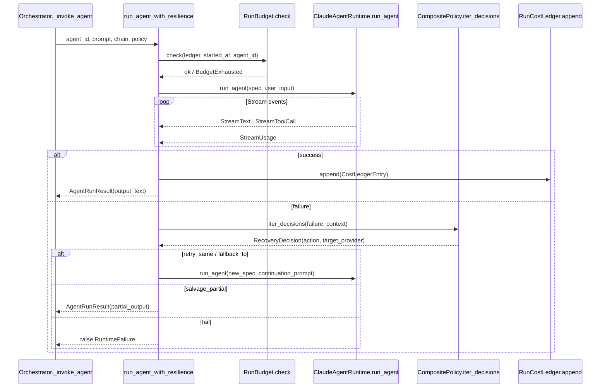

> **ReproLab Explainer** · [Index](./00-start-here.md) · [‹ Prev](./02-the-pipeline.md) · [Next ›](./04-verification-and-trust.md)

# 03 — Agents & the LLM Runtime

*How a single agent call actually works: the provider-agnostic runtime, the registry that defines every agent, the structured output contract, telemetry, and the resilience layer that keeps a long run on budget and alive through transient failures.*

## In one paragraph

A ReproLab **agent** is nothing more than an LLM invocation with a typed input prompt, a tool allowlist, and a Pydantic-validated JSON output. Python drives all sequencing; the LLM does the reasoning. Every agent call goes through the same stack: the **`AGENT_REGISTRY`** describes what the agent is (prompt, tools, default model), **`AgentSpec.to_runtime_spec()`** converts that into a provider-neutral **`AgentRuntimeSpec`**, and **`make_runtime()`** returns one of two concrete adapters — `ClaudeAgentRuntime` (backed by `claude-agent-sdk`) or `OpenAiAgentRuntime` (backed by `openai-agents`). Both adapters stream `StreamText`, `StreamToolCall`, and `StreamUsage` events through the **resilience engine** (`run_agent_with_resilience`), which enforces cost and wall-clock budgets, classifies failures into a provider-independent taxonomy, retries or falls back to the other provider, and writes telemetry to `agent_telemetry.jsonl` and a cost ledger to `cost_ledger.jsonl`.

## Why this exists

Without this layer, every stage in the 14-stage pipeline would need its own bespoke provider client, retry loop, cost accounting, and tool-call guard. Instead, a stage agent gets one function call — `_invoke_agent(agent_id, prompt)` in the orchestrator — and the stack handles the rest. The abstraction also lets the system switch providers mid-run (Anthropic quota exhausted → OpenAI fallback) without any pipeline logic changing.

## The agent model

Every unit of LLM work in ReproLab fits the same contract:

- **Input**: a string prompt assembled by the orchestrator stage handler.
- **Tools**: a fixed list drawn from `{Read, Write, Edit, Bash, WebSearch, WebFetch, Agent}`, declared per agent in the registry.
- **Output**: streamed text that must contain exactly one JSON object parseable against a Pydantic schema.

Python owns all state transitions. The LLM sees a prompt describing its task, uses its tool allowlist to read or write files, and returns a structured result. The orchestrator reads that result, updates pipeline state, and decides whether to advance to the next stage. There is no agent-to-agent messaging at the LLM level; the only inter-agent communication is the files written to `runs/<project_id>/`.

Each agent also runs inside a **`RuntimeGuard`** (`backend/agents/runtime/base.py:52`). The guard carries a list of blocked terms — typically repository URLs from the PaperBench benchmark — and both the prompt and every outgoing tool call are checked against it. A violation raises `RuntimeGuardViolation`, which the resilience engine classifies as a fatal `GuardViolation` and terminates the run immediately.

## The runtime abstraction

### The protocol

`AgentRuntime` is a structural `Protocol` (`backend/agents/runtime/base.py:159`). Implementing it requires one property (`provider_name`) and one async generator method:

```python
async def run_agent(
    self,
    *,
    agent: AgentRuntimeSpec,
    user_input: str,
) -> AsyncIterator[StreamEvent]: ...
```

`StreamEvent` is the union `StreamText | StreamToolCall | StreamUsage` (`base.py:142`). Both concrete adapters yield these three event types; the resilience engine consumes them.

`AgentRuntimeSpec` is the provider-neutral spec (`base.py:97`). It carries the agent name, instructions, model name, tool list, sub-agents, turn cap, thinking budget, working directory, and guard policy. Everything the runtime needs; nothing provider-specific.

### The factory

`make_runtime(provider=None)` in `backend/agents/runtime/factory.py:135` resolves the provider through a three-step priority chain:

1. Explicit `provider` argument
2. `REPROLAB_LLM_PROVIDER` env var
3. `settings.llm_provider` (default `"anthropic"`)

It lazily imports the appropriate adapter and returns it. Credentials are validated only when `require_api_key=True` — so import-time tests and offline paths can instantiate the orchestrator without secrets (`factory.py:138`).

For **Anthropic**, a valid credential is either `ANTHROPIC_API_KEY`/`REPROLAB_ANTHROPIC_API_KEY` in the environment **or** the `claude` CLI binary on PATH (`factory.py:48`). The `claude-agent-sdk` adapter spawns Claude Code as a subprocess and inherits its subscription login, so API-key-less use is intentional.

For **OpenAI**, the factory accepts `OPENAI_API_KEY` or `OPENAI_ADMIN_KEY` in the same unprefixed/`REPROLAB_`-prefixed pattern (`factory.py:59`).

### The adapters

**`ClaudeAgentRuntime`** (`backend/agents/runtime/claude_runtime.py`) wraps `claude-agent-sdk`. It calls `query(prompt=..., options=ClaudeAgentOptions(...))` and converts `AssistantMessage` content blocks to `StreamText`/`StreamToolCall` events, then emits `StreamUsage` from the final `ResultMessage` (`claude_runtime.py:74`).

**`OpenAiAgentRuntime`** (`backend/agents/runtime/openai_runtime.py`) wraps `openai-agents`. It builds an `Agent` object with synthesized tool functions (Read, Write, Edit, Bash wrappers — `openai_runtime.py:146`), calls `Runner.run_streamed()`, and maps `raw_response_event` and `run_item_stream_event` into the same `Stream*` vocabulary. The OpenAI adapter also encodes agent names to valid OpenAI function identifiers using a deterministic hex-escape scheme (`openai_runtime.py:122`) to avoid collisions in handoff tool names.

One asymmetry: the OpenAI adapter's `WebSearch` and `WebFetch` stubs return an error string rather than actually searching (`openai_runtime.py:251`). Agents relying on web access need the Anthropic adapter or an MCP integration.

### The provider / cost-tier chain

Model selection at invocation time follows a three-level override, resolved in `AgentSpec.to_runtime_spec()` (`backend/agents/registry.py:59`):

1. **Call-site override** — `model_override` argument (used by the orchestrator when a reasoning model is needed for verification gates).
2. **Settings override** — `settings.agent_provider_overrides` (a dict like `{"baseline-implementation.anthropic": "claude-opus-4-7"}`) read from `.env` as `REPROLAB_AGENT_PROVIDER_OVERRIDES`.
3. **Registry default** — `AgentSpec.default_model_anthropic` / `default_model_openai`, falling back to `settings.anthropic_default_model` (`claude-sonnet-4-6`) or `settings.openai_default_model` (`gpt-4o`) (`registry.py:242`).

Heavy builder agents like `baseline-implementation` and `improvement-path` register `claude-opus-4-7` as their Anthropic default (`registry.py:138,218`). Verifier agents default to `o4-mini` on OpenAI (`registry.py:156`).

`settings.anthropic_reasoning_model` (`claude-opus-4-7`) and `settings.openai_reasoning_model` (`o4-mini`) exist for orchestrator-level overrides passed to verification and supervisor agents — they are not used automatically by the registry.

Cross-provider fallback is controlled by `settings.provider_fallback_disabled` (`backend/config.py:59`). When `True`, the provider chain is `[primary]` only. This setting exists for single-provider deployments where a stale credential for the other provider would surface a misleading 401 mid-run.

## The Apify ArXiv MCP integration

When `APIFY_API_TOKEN` (or `REPROLAB_APIFY_API_TOKEN`) is set, the `ClaudeAgentRuntime` registers an SSE-based MCP server named `apify-arxiv` (`claude_runtime.py:143`) at the URL in `settings.apify_arxiv_mcp_url`. The MCP server exposes ArXiv search tools to the agents listed in `settings.apify_arxiv_enabled_agents` (default: `"artifact-discovery,paper-understanding"` — `backend/config.py:194`).

The tool prefix `mcp__apify-arxiv` is appended to those sub-agents' tool lists before the `claude-agent-sdk` call. When the token is absent, no MCP server is registered and no latency is added (`claude_runtime.py:162`). The OpenAI adapter has no equivalent MCP wiring.

## The AGENT_REGISTRY

`AGENT_REGISTRY` in `backend/agents/registry.py:93` is a plain `dict[str, AgentSpec]` with 14 entries. `AgentSpec` is a frozen dataclass with fields:

| Field | Role |
|---|---|
| `agent_id` | Stable string key, e.g. `"baseline-implementation"` |
| `role` | `"builder"`, `"verifier"`, `"supervisor"`, or `"improvement"` |
| `prompt` | System prompt, imported from `backend/agents/prompts/` |
| `tools` | List of tool name strings from the shared vocabulary |
| `default_model_anthropic` | Agent-specific model override on Anthropic |
| `default_model_openai` | Agent-specific model override on OpenAI |
| `max_turns` | Hard turn cap if set |
| `thinking_budget_tokens` | Extended thinking budget for deep-reasoning agents |

`AgentSpec.to_runtime_spec(provider, ...)` converts an entry into `AgentRuntimeSpec` and resolves the model by the three-level chain above. The orchestrator passes all other registry entries as `sub_agents`, giving each agent the ability to hand off to any peer (the Claude SDK exposes these as spawnable sub-agents; OpenAI exposes them as handoffs).

The `spawn_permissions` flag (`True` on `supervisor-verifier` and `improvement-orchestrator`) is stored in the registry but currently unused by the runtime spec conversion. It was intended to gate which agents can call the `Agent` tool; actual enforcement is not wired up (`registry.py:197,208`).

## Structured output

Structured output is requested purely through prompt engineering — not via a provider API parameter. `structured_output_instruction(model)` in `backend/agents/structured_output.py:8` generates a `# Structured Output Contract` section appended to the prompt. It embeds the Pydantic model's `required` fields and `allowed top-level fields` as a plain text list and instructs the agent to return exactly one JSON object.

The orchestrator calls `append_structured_output_instruction(prompt, output_model)` before every `_invoke_agent` call (`orchestrator.py:536`), where `_OUTPUT_MODELS` maps agent IDs to their target Pydantic class (e.g., `"paper-understanding"` → `PaperClaimMap`).

After the invocation returns, the orchestrator tries two extraction paths in the agent-specific module:
1. Read the JSON file the agent wrote to disk (preferred — agents are instructed to write their output).
2. Parse the JSON from the agent's streamed text output using a depth-tracking brace scanner.

Malformed output raises `ValueError` inside the stage handler, which propagates as a `FatalRuntimeFailure` and terminates the run unless the policy salvages partial output.

## Telemetry

Every completed invocation (success or failure) appends one `AgentInvocationRecord` to `<runs_root>/<project_id>/agent_telemetry.jsonl` (`backend/agents/telemetry.py:13`). The record contains:

- `agent_id`, `model`, `provider`
- `started_at`, `finished_at`, `duration_seconds`
- `message_count`, `output_chars`, `tool_calls` (list of `"tool_name arg"` strings)
- `usage` dict: `input_tokens`, `output_tokens`, `cache_read_input_tokens`, `cache_creation_input_tokens`, `reasoning_tokens`
- `success`, `error_message`, `attempt_index`, `outcome`, `failure_kind`, `next_provider`

The recorder is `AgentTelemetryRecorder`, which opens the file in append mode and flushes after each write (`telemetry.py:39`). The cost ledger (`cost_ledger.jsonl`) is a parallel append-only file written by the resilience engine, containing token counts and estimated USD per attempt.

## The resilience engine

`run_agent_with_resilience` in `backend/agents/resilience/engine.py:95` is the outermost wrapper around every agent invocation. Understanding it is the key to understanding how a multi-hour run survives.

### Budget enforcement

`RunBudget` (`backend/agents/resilience/budget.py:13`) is checked before every attempt, including fallback attempts. It enforces three limits:

- **`max_usd`** — compares `ledger.total_usd()` against the cap; raises `BudgetExhausted` if exceeded.
- **`max_wall_clock_seconds`** — compares elapsed time since pipeline start.
- **`max_invocations_per_agent`** — per-agent attempt count from `budget.check()`.

All three are surfaced through the CLI flags `--max-usd`, `--max-wall-clock`, and `--max-invocations` documented in `docs/agents/resilience.md`.

`RunCostLedger` (`backend/agents/resilience/cost.py:90`) accumulates `CostLedgerEntry` records. `estimate_cost_usd(model, usage)` looks the model up in a hardcoded `PRICING` table (`backend/agents/resilience/pricing.py:25`) — updated `2026-05-10` — and returns `None` for unknown models so the ledger degrades gracefully rather than blocking unknown model usage.

### Failure classification

Every exception that escapes the adapter's `run_agent` method is funnelled through `classify_failure(provider, exc, ...)` in `backend/agents/resilience/classify.py:57`. The function checks exception type name and HTTP status code in order:

1. `AgentLimitExceeded` → `TurnBudgetExhausted`, `ToolBudgetExhausted`, or `WallClockExceeded`
2. `RuntimeGuardViolation` → `GuardViolation` (fatal)
3. HTTP 401/403 or class name contains `"authentication"` → `AuthenticationError` (fatal)
4. Quota phrases in the error text → `QuotaExhausted`
5. HTTP 429 → `RateLimited`
6. HTTP 5xx or connection phrases → `TransientError`
7. Fallthrough → `TransientError` (conservative; assumes recoverable)

The anthropic-specific classifier (`classify.py:33`) also detects Claude Code's idiosyncratic quota phrase `"claude code returned an error result: success"`.

### Recovery policy

The default recovery policy is a `CompositePolicy` (`engine.py:84`) that applies seven rules in order, yielding the first matching `RecoveryDecision`:

| Policy | Trigger | Action |
|---|---|---|
| `BackoffOnTransient` | `TransientError` (≤2 seen) | `retry_same` with exponential backoff (1s, 2s) |
| `BackoffOnRateLimit` | `RateLimited` (≤1 seen) | `retry_same` after `retry_after_seconds` or 5s |
| `SalvageOnTurnBudget` | `TurnBudgetExhausted` with partial output | `salvage_partial` |
| `SalvageOnWallClock` | `WallClockExceeded` with partial output | `salvage_partial` |
| `BumpOnTurnBudget` | `TurnBudgetExhausted` (≤2 bumps) | `retry_same` with `max_turns × 2` |
| `RolloverOnQuota` | `QuotaExhausted` | `fallback_to` next healthy provider |
| `FailFast` | anything else | `fail` |

Salvage is only accepted if the partial output passes `salvage_validator` — a lambda that tries to parse the output against the agent's expected Pydantic schema (`orchestrator.py:604`).

Fallback carries a **continuation prompt** (`backend/agents/resilience/context.py:45`): the new provider sees the prior attempt's provider name, failure kind, and truncated partial output (up to 8192 chars), plus the original task. This lets the fallback provider resume from whatever the primary wrote to disk rather than starting from scratch.

### Provider health monitoring

`ProviderHealthMonitor` (`backend/agents/resilience/health.py:29`) tracks consecutive quota and transient failures per provider within a run. After 3 consecutive quota failures, a provider enters a 30-minute cooldown. After 5 consecutive transient failures within a 60-second window, it enters a 5-minute cooldown. A provider can also be **marked dead** for the lifetime of the monitor — this happens when an authentication error occurs on a fallback (non-primary) provider (`engine.py:169`): rather than killing the run, the dead provider is skipped and the run returns to the primary.



## Agent tour

The 14 agents split into four groups. See each agent's `docs/agents/` page for the full prompt and I/O contract; this section gives only the non-obvious bits.

### Builder agents (sequential pipeline)

**`paper-understanding`** — Consumes the parsed `workspace_claim_map.json` and reads additional project files. Produces `paper_claim_map.json` (`PaperClaimMap`): claims, datasets, metrics, architecture, training recipe, ambiguities. Also registered as an Apify ArXiv MCP recipient so it can search ArXiv during LLM mode. Has an `run_offline()` path using heuristic regex extraction for tests. See [`docs/agents/paper-understanding.md`](../agents/paper-understanding.md).

**`artifact-discovery`** — Uses `WebSearch`, `WebFetch`, and `Bash`. Finds repositories, datasets, and dependency clues. Also registered for the Apify MCP (`config.py:194`). Produces `artifact_index.json`. See [`docs/agents/artifact-discovery.md`](../agents/artifact-discovery.md).

**`environment-detective`** — Reads the `PaperClaimMap` and `artifact_index`. Produces a `Dockerfile` and `environment_spec.json` (`EnvironmentSpec`). Has a heuristic offline path with a small framework compatibility table (`environment_detective.py:32`). The non-obvious bit: the LLM is instructed to write the Dockerfile directly to disk; the orchestrator falls back to parsing the JSON from streamed text only if the file is missing. See [`docs/agents/environment-detective.md`](../agents/environment-detective.md).

**`reproduction-planner`** — Read-only and write-only tools. Turns the claim map and environment spec into a `reproduction_contract.json` (`ReproductionContract`) — the formal commitment of what metric to hit, what tolerance to accept, what seed to use. See [`docs/agents/reproduction-planner.md`](../agents/reproduction-planner.md).

**`baseline-implementation`** — The heaviest builder: `claude-opus-4-7` by default on Anthropic (`registry.py:138`). Has Read, Write, Edit, and Bash tools. Implements or adapts the paper's algorithm inside the project directory. Its prompt includes the `SANDBOX_EXECUTION_CONTRACT` from `prompts/_sandbox_contract.py`, which defines the file layout convention the experiment-runner expects. See [`docs/agents/baseline-implementation.md`](../agents/baseline-implementation.md).

**`experiment-runner`** — Produces `ExperimentArtifacts`. Drives the sandbox (Docker or local) to execute the generated code; results land in `runs/<project>/baseline/`. In `run_with_runtime()` mode it invokes `RuntimeAppService` directly rather than through the LLM path. See [`docs/agents/experiment-runner.md`](../agents/experiment-runner.md).

### Verifier agents

The three worker verifiers (`method-fidelity-verifier`, `data-metrics-verifier`, `artifact-diff-verifier`) and `environment-verifier` implement the per-Gate checks. They are not detailed here — see **[04 — Verification & Trust](./04-verification-and-trust.md)** for the gate logic. `supervisor-verifier` synthesizes their outputs and generates the Research Map; it uses the `Agent` tool and `spawn_permissions=True` to delegate (`registry.py:198`). `rubric-verifier` derives or loads a PaperBench-style rubric and scores the reproduction (`registry.py:183`). All verifiers default to `o4-mini` on OpenAI.

### Improvement agents

**`improvement-orchestrator`** — Reads the gate decisions, experiment artifacts, and claim map; selects N improvement hypotheses; launches `improvement-path` sub-agents. Uses `spawn_permissions=True` and the `Agent` tool (`registry.py:209`). See [`docs/agents/improvement-orchestrator.md`](../agents/improvement-orchestrator.md).

**`improvement-path`** — One instance per hypothesis. Uses Read, Write, Edit, and Bash; defaults to `claude-opus-4-7` on Anthropic like `baseline-implementation` (`registry.py:218`). Executes the hypothesis in the project directory, captures metrics, and returns a `PathResult`. See [`docs/agents/improvement-path.md`](../agents/improvement-path.md).

### Infrastructure agents

**`dashboard-emitter`** — Not an LLM agent; no registry entry. A module (`backend/agents/dashboard_emitter.py`) that the orchestrator calls to append `DashboardEvent` records to `dashboard_events.jsonl` for SSE streaming to the frontend. See [`docs/agents/dashboard-emitter.md`](../agents/dashboard-emitter.md).

**`dependency-verifier`** — Not an LLM agent. A post-generation guardrail (`backend/agents/dependency_verifier.py`) that scans generated Dockerfiles for hallucinated package versions, git SHAs, and repository URLs via HTTP HEAD checks.

## How it connects

- **[02 — The Pipeline](./02-the-pipeline.md)** — The orchestrator's stage loop calls `_invoke_agent(agent_id, prompt)` for each stage. This chapter explains what happens inside that call; `02` explains how the stage result advances the state machine.
- **[04 — Verification & Trust](./04-verification-and-trust.md)** — The three gate verifiers and the supervisor-verifier are LLM agents running through the same runtime stack. Their registry entries, prompts, and structured output schemas are the same kind as any builder agent; what differs is the gate logic in the orchestrator that evaluates their output.
- **[05 — Sandboxes & Environments](./05-sandboxes-and-environments.md)** — `experiment-runner` and `baseline-implementation` write code to disk; the sandbox layer executes it. The runtime layer (this chapter) hands off a completed `project_dir` to the sandbox; sandbox internals are not the agents' concern.
- **[06 — Ingestion](./06-ingestion.md)** — Ingestion produces `workspace_claim_map.json`, the primary input to `paper-understanding`. The handoff is a file on disk; no runtime call crosses the boundary.
- **[07 — State, Events & Persistence](./07-state-events-persistence.md)** — `agent_telemetry.jsonl`, `cost_ledger.jsonl`, and `fallback_summary.json` written by the resilience engine feed the observability layer described there. The `dashboard_emitter` calls in the orchestrator emit SSE events processed there.

## Production Hardening

**Pricing table drift.** `backend/agents/resilience/pricing.py:25` is a hardcoded dict last updated `2026-05-10`. Any model not in this table produces `estimated_usd=None`, and the `max_usd` budget cap silently underestimates spend. A prod deployment should fetch live pricing from the provider APIs (or at minimum fail loudly on unknown models rather than returning `None`).

**Structured output relies on prompt engineering alone.** `structured_output.py` appends a natural-language contract to the prompt. There is no schema validation at the API level. If the model ignores the contract — which happens under high token pressure or with unexpectedly large outputs — the stage fails. Neither adapter uses provider-side JSON mode (e.g., Anthropic's `tool_use` for structured output or OpenAI's `response_format=json_object`). Adding provider-native schema enforcement would eliminate the parse-from-text fallback path.

**Fallback continuation prompt truncation.** `compact_partial_output` (`context.py:90`) truncates to the last 8192 chars. For agents that write long files to disk before failing, the continuation prompt's preamble may not contain enough context for the fallback provider to understand what was accomplished. The disk state is accurate, but the prompt context is not. A smarter approach would summarize the prior attempt's file-system diffs rather than raw text.

**The `spawn_permissions` guard is unenforced.** `supervisor-verifier` and `improvement-orchestrator` have `spawn_permissions=True` in the registry, but `to_runtime_spec()` does not read this field (`registry.py:56`). Any agent with `Agent` in its tool list can spawn sub-agents regardless of flag. This is a security/budget gap if an agent prompt is manipulated to call the Agent tool unexpectedly.

**OpenAI adapter WebSearch/WebFetch are stubs.** `openai_runtime.py:251` returns an error string for web access tools. Agents that depend on `WebSearch` (e.g., `artifact-discovery`) do not produce useful output on the OpenAI adapter without MCP integration. This is only relevant when using `REPROLAB_LLM_PROVIDER=openai`; Anthropic runs are unaffected. The provider-swap fallback (Anthropic → OpenAI) can silently degrade artifact discovery quality.

**Per-agent wall-clock overrides, not per-run.** `settings.agent_wall_clock_overrides` (`config.py:50`) allows bumping the cap for heavy agents like `baseline-implementation` without lifting the whole run's profile. However, there is no automated mechanism to detect that a complex paper routinely requires more time and suggest an override. Operators must monitor `agent_telemetry.jsonl` duration fields and configure overrides manually.

## Key files

| File | Role |
|---|---|
| `backend/agents/runtime/base.py` | Protocol definition, `AgentRuntimeSpec`, `StreamEvent` types, `RuntimeGuard` |
| `backend/agents/runtime/factory.py` | `make_runtime()`, provider selection, credential validation |
| `backend/agents/runtime/claude_runtime.py` | `ClaudeAgentRuntime`: `claude-agent-sdk` adapter, MCP server wiring |
| `backend/agents/runtime/openai_runtime.py` | `OpenAiAgentRuntime`: `openai-agents` adapter, tool function synthesizers |
| `backend/agents/runtime/invoke.py` | `collect_agent_text()`: one-shot helper for simple agent invocations |
| `backend/agents/registry.py` | `AGENT_REGISTRY`, `AgentSpec`, `to_runtime_spec()` |
| `backend/agents/structured_output.py` | Structured output prompt contract generator |
| `backend/agents/telemetry.py` | `AgentInvocationRecord`, `AgentTelemetryRecorder` |
| `backend/agents/resilience/engine.py` | `run_agent_with_resilience()`, `_run_single_attempt()` |
| `backend/agents/resilience/policy.py` | `CompositePolicy` and all recovery rule classes |
| `backend/agents/resilience/budget.py` | `RunBudget` — cost/time/invocation caps |
| `backend/agents/resilience/cost.py` | `RunCostLedger`, `CostLedgerEntry` |
| `backend/agents/resilience/pricing.py` | Hardcoded model pricing table |
| `backend/agents/resilience/classify.py` | Provider exception → `RuntimeFailure` taxonomy |
| `backend/agents/resilience/failures.py` | `RuntimeFailure` class hierarchy |
| `backend/agents/resilience/health.py` | `ProviderHealthMonitor` — cooldown and dead-provider tracking |
| `backend/agents/resilience/context.py` | `AttemptContext`, `AttemptRecord`, continuation prompt assembly |
| `backend/config.py` | `llm_provider`, model defaults, `agent_provider_overrides`, `agent_wall_clock_overrides`, `provider_fallback_disabled`, Apify settings |
| `backend/agents/prompts/` | Per-agent system prompts, one file per agent |

---

**The ReproLab Explainer** — jump to any chapter:

[**00 · Start Here**](./00-start-here.md)  ·  [**01 · Overview**](./01-overview.md)  ·  [**02 · The Pipeline**](./02-the-pipeline.md)  ·  ▸ **03 · Agents & Runtime**  ·  [**04 · Verification & Trust**](./04-verification-and-trust.md)  ·  [**05 · Sandboxes**](./05-sandboxes-and-environments.md)  ·  [**06 · Ingestion**](./06-ingestion.md)  ·  [**07 · State & Events**](./07-state-events-persistence.md)  ·  [**08 · Frontend & Ops**](./08-frontend-and-ops.md)

‹ [**02 · The Pipeline**](./02-the-pipeline.md)  ·  [**04 · Verification & Trust**](./04-verification-and-trust.md) ›
