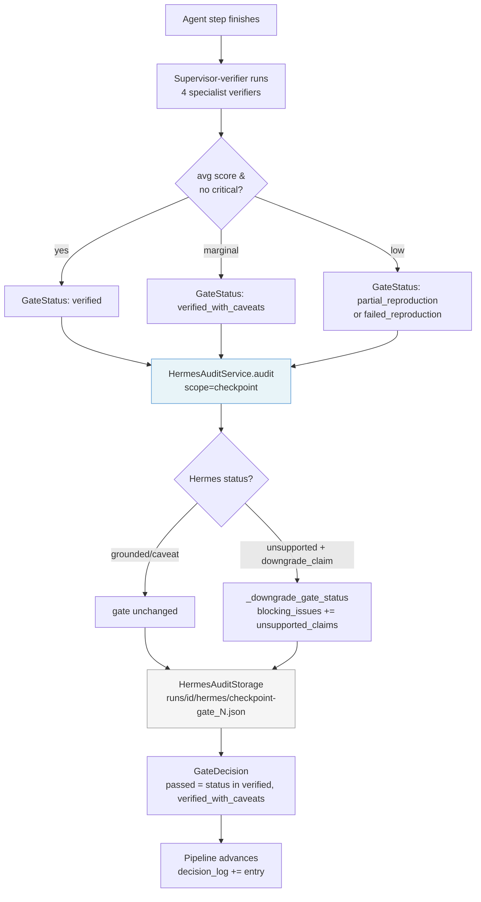

> **ReproLab Explainer** · [Index](./00-start-here.md) · [‹ Prev](./03-agents-and-runtime.md) · [Next ›](./05-sandboxes-and-environments.md)

# 04 — Verification, Scoring & Trust

*How ReproLab decides whether a reproduction is good, and how it builds an auditable record that an autonomous agent's verdict can be trusted.*

## In one paragraph

ReproLab imposes three **gates** at fixed points in the pipeline: Gate 1 (after planning), Gate 2 (after the baseline run), and Gate 3 (after improvements). Each gate runs four specialist verifiers whose scores a **supervisor-verifier** aggregates into a structured pass/fail with a `GateStatus`. Alongside the gates, a separate **rubric-verifier** (Track 3) scores the same reproduction against a PaperBench-style weighted rubric; the rubric is resolved once per run so the baseline and improved scores stay comparable. An independent **Hermes audit chain** wraps every agent step and every gate, recording whether the agent's claims are grounded in evidence; its reports are stored append-only under `runs/<id>/hermes/` and can downgrade a gate's status if they find unsupported claims. Finally, an offline `evals/` subsystem — entirely separate from the live pipeline — lets operators score reproductions against ground-truth paper metrics, run A/B tests between agent versions, and build Elo rankings.

## Why this exists

An autonomous agent that reproduces a research paper can produce wrong answers confidently. Without verification, every run would need human inspection before anyone could trust the result. The gate system shifts that burden: it defines what "good" means for each stage, checks it mechanically and with LLM judgment, and leaves a machine-readable decision record. The Hermes audit chain addresses a second failure mode — the verifiers themselves are LLM agents, so their verdicts can contain unsupported claims; an independent model auditing those verdicts is the system's main defense against the whole verification stack becoming a single point of failure.

## What a gate is

A **gate** is a structured checkpoint that converts a stage's outputs into a `GateDecision` — a typed record with three fields: `gate` (a string like `"gate_1"`), `passed` (bool), and `status` (`GateStatus`). The `GateStatus` enum (`backend/agents/schemas.py:180`) has six values:

| Status | Meaning |
|---|---|
| `verified` | Reproduction is valid |
| `verified_with_caveats` | Valid but with noted issues |
| `partial_reproduction` | Some claims reproduced, others not |
| `failed_reproduction` | Reproduction failed |
| `blocked_requires_human` | Cannot decide, needs human input |
| `invalid_claim` | The paper's claim itself is problematic |

A gate **passes** when status is `verified` or `verified_with_caveats`. What a *failing* gate does is **not uniform** — it depends on which gate failed: **Gate 1** stops the run immediately (no compute has been spent downstream yet); **Gate 2** also stops the run, *unless* the environment build already exhausted its repair budget, in which case the run continues **fail-soft** to an honest partial verdict; **Gate 3** never stops the run. The precise control flow lives in [02 — The Pipeline](./02-the-pipeline.md) — this chapter explains how each gate *reaches* its verdict.

The three gates map to specific pipeline stages (`backend/agents/orchestrator.py:165`):

- **Gate 1** (`GATE_1_PASSED`) — after `PLAN_CREATED`. Checks that the reproduction plan is sound before committing compute to implementation.
- **Gate 2** (`GATE_2_PASSED`) — after `BASELINE_RUN`. Checks that the baseline implementation actually ran and its artifacts are valid.
- **Gate 3** (`GATE_3_PASSED`) — after `IMPROVEMENTS_RUN`. Checks the improvement paths and triggers the final Research Map.

## The verifier family

### Four specialist verifiers

`run_gate_offline()` (`backend/agents/verification.py:245`) runs four verifiers in sequence and passes all four scores to the supervisor. The four are:

**method_fidelity** — Checks that the implementation matches the paper's algorithm: assumptions were applied, mode is `implement_from_paper` when expected, and `train.py` exists (`backend/agents/verification.py:33`). Score penalty: `1.0 - (mismatches * 0.2)`.

**environment_execution** — Checks environment reproducibility: Dockerfile present with pinned packages, `commands.log` valid JSONL, run logs exist, `provenance.json` parses cleanly (`backend/agents/verification.py:80`). Severity escalates to `"high"` when any command logged a failure or provenance marks the run unsuccessful (`backend/agents/verification.py:156`).

**data_metrics** — Checks that the paper's target metrics appear in the experiment artifacts and that the experiment completed (`backend/agents/verification.py:160`). Score penalty: `1.0 - (mismatches * 0.25)`.

**artifact_diff** — Checks that all five required hard artifacts exist: metrics, logs, commands.log, provenance.json, and plots (`backend/agents/verification.py:199`). Score is the fraction present out of five required items.

The LLM versions of these verifiers are defined as system prompts in `backend/agents/prompts/verifiers.py`. Each prompt instructs the agent to emit a JSON object with `verifier_name`, `score` (0–1), `findings`, `mismatches`, and `severity`. The offline (deterministic) versions in `verification.py` implement the same contract without an LLM call, which makes them useful for unit tests.

### Supervisor: aggregation and override authority

The **supervisor-verifier** (`backend/agents/prompts/verifiers.py:120`) aggregates the four scores into a single `VerificationReport`. Its decision logic (offline path, `backend/agents/verification.py:263`):

1. Compute the average score across all four verifiers.
2. Check whether any verifier reported `severity == "high"`.
3. Map the result to `GateStatus`:
   - avg ≥ 0.9 and no critical issues → `verified`
   - avg ≥ 0.7 → `verified_with_caveats`
   - avg ≥ 0.5 → `partial_reproduction`
   - experiment succeeded but score < 0.5 → `verified_with_caveats`
   - otherwise → `failed_reproduction`
4. If any verifier cited no evidence, downgrade `verified` → `verified_with_caveats`.

The supervisor prompt (`backend/agents/prompts/verifiers.py:130`) states explicitly: "You have FULL OVERRIDE AUTHORITY — there is no voting." Individual verifier findings are advisory; the supervisor makes a binding call and records its reasoning in `decision_log_entry`.

### Dynamic confidence thresholds

The `ReproducibilityScoringService` (`backend/services/scoring/service.py`) applies **dynamic thresholds** on top of the raw verifier scores. Each verifier's score gets a per-item threshold derived from its complexity, risk level, and evidence quality (`backend/services/scoring/service.py:86`):

- Base threshold: 70.0
- +12 if complexity is `"high"` (verifier had mismatches)
- +10 / +18 if risk is `"high"` / `"critical"`
- +8 / −8 if evidence quality is `"weak"` / `"strong"` (based on evidence ref count)
- Clamped to [50, 95]

Verdicts: `verified` if actual ≥ threshold; `caveated` if within 15 of threshold; `failed` below.

The composite `ReproducibilityScore` (`backend/services/scoring/model.py:27`) weights the five dimensions:

```
composite = env * 0.20 + method * 0.25 + data * 0.20 + metric * 0.15 + artifact * 0.20
```

High assumption risk caps the composite at 84 (high risk) or 69 (critical), and any blocking issues cap it at 59 (`backend/services/scoring/service.py:54`).

## The rubric-verifier (Track 3)

### What it does

The **rubric-verifier** is a separate LLM agent that scores the reproduction against a PaperBench-style weighted rubric. Unlike the four specialist verifiers, it scores across 6–12 *areas* (method fidelity, data fidelity, execution reproducibility, evaluation protocol, result match, artifact completeness) and produces a single `overall_score` in [0, 1] (`backend/agents/schemas.py:336`). This score drives the self-improvement loop.

### Rubric resolution: one rubric per run

The rubric is resolved once per run via `resolve_rubric_source()` (`backend/agents/rubric_source.py:65`):

- If a vendored PaperBench bundle exists at `third_party/paperbench/<paper_id>/` and passes validation, a `BundleRubricSource` is returned — its `rubric.json` is authoritative.
- Otherwise (no bundle, missing file, malformed JSON), a `GeneratedRubricSource` is returned — the verifier LLM generates the rubric on its first call.

When the verifier runs for the first time, the orchestrator stores the resolved areas and weights in `PipelineState.rubric_spec` (`backend/agents/orchestrator.py:1755`). Every subsequent checkpoint passes that spec back to the agent. This means the LLM can only supply scores at later checkpoints — it cannot reweight or rename areas. The weights come from the persisted spec; any weights the model returns on a re-run are silently overridden (`backend/agents/orchestrator.py:1703`).

This design was hardened after a real bug: before `rubric_spec` was introduced, each checkpoint generated a fresh rubric, so `baseline_verification` and `improved_verification` were scored against *different* rubrics. The self-improvement loop's stop criterion was measuring rubric churn, not reproduction progress (`learn.md:154`).

### Trust boundary: `from_areas` computes, never trusts

`RubricVerification.from_areas()` (`backend/agents/schemas.py:353`) computes `overall_score` and `meets_target` deterministically from the per-area scores and weights. These fields in the model's JSON output are ignored. This is the core trust boundary: the model scores individual areas, but the aggregate that drives decisions is always recomputed from code.

### Honesty backstops

The rubric verifier prompt (`backend/agents/prompts/rubric_verifier.py:51`) states hard caps: no executable code → areas ≤ 0.20; code present but never ran → areas ≤ 0.35. Because prompt instructions are advisory to LLMs, the orchestrator enforces the same caps mechanically: when `experiment_artifacts.success` is False, every area score is clamped to `min(score, 0.35)` before aggregation (`backend/agents/orchestrator.py:1731`). The prompt and the code both enforce the invariant.

### Target score and self-improvement loop

`rubric_target_score` (default `0.70`, `backend/config.py:116`) is the threshold for `meets_target`. The comment in `config.py` is worth quoting directly: "Heuristic target on the verifier's own 0-1 rubric scale — NOT calibrated against PaperBench's judge (a different scale). Per-version calibration is future work." The two scales are independent.

After Gate 3, the orchestrator runs `_run_improvement_reiteration_loop()` (`backend/agents/orchestrator.py:2100`): if `improved_verification.overall_score < rubric_target_score`, it loops back through improvement-selection and Gate 3, feeding the latest verification's `weak_points` back to the improvement orchestrator. The loop is hard-capped at `rubric_max_improvement_iterations` (default `2`). If the verifier fails during a re-iteration round, the loop stops and keeps the best verification seen so far.

## The Hermes audit chain

### What it is and why it exists

The **Hermes audit chain** is an independent oversight log. After every agent step and at every gate, a separate LLM model audits the structured output and answers: "Is this claim grounded in the evidence the agent says it used?" The audit runs outside the main agent runtime — it uses whatever model is available (see provider chain below) and writes its verdict to `runs/<id>/hermes/` before the pipeline continues.

Why an independent audit chain? The verifier agents are LLMs too. If the supervisor-verifier claims a reproduction is valid, but that claim is based on evidence it hallucinated, the gate has passed on a false premise. Hermes is the system's check on the verifiers themselves.

### Audit lifecycle

Two types of audits occur (`backend/hermes_audit/payloads.py`):

- **Step audits** (`scope=step`): after each agent finishes — e.g. after `baseline-implementation`, after each improvement path. The payload is the agent's structured output plus the raw reasoning trace.
- **Checkpoint audits** (`scope=checkpoint`): at each gate (gate_1, gate_2, gate_3). The payload includes the full evidence bundle: verifier scores, artifact paths, and state snapshot.

Each audit produces a `HermesAuditReport` (`backend/hermes_audit/models.py:46`) with a `status` — one of `grounded`, `caveat`, `unsupported`, `unavailable`, `system_error` — and a `recommended_intervention`.

The checkpoint report can downgrade a gate's status. `_apply_checkpoint_report_to_gate()` (`backend/agents/orchestrator.py:992`) acts when `status == unsupported` and the intervention is one of `downgrade_claim`, `suppress_publication`, or `escalate_human`: it calls `_downgrade_gate_status()` which walks the status down one level (`verified` → `verified_with_caveats` → `partial_reproduction` → `failed_reproduction`) and appends the unsupported claims to `gate.blocking_issues` (`backend/agents/orchestrator.py:983`).

### Storage layout

`HermesAuditStorage` (`backend/hermes_audit/storage.py:13`) writes each report to:

```
runs/<project_id>/hermes/<scope>-<safe_target>.json
```

An `index.json` in the same directory maps `"<scope>:<target>"` to status, intervention, and summary. This is an append-only pattern: each audit target gets at most one file per scope, but the index accumulates all entries. The result is a human-readable audit trail alongside every pipeline run.

### Provider chain and self-learning routing

The audit client (`backend/hermes_audit/client.py:111`) tries providers in order, routing to whichever one last succeeded. The default chain is (`backend/hermes_audit/client.py:73`):

1. **NousHermesProvider** — the purpose-built auditor, tried first by design.
2. **ClaudeAuditProvider** — direct Anthropic API call; fastest after Hermes.
3. **ClaudeCodeSdkProvider** — Claude Code subscription; used when no API key is configured.
4. **OpenAIAuditProvider** — cross-provider fallback.
5. **CodexCliProvider** — OpenAI subscription via `codex login`; last resort.

Provider success/failure rates are persisted between runs in `runs/.hermes_adapter_memory.json` (`backend/hermes_audit/memory.py:25`). A provider that fails 3 consecutive times is **quarantined** — moved to the end of the order — but still tried as a last resort, since providers can recover. The ordering algorithm (`backend/hermes_audit/memory.py:91`): last-successful-provider first, then remaining by success rate (descending), quarantined providers last.

If the whole chain fails, the report returns `status=unavailable` — it never silently substitutes an "ok" result (`backend/hermes_audit/client.py:212`).

### Diagram: gate decision flow with Hermes audit



## The `backend/evals/` subsystem — offline evaluation

The `evals/` subsystem is entirely separate from the live pipeline gates. It is an **offline, post-hoc** tool for evaluating reproduction quality across runs, across versions, and against ground-truth paper metrics. You run it after a pipeline completes; it does not affect pipeline decisions.

### Reproduction fidelity scoring

`evaluate_reproduction()` (`backend/evals/reproduction.py:184`) runs five layers:

| Layer | What it checks |
|---|---|
| 1 | Build success — Dockerfile + code exist |
| 2 | Run success — `experiment_artifacts.success` |
| 3 | Convergence — (not yet implemented; placeholder) |
| 4 | Metric match — relative error of reproduced vs. paper values |
| 5 | Method fidelity — mode, assumption coverage, metric presence |

The composite score weights: `build(0.1) + run(0.2) + metric_match(0.4) + fidelity(0.3)` (`backend/evals/schemas.py:42`). Metric match uses a 15% relative tolerance: within 15% → score 1.0; 15–30% → linear decay; beyond 30% → score 0.0 (`backend/evals/reproduction.py:78`). When DeepEval is installed, `ReproductionFidelityMetric` wraps the same logic into DeepEval's CI interface (`backend/evals/reproduction.py:234`).

### PaperBench bundle scoring

`backend/evals/paperbench/` provides tools for working with the official PaperBench evaluation format. A **bundle** lives at `third_party/paperbench/<paper_id>/` and contains `paper.md`, `addendum.md`, `rubric.json`, and optional task instructions (`backend/evals/paperbench/bundle.py:28`). The `summarize_rubric()` function (`backend/evals/paperbench/score.py:125`) walks the rubric tree and computes normalized leaf weights by task category and fine-grained category, following PaperBench's upstream weight semantics.

`PaperBenchJudgeCommand` (`backend/evals/paperbench/score.py:74`) constructs the `argv` needed to invoke PaperBench's upstream `paperbench.scripts.run_judge` entrypoint with the simple judge (model: `o3-mini-2025-01-31`, reasoning effort: `high`). This is a **command builder only** — it does not invoke the judge itself; the caller does.

### A/B testing and Elo ranking

`BayesianABTest` (`backend/evals/ab_testing.py`) uses a Beta-Binomial model for binary metrics (build/run success) and a Normal model for continuous metrics (fidelity, metric match). Bayesian posteriors report `P(A > B)` and reach statistical significance faster than frequentist tests on small sample sizes — appropriate given that each evaluation is an expensive agent run.

`EloTournament` (`backend/evals/elo.py:53`) runs round-robin matches between agent versions, using an LLM judge to compare Research Maps pairwise. Standard Elo: K=32, starting rating 1500. Rankings are saved via `EvalStore` for later comparison.

**Innovation scoring** (`backend/evals/innovation.py`) scores improvement hypotheses on five 1–5 dimensions (novelty, feasibility, significance, clarity, actionability) and checks experiment integrity (multi-variable changes, selective reporting, data leakage). These have no live pipeline equivalent — they're offline judgment tools.

The `EvalRunner` (`backend/evals/runner.py`) is the main entry point: construct it with a store, call `evaluate_reproduction()` or `evaluate_full()` on a finished `PipelineState`, and results are persisted to the configured `EvalStore`.

## How it connects

- **→ `./02-the-pipeline.md`**: The orchestrator invokes `run_gate_1()`, `run_gate_2()`, and `run_gate_3()` as steps in the 14-stage loop. This chapter covers what happens inside those calls; the pipeline chapter covers how the loop decides whether to continue.
- **→ `./03-agents-and-runtime.md`**: The supervisor-verifier and rubric-verifier are agents invoked via `_invoke_agent()`; they use the same runtime (Anthropic or OpenAI). This chapter covers the verification logic; the runtime chapter covers how those agent calls are structured and timed.
- **→ `./05-sandboxes-and-environments.md`**: The environment-verifier checks whether the Docker container is reproducible. The sandbox chapter covers how the container is built and run; the verification chapter covers how the verifier judges the result.
- **→ `./06-ingestion.md`**: The `PaperClaimMap` produced by ingestion is the input to `verify_method_fidelity()` and `verify_data_metrics()`. Those verifiers check whether the implementation matches what the ingestion stage extracted.
- **→ `./07-state-events-persistence.md`**: `GateDecision`, `RubricVerification`, and `HermesAuditReport` objects are all persisted in `pipeline_state.json` via `PipelineState.save_checkpoint()`. The Hermes reports have their own parallel filesystem layout under `runs/<id>/hermes/`.
- **→ `./08-frontend-and-ops.md`**: The rubric scores (`baseline_verification`, `improved_verification`) and improvement iteration count are included in the final benchmark report emitted to the frontend; the UI displays per-area rubric breakdowns and a live re-iteration badge.

## Production Hardening

**The rubric scale is uncalibrated.** `rubric_target_score = 0.70` is a heuristic on the verifier's own 0–1 scale, explicitly noted in `backend/config.py:116` as "NOT calibrated against PaperBench's judge." Runs that "meet target" cannot be compared to PaperBench leaderboard scores. Hardening requires collecting ground-truth PaperBench judge scores on a held-out paper set and fitting a calibration function — or running the upstream `run_judge` command on the submission directly via `PaperBenchJudgeCommand`.

**Hermes checkpoint reports do not block the pipeline.** When `_apply_checkpoint_report_to_gate()` (`backend/agents/orchestrator.py:992`) downgrades a gate, the pipeline still continues — the run is never halted. A `blocked_requires_human` gate status is possible in theory but has no mechanism to pause execution. For high-stakes deployments, a hard halt on `suppress_publication` would prevent downstream consumers from seeing an unsupported result.

**The offline verifiers in `verification.py` score by formula, not by LLM.** `run_gate_offline()` (`backend/agents/verification.py:245`) applies simple arithmetic — `1.0 - (mismatches * 0.2)` — without reading the actual paper or code artifacts in detail. In production, gates should always invoke the LLM-backed supervisor-verifier and the specialist agents, not the offline path. The offline path is for unit tests.

**The Hermes memory file is a single JSON file with no access control.** `runs/.hermes_adapter_memory.json` is written atomically (`backend/hermes_audit/memory.py:162`) but lives in the shared runs directory. In multi-tenant or concurrent deployments, multiple processes writing this file can corrupt it (though corruption degrades gracefully to a fresh memory on parse failure). A database-backed store with row-level locking would be more robust.

**`EvalStore` uses SQLite with no schema migrations.** `backend/evals/store.py` writes reproductions, A/B tests, and Elo ratings to a SQLite file. There are no migration guards, so schema changes in future releases will silently fail on existing databases. A migration framework (Alembic) and a schema version check on startup would prevent silent data loss.

**Gate 3's self-improvement loop has no cost cap.** `rubric_max_improvement_iterations` (default `2`) limits re-iteration rounds, but each round runs N improvement path agents in parallel, each of which may invoke expensive LLMs and run Docker containers. A dollar-denominated budget (`max_cost_usd`) independent of iteration count would prevent a stuck verifier loop from burning unbounded cloud credits.

## Key files

| File | Role |
|---|---|
| `backend/agents/verification.py` | Four offline verifiers + supervisor aggregation (`run_gate_offline`, `run_improvement_gate_offline`) |
| `backend/agents/schemas.py` | `GateStatus`, `GateDecision`, `VerificationReport`, `VerifierScore`, `RubricAreaScore`, `RubricVerification` |
| `backend/agents/rubric_source.py` | `BundleRubricSource`, `GeneratedRubricSource`, `resolve_rubric_source` |
| `backend/agents/prompts/verifiers.py` | LLM system prompts for all four specialist verifiers and the supervisor |
| `backend/agents/prompts/rubric_verifier.py` | Two-phase rubric-verifier prompt (establish rubric, then score areas) |
| `backend/agents/orchestrator.py` | `run_gate_1/2/3`, `_run_rubric_verifier`, `_run_improvement_reiteration_loop`, `_apply_checkpoint_report_to_gate` |
| `backend/config.py` | `rubric_verifier_enabled`, `rubric_verifier_model`, `rubric_target_score`, `rubric_max_improvement_iterations` |
| `backend/hermes_audit/client.py` | `NousHermesClient` — provider chain, JSON extraction, memory wiring |
| `backend/hermes_audit/providers.py` | `AuditProvider` Protocol + 5 implementations (`NousHermesProvider`, `ClaudeAuditProvider`, `ClaudeCodeSdkProvider`, `OpenAIAuditProvider`, `CodexCliProvider`) |
| `backend/hermes_audit/models.py` | `HermesAuditReport`, `HermesAuditStatus`, `HermesInterventionType` |
| `backend/hermes_audit/storage.py` | `HermesAuditStorage` — writes `runs/<id>/hermes/*.json` and `index.json` |
| `backend/hermes_audit/memory.py` | `AdapterMemory`, `ProviderStats` — provider routing memory, quarantine logic, atomic persistence |
| `backend/hermes_audit/payloads.py` | `build_step_audit_payload`, `build_checkpoint_audit_payload` |
| `backend/services/scoring/service.py` | `ReproducibilityScoringService` — dynamic thresholds, composite score |
| `backend/services/scoring/model.py` | `ReproducibilityScore`, `DynamicThresholdAssessment` |
| `backend/services/comparison/model.py` | `ComparisonReport`, `ComparableGroup` — multi-paper comparison models |
| `backend/persistence/repositories/verification_repository.py` | SQLite persistence for `VerificationRecord` |
| `backend/evals/reproduction.py` | Five-layer reproduction scoring, `evaluate_reproduction`, DeepEval integration |
| `backend/evals/runner.py` | `EvalRunner` — orchestrates reproduction, innovation, A/B, Elo evaluation |
| `backend/evals/schemas.py` | `ReproductionScore`, `InnovationScore`, `ABTestResult`, `EloRating` |
| `backend/evals/ab_testing.py` | `BayesianABTest`, `MultiMetricABTest` — Beta-Binomial and Normal posteriors |
| `backend/evals/elo.py` | `EloTournament` — round-robin Elo with LLM judge |
| `backend/evals/paperbench/bundle.py` | `PaperBenchBundle` — load and validate vendored paper bundles |
| `backend/evals/paperbench/score.py` | `summarize_rubric`, `PaperBenchJudgeCommand` — rubric accounting and judge invocation |
| `backend/evals/innovation.py` | Hypothesis scoring rubric, integrity checks, research map scoring |

---

**The ReproLab Explainer** — jump to any chapter:

[**00 · Start Here**](./00-start-here.md)  ·  [**01 · Overview**](./01-overview.md)  ·  [**02 · The Pipeline**](./02-the-pipeline.md)  ·  [**03 · Agents & Runtime**](./03-agents-and-runtime.md)  ·  ▸ **04 · Verification & Trust**  ·  [**05 · Sandboxes**](./05-sandboxes-and-environments.md)  ·  [**06 · Ingestion**](./06-ingestion.md)  ·  [**07 · State & Events**](./07-state-events-persistence.md)  ·  [**08 · Frontend & Ops**](./08-frontend-and-ops.md)

‹ [**03 · Agents & Runtime**](./03-agents-and-runtime.md)  ·  [**05 · Sandboxes**](./05-sandboxes-and-environments.md) ›
