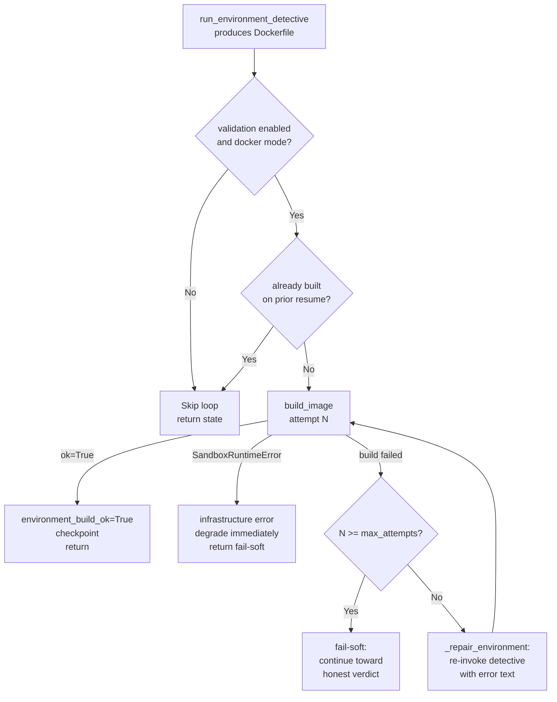

> **ReproLab Explainer** · [Index](./00-start-here.md) · [‹ Prev](./04-verification-and-trust.md) · [Next ›](./06-ingestion.md)

# 05 — Sandboxes & Environment Reconstruction

_How ReproLab safely runs LLM-written code and builds the Docker environment it runs in._

## In one paragraph

Every experiment command in ReproLab is LLM-generated, untrusted, and potentially dangerous — it may download arbitrary packages, write to the filesystem, or run an ML training job for hours. ReproLab contains this behind a **`RuntimeBackend`** abstraction with three implementations: `local_process` (no isolation, dev only), `local_docker` (Docker containers on the host daemon, with network/CPU/memory limits), and `runpod_backend` (remote GPU pods over SSH). The currently active backend is Docker; RunPod code exists but is force-disabled by config. Before experiment commands ever run, the **environment-detective** agent reads the paper's hardware clues and emits a `Dockerfile`. The orchestrator then immediately builds and validates that image in a **Track-4 build-and-repair loop**: on failure it feeds the build error back to the detective, retries up to `environment_build_max_attempts` times, and fails soft if the cap is spent — the run proceeds with an honest partial-reproduction verdict rather than halting. Parallel improvement paths each get their own git **worktree** so their filesystem mutations don't interfere.

## Why this exists

The code ReproLab runs is reconstructed by an LLM from a paper it has just read. It can install packages, train models for hours, write anywhere on disk, and make outbound network calls. Running that directly on the host would be catastrophic: a bad `pip install` could corrupt the Python environment; a training script that hard-codes `/tmp/output` could clobber data; a compromised package could exfiltrate API keys. The sandbox layer enforces three things the LLM cannot override:

1. **Filesystem isolation**: the project directory is mounted read-only; the only writable surface is an explicit `/artifacts` mount.
2. **Network isolation**: by default, `network_mode: none` is applied to the container. The experiment cannot phone home, download models, or hit APIs mid-run.
3. **Resource caps**: memory and CPU limits prevent a runaway training job from starving the host process.

Without this, autonomous ML reproduction would be unsafe to run on any machine you care about.

## The backend contract

**`RuntimeBackend`** (`backend/services/runtime/interface.py:113`) is a five-method abstract class:

```python
class RuntimeBackend(ABC):
    async def create_sandbox(self, config: SandboxConfig) -> Sandbox: ...
    async def exec(self, sandbox: Sandbox, command: str, timeout: int) -> ExecResult: ...
    async def copy_out(self, sandbox: Sandbox, path: str) -> bytes: ...
    async def copy_in(self, sandbox: Sandbox, path: str, data: bytes) -> None: ...
    async def destroy(self, sandbox: Sandbox) -> None: ...
```

Everything above and below this interface is decoupled. The orchestrator and `experiment_runner` talk only to `RuntimeAppService`, which wraps a `RuntimeBackend` and records `DomainEvent`s to the event store (`backend/services/runtime/service.py:49`).

**`SandboxConfig`** (`interface.py:31`) captures all parameters for one sandbox: `project_root` (the code directory, mounted at `/work`), `artifact_root` (mounted at `/artifacts`), `dockerfile_path`, resource limits, and a `network_disabled` flag. The `readonly_project` field (`interface.py:48`) is set to `True` by `run_with_runtime` (`experiment_runner.py:229`) — the LLM can read its own code but cannot write to it.

**`ExecResult`** (`interface.py:76`) is the typed result of every command. Its `.succeeded` property (`interface.py:93`) returns `True` only when `exit_code == 0`, `timed_out == False`, and `cause_kind is None`. The `RuntimeCauseKind` enum (`interface.py:19`) gives structured failure reasons: `oom_killed`, `exec_timeout`, `build_failed`, etc. — these flow into the event store and the provenance record.

## The three backends

### local_process — no isolation

**`LocalProcessBackend`** (`backend/services/runtime/local_process.py:25`) runs commands directly via `asyncio.create_subprocess_shell` on the host. It honors the same `project_root`/`artifact_root` contract as Docker but provides zero filesystem or network isolation. It is the fallback for environments without Docker and is the backend chosen by `run_with_local_process` (`experiment_runner.py:345`), which explicitly sets `network_disabled=False` and `memory_limit=None`. Use only for local debugging; never against untrusted code.

### local_docker — the active sandbox

**`LocalDockerBackend`** (`backend/services/runtime/local_docker.py:127`) is the current production backend. It uses the Docker Python SDK to:

1. Build the Dockerfile (if `dockerfile_path` is set in `SandboxConfig`) — or use a pre-built image tag.
2. Start a detached keepalive container (`sleep infinity`) with the volume mounts, resource limits, and `network_mode: none` when `network_disabled=True`.
3. Execute commands inside the running container via `container.exec_run` (`local_docker.py:216`).
4. Copy files in and out via tar archives over the Docker API (`local_docker.py:259`, `local_docker.py:276`).
5. Stop and forcibly remove the container on `destroy` (`local_docker.py:295`).

The build timeout is 30 minutes (`DEFAULT_BUILD_TIMEOUT_SECONDS = 1800`, `local_docker.py:24`). GPU access is opt-in: when `gpu_mode` is `prefer` or `max`, `DeviceRequest(count=-1, capabilities=[["gpu"]])` is added to the `containers.run` call (`local_docker.py:191`).

**The socket-sharing trade-off**: the host image (`Dockerfile:14`) and `docker-compose.yml:28` both document that `/var/run/docker.sock` is bind-mounted into the application container. This lets `LocalDockerBackend` spawn sandbox containers against the host daemon without Docker-in-Docker, but it grants the application container effective root on the host's Docker. The `Dockerfile` header comment is explicit: "fine for local dev, NOT for prod" (`Dockerfile:14`).

### runpod_backend — exists, currently disabled

**`RunpodBackend`** (`backend/services/runtime/runpod_backend.py:43`) provisions a remote GPU pod via the RunPod REST API, uploads the project directory over SFTP, runs commands via SSH, and syncs `/artifacts` back to the host. The lifecycle is: POST `/pods` → poll until SSH port is reachable → `asyncssh` connect → upload workspace → run → `tar` artifacts back → DELETE `/pods`.

Two hardened delete guardrails prevent accidental pod deletion:

1. `_owned_pod_ids` (`runpod_backend.py:107`): a per-instance allowlist of pod IDs this backend created. `_delete_pod` refuses to delete any pod not in this set (`runpod_backend.py:549`).
2. Name-prefix check (`runpod_backend.py:571`): before deleting, the backend fetches the pod and verifies its name starts with `"reprolab-"` — covering the case where a pod ID was added to the allowlist via a future code path but the pod was actually someone else's.

Persistent-pod mode: when `REPROLAB_RUNPOD_POD_ID` is set, the backend attaches to an existing pod and never adds it to `_owned_pod_ids`, so `destroy()` skips deletion (`runpod_backend.py:353`).

**Current reality**: RunPod is force-disabled. `backend/config.py:139` sets `force_sandbox = "docker"` and `backend/config.py:130` sets `default_sandbox = "docker"`. The `apply_sandbox_override` function in `backend/services/events/live_runs.py:146` rewrites every incoming run request to this forced value before it reaches the orchestrator. Additionally, `backend/agents/execution.py:35` declares `DEFAULT_SANDBOX_MODE = SandboxMode.runpod` — a constant that is overridden in practice by the `force_sandbox` config path, but its value is a documentation hazard (it implies RunPod is the natural default).

## Sandbox selection

Selection flows through three layers:

| Layer | Mechanism | File |
|---|---|---|
| Per-request client value | `StartRunRequest.sandbox` field | `backend/schemas/requests.py` |
| Force override | `apply_sandbox_override` rewrites to `force_sandbox` | `live_runs.py:146` |
| Auto resolution | `resolve_sandbox_mode(auto, pipeline_mode=...)` → `DEFAULT_SANDBOX_MODE` | `execution.py:177` |

`resolve_sandbox_mode` (`execution.py:177`) is simple: if the requested mode is not `auto`, pass it through unchanged; if it is `auto`, return `DEFAULT_SANDBOX_MODE`. The docstring notes that `auto` is "RunPod-first" by design — but in the current deployment this is moot because `force_sandbox="docker"` overrides the request before `resolve_sandbox_mode` is ever called.

`ensure_sandbox_mode_available` (`execution.py:195`) is the fail-fast check called at run startup. For `docker` it calls `LocalDockerBackend.verify_available()` which pings the daemon. For `runpod` it checks for an API key and SSH private key via `ensure_runpod_available` (`runpod_backend.py:651`).

## Environment reconstruction

Before any experiment runs, the pipeline must build a working Docker image. The **`environment-detective`** agent is responsible for inferring what that image needs.

### What environment-detective produces

Given a `PaperClaimMap` (hardware clues, framework mentions, datasets) and `artifact_index`, the agent emits an `EnvironmentSpec` containing a full `Dockerfile` text and a structured `pip_packages` dict. The agent has two entry points:

- `run_offline()` (`environment_detective.py:54`): deterministic, no LLM — uses a built-in `_FRAMEWORK_COMPATIBILITY` matrix to infer Python and CUDA versions from the framework mentioned in the claim map. Useful for tests and CI.
- `run_with_sdk()` (`environment_detective.py:105`): full LLM-driven inference via the configured agent runtime. The agent prompt (`backend/agents/prompts/environment_detective.py:1`) instructs the LLM to check `requirements.txt`, cross-reference GitHub, and never fabricate package versions or commit SHAs.

The generated Dockerfile follows hard rules from the prompt (`environment_detective.py prompt:51`):
- Slim base image (`python:3.X-slim`), one `apt-get` layer, per-package `pip install` layers.
- No `COPY` of source code — the Dockerfile is the environment only; the code is volume-mounted.
- A no-network smoke import as the **final `RUN` layer** that proves the environment imports cleanly before any experiment runs. If this smoke layer fails during `docker build`, the build-repair loop catches it.

### The Track-4 build-and-repair loop

The central insight: a broken Dockerfile is caught in minutes at `ENVIRONMENT_BUILT` instead of failing ~30 minutes later at `BASELINE_RUN` with no feedback. The loop is implemented in `_run_environment_build_loop` (`orchestrator.py:1294`).

The loop only runs when `environment_build_validation_enabled = True` (default) and `sandbox_mode is SandboxMode.docker` (`orchestrator.py:1312`). Local-process and RunPod runs are no-ops — there is no image to build.

```
build_image(dockerfile_path, project_dir, tag)
   ├── ok=True   → set environment_build_ok=True, checkpoint, return
   ├── ok=False  → capture error_text
   │     ├── attempt < max_attempts → _repair_environment(state, error_text)
   │     │     └── invoke environment-detective with REPAIR_PROMPT
   │     │           (prior Dockerfile + build error) → new EnvironmentSpec
   │     └── attempt >= max_attempts → break, fail-soft
   └── SandboxRuntimeError (daemon down) → degrade immediately, return
```

`_repair_environment` (`orchestrator.py:1235`) re-invokes the environment-detective using `ENVIRONMENT_DETECTIVE_REPAIR_PROMPT` (`prompts/environment_detective.py:80`), which gives the LLM the prior Dockerfile and the build error, then asks for a targeted fix. New assumptions from the repair round are merged into the ledger de-duped by `assumption_id` (`orchestrator.py:1272`).

**Fail-soft behavior** (`orchestrator.py:1427`): when the attempt cap is spent without a buildable image, `environment_build_ok` stays `False`, the checkpoint is saved, and the function returns normally — it does not raise. The run continues to Gate 2, which will produce an honest partial-reproduction verdict (experiment failed, low score) rather than `blocked_requires_human`. This is deliberate: the system stays autonomous.

**Resume safety** (`orchestrator.py:2323`): if a run crashes inside the build loop, `pipeline_state.json` has `stage=ENVIRONMENT_BUILT` and `environment_build_ok=False`. On resume, `run()` detects this and re-enters the loop, picking up from `environment_build_attempts` where it left off.



## Git worktrees for parallel improvement paths

During the improvements phase, the pipeline runs multiple hypotheses concurrently. Each **improvement path** gets its own git worktree so its code modifications don't touch the baseline working tree.

**`GitWorktreeManager`** (`backend/services/worktrees/manager.py:38`) is a thin wrapper around `git worktree add -B <branch> <path> <base-ref>`. It creates one worktree per improvement path under `worktrees_root/<project_id>/<path_id>/`, on a branch named `improvement/<path_id>-<slug>` (`manager.py:59`). The manager deliberately does not clean or reset the repo — it only asks git to create or remove worktrees in explicit directories.

Each worktree then gets its own `SandboxConfig` pointing at that worktree's directory as `project_root`, so the sandbox mounts isolate each improvement path's code changes from every other.

## The sandbox execution contract

The `SANDBOX_EXECUTION_CONTRACT` (`backend/agents/prompts/_sandbox_contract.py:22`) is a prompt snippet injected into every agent that writes experiment commands. It codifies the mount model that is uniform across all three backends:

- `/work` (or `config.workdir`) — read-only project mount
- `$OUTPUT_DIR` / `/artifacts` — the only writable surface
- `MPLCONFIGDIR`, `PYTHONUNBUFFERED`, `REPROLAB_ARTIFACT_DIR` set for every command

The contract instructs agents never to hardcode `/artifacts` (the resolved path differs across modes) and to redirect all cache-hungry tools (`HF_HOME`, `TORCH_HOME`, `TRITON_CACHE_DIR`, etc.) under `$OUTPUT_DIR`. The prompt comment notes this is the "single most common reason a reproduction fails in the sandbox even when the code itself is correct" (`_sandbox_contract.py:75`).

## How it connects

- **[02-the-pipeline.md](./02-the-pipeline.md)**: the build-and-repair loop runs inside the `ENVIRONMENT_BUILT` stage of the 14-stage pipeline. The orchestrator advances stages and calls `_run_environment_build_loop` immediately after `run_environment_detective` returns.
- **[03-agents-and-runtime.md](./03-agents-and-runtime.md)**: the environment-detective and experiment-runner are agents whose LLM calls go through the `AgentRuntime` abstraction. This chapter covers only the sandbox side of what those agents do; the LLM invocation mechanics are in chapter 03.
- **[04-verification-and-trust.md](./04-verification-and-trust.md)**: Gate 2 (`GATE_2_PASSED`) receives `ExperimentArtifacts` from the experiment runner and decides whether the reproduction succeeded. When `environment_build_ok = False`, the artifacts will show `success: False` and Gate 2 produces a partial-reproduction verdict.
- **[06-ingestion.md](./06-ingestion.md)**: the `PaperClaimMap` fed into environment-detective (hardware clues, framework, datasets) is produced by paper ingestion and paper-understanding. Without that structured output, environment-detective has nothing to infer from.
- **[07-state-events-persistence.md](./07-state-events-persistence.md)**: `RuntimeAppService` records `SandboxRequested`, `SandboxCreated`, `CommandExecuted`, `CommandFailed`, and `SandboxDestroyed` domain events to the event store. Every command execution is durably logged there.

## Production Hardening

**1. Docker socket exposure is a root-equivalent hole.** `docker-compose.yml:28` mounts `/var/run/docker.sock` into the app container so `LocalDockerBackend` can reach the host daemon. Any code running inside the app container can create privileged containers, delete images, or escape to the host. The `Dockerfile:14` comment calls this out: "fine for local dev, NOT for prod." Hardening requires moving to a rootless Docker daemon, a dedicated socket proxy (e.g. `docker-socket-proxy` with an allowlist), or switching to RunPod (which avoids the host daemon entirely).

**2. `DEFAULT_SANDBOX_MODE = SandboxMode.runpod` in `execution.py:35` is misleading.** This constant is the value used when `sandbox_mode="auto"` and no `force_sandbox` config overrides it. In the current deployment, `force_sandbox="docker"` neutralizes it — but if a developer runs the CLI directly without a `.env` file, `auto` resolves to RunPod, and the run fails at `ensure_runpod_available` with a confusing "API key missing" error. The constant should be updated to `SandboxMode.docker` to match the actual supported default, or the auto-resolution logic should check `config.default_sandbox` instead.

**3. No container cleanup on process crash.** `LocalDockerBackend.destroy` stops and removes the container (`local_docker.py:295`), but this runs in the `finally` block of `run_with_runtime` (`experiment_runner.py:341`). If the orchestrator process is killed with `SIGKILL` (as happens on Railway OOM kills or a `docker compose down --remove-orphans`), containers may be left running under `reprolab-<project>-<run>` names. These orphan containers hold `/var/run/docker.sock` permissions. A sweeper job that `docker ps --filter label=reprolab.project_id` and removes containers older than `command_timeout_seconds` would address this.

**4. The build-and-repair loop has no deduplication across `docker build` layers.** Each repair attempt calls `docker build` from scratch with `rm=True`. On repeated failures, this means paying the full `pip install` cost each time. Layer caching would help, but the current `build_image` call (`local_docker.py:64`) does not set `--cache-from`. For papers with heavy dependencies (PyTorch + CUDA), each failed repair can cost 5–10 minutes of pip install time against the 30-minute build timeout.

**5. RunPod artifact sync is not transactional.** `_sync_artifacts_to_host` (`runpod_backend.py:466`) runs `tar cf - .` over SSH and extracts on the host. If the run crashes mid-sync, partial artifacts are silently extracted without any integrity check. The tar path-traversal check (`runpod_backend.py:713`) is correct, but a checksum (e.g. sha256 of the archive before extraction) and a rename-into-place for the artifact directory would prevent partially-extracted results from being scored as if they were complete.

## Key files

| File | Role |
|---|---|
| `backend/services/runtime/interface.py` | `RuntimeBackend` ABC, `SandboxConfig`, `ExecResult`, `RuntimeCauseKind` — the full backend contract |
| `backend/services/runtime/local_docker.py` | Docker backend: `LocalDockerBackend`, `build_image()`, `ensure_local_docker_available()` |
| `backend/services/runtime/local_process.py` | Host-process backend for dev/CI; no isolation |
| `backend/services/runtime/runpod_backend.py` | RunPod backend: SSH/SFTP lifecycle, pod-delete guardrails |
| `backend/services/runtime/service.py` | `RuntimeAppService`: wraps a backend with event-store recording |
| `backend/services/runtime/aggregate.py` | `SandboxAggregate`: state machine (NEW → REQUESTED → CREATED → RUNNING → DESTROYED) |
| `backend/agents/execution.py` | `SandboxMode`, `resolve_sandbox_mode`, `ensure_sandbox_mode_available`, `ExecutionProfile` |
| `backend/config.py` | `force_sandbox`, `default_sandbox`, `environment_build_validation_enabled`, `environment_build_max_attempts`, all `runpod_*` settings |
| `backend/agents/environment_detective.py` | `run_offline()` and `run_with_sdk()` — environment inference, Dockerfile generation |
| `backend/agents/prompts/environment_detective.py` | `ENVIRONMENT_DETECTIVE_PROMPT` and `ENVIRONMENT_DETECTIVE_REPAIR_PROMPT` |
| `backend/agents/prompts/_sandbox_contract.py` | `SANDBOX_EXECUTION_CONTRACT` — the mount/env-var contract injected into agent prompts |
| `backend/agents/experiment_runner.py` | `run_with_runtime()` — constructs `SandboxConfig`, drives command execution, captures artifacts |
| `backend/agents/orchestrator.py` | `_run_environment_build_loop()`, `_repair_environment()` — Track-4 build-repair loop |
| `backend/services/worktrees/manager.py` | `GitWorktreeManager` — one worktree per parallel improvement path |
| `Dockerfile` | App image: three-stage build; socket-sharing trade-off documented in header |
| `docker-compose.yml` | `/var/run/docker.sock` bind mount; `runs` volume; `.env` mount |

---

**The ReproLab Explainer** — jump to any chapter:

[**00 · Start Here**](./00-start-here.md)  ·  [**01 · Overview**](./01-overview.md)  ·  [**02 · The Pipeline**](./02-the-pipeline.md)  ·  [**03 · Agents & Runtime**](./03-agents-and-runtime.md)  ·  [**04 · Verification & Trust**](./04-verification-and-trust.md)  ·  ▸ **05 · Sandboxes**  ·  [**06 · Ingestion**](./06-ingestion.md)  ·  [**07 · State & Events**](./07-state-events-persistence.md)  ·  [**08 · Frontend & Ops**](./08-frontend-and-ops.md)

‹ [**04 · Verification & Trust**](./04-verification-and-trust.md)  ·  [**06 · Ingestion**](./06-ingestion.md) ›
