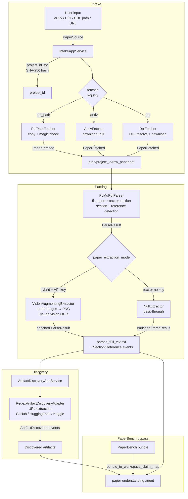

> **ReproLab Explainer** · [Index](./00-start-here.md) · [‹ Prev](./05-sandboxes-and-environments.md) · [Next ›](./07-state-events-persistence.md)

# 06 — Ingestion

*How a raw paper reference — an arXiv ID, a DOI, a local PDF, or a vendored PaperBench bundle — becomes clean, structured, queryable knowledge that the pipeline can act on.*

## In one paragraph

Ingestion is a three-phase funnel: **intake** fetches the paper from its source (arXiv, DOI resolver, local file system, or remote URL) and stages it on disk; **parsing** runs PyMuPDF over the PDF to extract `full_text`, sections, references, and figures, then optionally runs a Claude-vision augmentation pass to enrich scanned or figure-heavy pages; **discovery** scans the parsed text for external artifact references — GitHub repos, HuggingFace datasets, Kaggle datasets — using a regex adapter. Each phase is a small application service sitting over an event-sourced aggregate; all state transitions are recorded as domain events. The final product of ingestion is a blob of full text, a set of structured sections and references, and a list of discovered artifacts, which together form the context the paper-understanding agent reads.

## Why this exists

Before the pipeline can reason about a paper, it needs a reliable, normalized text representation of it. Papers arrive in inconsistent forms — a user might paste an arXiv URL, type a DOI, upload a PDF, or reference a vendored PaperBench bundle. PDF text layers vary wildly: some are clean, some are scanned images with no embedded text. References to code repositories and datasets are buried in unstructured prose. Ingestion solves all of this in one place: normalizing the source, materializing the PDF on disk, extracting clean text (falling back to Claude-vision OCR when the text layer is empty), and pulling out structured references before any agent sees the paper. Without this funnel the agents would have to reinvent source normalization, error handling, and idempotency themselves — and they'd each see different text for the same paper.

## Phase 1 — Intake: fetch and stage the PDF

### Source normalization

The user submits a **`PaperSource`** — a discriminated union of three types (`backend/services/ingestion/intake/sources.py:83`):

| Kind | Type | Example input |
|---|---|---|
| `pdf_path` | `PdfPath` | `/home/user/attention.pdf` |
| `arxiv` | `ArxivId` | `2005.14165` or `https://arxiv.org/abs/2005.14165` |
| `doi` | `DoiRef` | `10.1145/3025453.3025907` or `https://doi.org/10.1145/3025453.3025907` |

Each type's Pydantic validator normalizes the raw string at construction time — stripping `https://doi.org/` prefixes, extracting the bare arXiv ID from a full URL, and so on (`sources.py:42-79`). This means the rest of the codebase always sees a clean canonical identifier.

### Deterministic project IDs

The **`IntakeAppService`** (`intake/service.py`) derives a deterministic `project_id` for every source by SHA-256-hashing a typed prefix and the normalized identifier (`service.py:248-271`). The same arXiv ID always produces the same `prj_<16-char-hex>`. This makes `RegisterProject` idempotent: if you submit the same paper twice, the service detects it is already in `REGISTERED` state and returns the existing ID without writing new events (`service.py:109-113`).

### Fetchers — one per source kind

Each source kind is handled by a concrete **`IntakeFetcher`** that implements a three-method `Protocol` (`intake/fetchers/interface.py:34-46`): a `kind` property (matching `source.kind`) and a `fetch(source, project_id)` method that returns a `FetchResult` with `raw_paper_path`, `pdf_sha256`, and `pdf_size_bytes`. Failures raise `IntakeFetchError` with a stable `cause_kind` string and a `retryable` boolean.

| Fetcher | File | What it does |
|---|---|---|
| `PdfPathFetcher` | `fetchers/pdf_path.py` | Validates magic bytes (`%PDF-`) and 100 MB cap; copies file to `runs/{project_id}/raw_paper.pdf` while computing SHA-256 in one streaming pass |
| `ArxivFetcher` | `fetchers/arxiv.py` | Constructs `https://arxiv.org/pdf/{id}` and delegates to `download_pdf` |
| `DoiFetcher` | `fetchers/doi.py` | Constructs `https://doi.org/{doi}` with `Accept: application/pdf` and delegates to `download_pdf` |
| `RemotePDF` (shared) | `fetchers/remote_pdf.py` | `download_pdf()` helper used by arXiv and DOI fetchers — 30s timeout, magic-byte check, atomic `os.replace` from a `.tmp` file |

The service selects the right fetcher by looking up `agg.source.kind` in a `dict[str, IntakeFetcher]` registry (`service.py:162`). An unregistered `kind` records a `PaperFetchFailed` event (retryable=False) rather than crashing.

### Fetch failure semantics

The aggregate (`intake/aggregate.py`) tracks three states: `NEW → REGISTERED → FETCHED`. A fetch failure keeps the aggregate in `REGISTERED` (`aggregate.py:124-126`), so retrying the `FetchPaper` command works without re-registering. A `ConcurrencyError` on a write-race is handled gracefully — the loser reloads the aggregate and returns the winner's project ID (`service.py:128-133`).

## Phase 2 — Parsing: from PDF to structured text

### PyMuPDF base pass

`ParserAppService` (`parser/service.py`) drives parsing. It requires the project to be in `FETCHED` state, then calls `PyMuPdfParser.parse()` (`parser/pymupdf_parser.py`), which:

1. Opens the PDF with `fitz.open()`.
2. Concatenates all pages' text via `page.get_text("text")` into `full_text` (`pymupdf_parser.py:125-129`).
3. Applies two-pass heuristic section detection — numbered headings (`3.1 Method`) and known top-level names (`Abstract`, `Introduction`, etc.) — emitting a `Section` per heading with `title`, `text`, `char_offset`, and `depth` (`pymupdf_parser.py:132-198`). Falls back to a single `Document` section if no headings are found, so the pipeline never blocks on parse heuristics.
4. Scans the References section for arXiv IDs and DOIs, emitting a `Reference` per citation block with a stable `ref_<hash>` ID (`pymupdf_parser.py:200-233`).

The parser intentionally emits no `Figure` objects in the current slice — `figures=()` — leaving that for the vision pass.

### Vision augmentation pass (hybrid mode)

After the base parse, `ParserAppService` calls `self._extractor.extract(...)` (`parser/service.py:141-151`). The extractor is a `PaperExtractor` protocol with a strict contract: **`extract()` must never raise** (`parser/extractor.py:8`). If it throws, the service logs the exception and continues with the base result.

The concrete implementation is `VisionAugmentingExtractor` (`parser/extractor.py:70`). It is activated when `paper_extraction_mode == "hybrid"` (the default; `backend/config.py:105`). Here is what it does:

1. **Availability check.** Calls `ClaudeVisionClient.is_available()` (`parser/vision.py:53`), which returns `False` if `anthropic_api_key` is empty or the `anthropic` SDK is not installed. If unavailable, returns the base result unchanged — making the feature safe to use without an API key.
2. **Candidate page selection.** For each PDF page, it measures the embedded-text length. Pages below 120 characters (`TEXT_DENSITY_THRESHOLD`, `extractor.py:27`) are considered scanned/image-only. Pages referenced by existing `Figure` objects are also included. At most 12 pages are processed (`MAX_VISION_PAGES`, `extractor.py:29`).
3. **Per-page vision call.** Each candidate page is rendered to PNG at 150 DPI via `page.get_pixmap(dpi=150).tobytes("png")` and sent to Claude with a structured prompt (`parser/vision.py:20-32`) that asks for full transcription and figure/table/equation descriptions.
4. **Enrichment.** Scanned-page transcriptions are appended to `full_text`; a `[Visual Content]` appendix section is added with per-page descriptions; `Figure` objects are enriched with their description text (`extractor.py:190-225`).

The factory function `extractor_from_settings()` (`extractor.py:228-234`) wires the right extractor at startup: `hybrid` → `VisionAugmentingExtractor(ClaudeVisionClient(model=settings.paper_extraction_vision_model))`, anything else → `NullExtractor`.

### Parsing events and the blob

Each `Section`, `Reference`, and `Figure` is recorded as an individual domain event (`SectionExtracted`, `ReferenceExtracted`, `FigureExtracted` — `parser/events.py`). The full text is written to `runs/{project_id}/parsed_full_text.txt` and its SHA-256 recorded in `ParsingCompleted` (`parser/service.py:173-186`). These events are the durable record; the file is a materialized view.

## Phase 3 — Discovery: finding external artifacts

`ArtifactDiscoveryAppService` (`discovery/service.py`) reads the `parsed_full_text.txt` blob path from the `ParsingCompleted` event and runs a list of **`DiscoveryAdapter`** instances over the text (`service.py:129-134`).

### The adapter interface

```python
class DiscoveryAdapter(Protocol):
    @property
    def name(self) -> str: ...
    def discover(self, *, project_id: str, text: str) -> Sequence[DiscoveredArtifact]: ...
```
(`discovery/adapters/interface.py:17-23`)

The Protocol makes it trivial to swap in an LLM-backed adapter later — the service doesn't care about implementation.

### The regex adapter

`RegexArtifactDiscoveryAdapter` (`discovery/adapters/regex.py`) is the only adapter currently wired. It:

1. Finds all `https?://...` URLs in the text with a single compiled regex.
2. Parses each URL and pattern-matches the host+path against GitHub (`github.com/{owner}/{repo}`), HuggingFace datasets (`huggingface.co/datasets/{owner}/{name}`), and Kaggle datasets (`www.kaggle.com/datasets/{owner}/{name}`).
3. Emits a `DiscoveredArtifact` with `kind` (repository/dataset/issue/discussion), a stable namespaced `locator` (e.g. `github:openai/baselines`), a 160-character `evidence_quote` from the surrounding text, and a default `confidence` of 0.9.
4. De-duplicates by `(kind, locator)` — the first occurrence wins.

Non-matching URLs are silently skipped. A malformed URL that makes `urlparse` raise is caught and skipped with a comment — a lesson learned from a production crash where paper text contained brackets that looked like IPv6 literals (`learn.md:682-703`, `CHANGELOG.md:343-350`).

Each discovered artifact is emitted as an `ArtifactDiscovered` event; deduplication happens in `_run_adapters` by maintaining a `dict` keyed on `(kind.value, locator)` (`discovery/service.py:131-134`).

## The structured product of ingestion

After all three phases, downstream agents have:

| Artifact | Location | Schema |
|---|---|---|
| Full text (+ vision transcription) | `runs/{project_id}/parsed_full_text.txt` | Plain UTF-8 |
| Sections | Event store (`SectionExtracted` events) | `parser/model.py:Section` |
| References | Event store (`ReferenceExtracted` events) | `parser/model.py:Reference` |
| Discovered artifacts | Event store (`ArtifactDiscovered` events) | `discovery/model.py:DiscoveredArtifact` |

All IDs are **content-addressed**: `section_id_for()` hashes `(project_id, depth, char_offset, title, text)` so re-parsing the same PDF produces the same IDs (`parser/model.py:20-40`).

The paper-understanding agent reads the full text and sections to produce a `PaperClaimMap` — the reasoning step is covered in `./03-agents-and-runtime.md`.

## The PaperBench adapter

PaperBench papers arrive pre-processed in a vendored bundle (under `third_party/paperbench/`), not as raw PDFs. The adapter `backend/services/ingestion/paperbench/adapter.py:bundle_to_workspace_claim_map()` bypasses the three-phase funnel entirely. It reads the bundle's `paper.md`, `addendum.md`, task instructions, and rubric JSON, assembles them into the `entries` list that the paper-understanding agent expects, and injects a `project_id` of the form `paperbench_{paper_id}` (`adapter.py:49`). The orchestrator detects this prefix and routes to the bundle rubric source (`orchestrator.py:137-143`). No fetcher, no PyMuPDF, no vision — but the downstream agent contract is identical.

## Diagram



## How it connects

- **`./03-agents-and-runtime.md`** — the paper-understanding agent is the first consumer of `parsed_full_text.txt` and the section events; it produces `PaperClaimMap` from them.
- **`./07-state-events-persistence.md`** — each ingestion phase owns at least one aggregate (`ProjectAggregate`, `ParsedPaperAggregate`, `DiscoveryAggregate`) whose state is built by replaying domain events through an `EventStore`. The `aggregate.py` / `events.py` / `service.py` pattern in every ingestion package is described there.
- **`./05-sandboxes-and-environments.md`** — ingestion itself runs in-process on the backend host; the sandbox is not involved until the pipeline starts executing code at `ENVIRONMENT_BUILT`.
- **`./04-verification-and-trust.md`** — Gate 1 relies on the `PaperClaimMap` that the paper-understanding agent produces from ingestion output; ingestion quality directly sets the fidelity ceiling for reproduction.
- **`./08-frontend-and-ops.md`** — the Lab UI submits the paper reference (arXiv ID, PDF upload, or DOI) that becomes a `PaperSource`, and the `project_id` computed at registration is what the frontend uses to poll run status.

## Production Hardening

1. **PyMuPDF runs in-process.** `pymupdf_parser.py:12-14` explicitly notes that subprocess isolation (spec §8.10) is a future follow-up. A malformed or adversarial PDF handed to `fitz.open()` can crash or hang the backend process. Production hardening: run the parser in a subprocess with a wall-clock timeout and a strict resource limit, surfacing failure as a `ParseError` with `cause_kind="pdf_open_failed"`.

2. **Vision cost is unbounded at scale.** `MAX_VISION_PAGES = 12` (`extractor.py:29`) caps per-document API calls, but there is no per-run budget or circuit breaker. A batch of 1,000 scanned papers could incur thousands of Claude-vision calls. Production hardening: add a per-run and per-day budget in `Settings`, tracked against a cost ledger similar to `cost_ledger.jsonl` that the resilience layer already maintains for agent invocations.

3. **Discovery adapter is regex-only.** `RegexArtifactDiscoveryAdapter` finds URLs that are explicitly written as `https://github.com/...`. A paper that says "available at github.com/openai/baselines" without a scheme, or names a dataset without a URL, produces no artifact. Production hardening: add an LLM-backed adapter behind the same `DiscoveryAdapter` Protocol that extracts artifact mentions from prose — the adapter interface already makes this a drop-in addition.

4. **DOI resolution follows redirects blindly.** `DoiFetcher` sends a request to `https://doi.org/{doi}` and expects a PDF in return (`fetchers/doi.py:43`). Many publishers redirect DOIs to HTML landing pages, not PDFs. The `not_a_pdf` check will catch these, but the error is non-retryable, and the pipeline stalls. Production hardening: follow redirects, inspect `Content-Type`, and if the final URL is not `application/pdf`, surface a structured `doi_resolves_to_html` error code so the operator can intervene.

5. **Full-text blob is a side-channel.** `parsed_full_text.txt` is read by `ArtifactDiscoveryAppService` via a file path stored in the `ParsingCompleted` event payload (`discovery/service.py:138-148`). If `runs/` is on a different mount or the file is deleted, discovery fails with an unrecoverable `DiscoveryError` even though the event log is intact. Production hardening: store the full text in the event store as a blob reference (using a content-addressed object store), not as a bare file path, so the path is just a cache.

## Key files

| File | Role |
|---|---|
| `backend/services/ingestion/intake/sources.py` | `PaperSource` discriminated union; arXiv/DOI normalization validators |
| `backend/services/ingestion/intake/service.py` | `IntakeAppService` — `RegisterProject` and `FetchPaper` commands; `project_id_for` hash function |
| `backend/services/ingestion/intake/aggregate.py` | `ProjectAggregate` state machine: `NEW → REGISTERED → FETCHED` |
| `backend/services/ingestion/intake/fetchers/interface.py` | `IntakeFetcher` Protocol and `FetchResult` |
| `backend/services/ingestion/intake/fetchers/pdf_path.py` | Local PDF copy with magic-byte validation and SHA-256 |
| `backend/services/ingestion/intake/fetchers/arxiv.py` | arXiv PDF download |
| `backend/services/ingestion/intake/fetchers/doi.py` | DOI → PDF download via doi.org resolver |
| `backend/services/ingestion/intake/fetchers/remote_pdf.py` | Shared `download_pdf()` with timeout, size cap, atomic write |
| `backend/services/ingestion/parser/service.py` | `ParserAppService` — drives parse + augmentation; writes `parsed_full_text.txt` |
| `backend/services/ingestion/parser/pymupdf_parser.py` | PyMuPDF text extraction; section and reference heuristics |
| `backend/services/ingestion/parser/extractor.py` | `VisionAugmentingExtractor`, `NullExtractor`, `extractor_from_settings()` |
| `backend/services/ingestion/parser/vision.py` | `ClaudeVisionClient` — page-to-PNG rendering + Anthropic messages API call |
| `backend/services/ingestion/parser/model.py` | `Section`, `Reference`, `Figure`; content-addressed ID functions |
| `backend/services/ingestion/parser/interface.py` | `Parser` Protocol, `ParseResult`, `ParseError` |
| `backend/services/ingestion/discovery/service.py` | `ArtifactDiscoveryAppService` — runs adapters, emits `ArtifactDiscovered` events |
| `backend/services/ingestion/discovery/adapters/interface.py` | `DiscoveryAdapter` Protocol |
| `backend/services/ingestion/discovery/adapters/regex.py` | `RegexArtifactDiscoveryAdapter` — URL extraction for GitHub/HuggingFace/Kaggle |
| `backend/services/ingestion/discovery/model.py` | `DiscoveredArtifact`, `DiscoveredArtifactKind` |
| `backend/services/ingestion/paperbench/adapter.py` | `bundle_to_workspace_claim_map()` — PaperBench bypass path |
| `backend/config.py` | `paper_extraction_mode` (default `"hybrid"`), `paper_extraction_vision_model` |

---

**The ReproLab Explainer** — jump to any chapter:

[**00 · Start Here**](./00-start-here.md)  ·  [**01 · Overview**](./01-overview.md)  ·  [**02 · The Pipeline**](./02-the-pipeline.md)  ·  [**03 · Agents & Runtime**](./03-agents-and-runtime.md)  ·  [**04 · Verification & Trust**](./04-verification-and-trust.md)  ·  [**05 · Sandboxes**](./05-sandboxes-and-environments.md)  ·  ▸ **06 · Ingestion**  ·  [**07 · State & Events**](./07-state-events-persistence.md)  ·  [**08 · Frontend & Ops**](./08-frontend-and-ops.md)

‹ [**05 · Sandboxes**](./05-sandboxes-and-environments.md)  ·  [**07 · State & Events**](./07-state-events-persistence.md) ›
