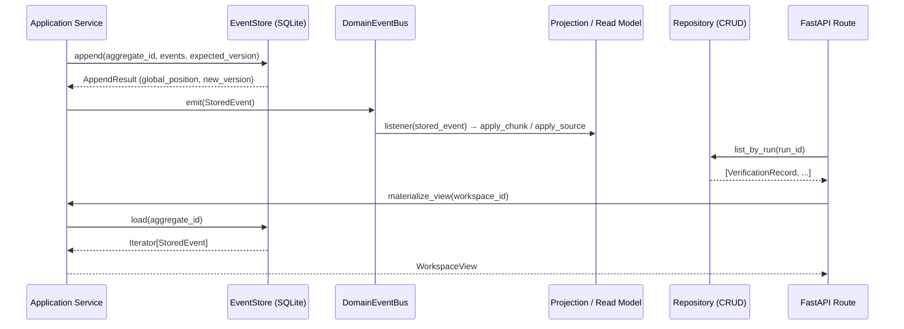

> **ReproLab Explainer** · [Index](./00-start-here.md) · [‹ Prev](./06-ingestion.md) · [Next ›](./08-frontend-and-ops.md)

# 07 — State, Events & Persistence

*How ReproLab remembers everything: an event-sourced core, two complementary persistence layers, and the context/knowledge machinery that gives agents grounded access to the paper and the reproduction code.*

## In one paragraph

Every domain mutation in ReproLab is an **append-only domain event** written to a SQLite event store (`backend/eventstore/`). Commands express intent; events record facts. Projections replay those events into read models that repositories serve. On top of this event-sourcing spine, the orchestrator also writes a parallel **file-backed state tree** (`runs/<project_id>/`) containing `pipeline_state.json` and a family of `*.jsonl` ledgers that the Next.js frontend reads directly. Above both persistence layers, the **context/knowledge layer** (`backend/services/context/`) gives agents a queryable view of the paper and the reproduction code: an indexer chunks sections into a `SourcesProjection`; a `KnowledgeGraphService` holds the Python AST graph; a `ChromaEmbeddingStore` powers vector search; and a `CrossProjectMemoryService` persists reusable findings across runs. Agents reach all of this through workspace tools — `rlm_query`, `semantic_search`, `graph_query`, `lookup`, and friends.

## Why this exists

An autonomous pipeline that reproduces ML papers can take hours, involve dozens of LLM calls, and crash at any point. Without durable state:

- **A crash at stage 9 means restarting from stage 1.** Event sourcing gives crash-resume: on restart the orchestrator replays the event log to restore aggregate state and re-enters at the last saved `PipelineStage`.
- **Agents cannot verify their own claims.** Without a grounded, queryable representation of the paper, each agent re-reads a raw prompt dump. The workspace/context layer lets agents ask targeted questions and receive cited answers.
- **Debugging a failed run is impossible.** Append-only logs with correlation IDs let you replay exactly what happened; mutable state does not.
- **Two frontends need the same data.** The React dashboard cannot open a SQLite connection; the orchestrator's `pipeline_state.json` is a flat JSON file the Next.js server-side payload reads without a database driver.

## The event store

The **event store** is the source of truth for all domain aggregates. The interface is defined in `backend/eventstore/interface.py`; the only production implementation is `SqliteEventStore` in `backend/eventstore/sqlite_store.py`.

### Schema

Three SQLite tables, all prefixed `event_store_` (`sqlite_store.py:52-90`):

| Table | Purpose |
|---|---|
| `event_store_events` | One row per domain event. `global_position` (AUTOINCREMENT) is the total ordering key; `aggregate_id + aggregate_version` is the per-stream ordering key. |
| `event_store_subscription_checkpoints` | Last ack'd `global_position` per `(subscription_name, consumer_id)`. Survives process restarts. |
| `event_store_subscription_redelivery` | Events held back for redelivery after `nack()`, with an `available_at` timestamp. |

### Append semantics

`EventStore.append()` (`interface.py:162`) atomically:
1. Checks `current_version == expected_version` (optimistic concurrency). A stale caller raises `ConcurrencyError` (`interface.py:29`).
2. Re-validates every event payload through its registered Pydantic class — a defense-in-depth gate against `model_construct` bypasses (`sqlite_store.py:200-207`).
3. Detects whole-batch duplicate `event_id`s and short-circuits as a no-op idempotent re-emit. A _partial_ duplicate raises `DuplicateEventError` (`sqlite_store.py:213-254`).

### WAL mode and crash safety

`SqliteEventStore` opens every connection with `PRAGMA synchronous=FULL` (`sqlite_store.py:123`). This is intentional: a prior pipeline crash (`learn.md:2026-05-09`) corrupted the event store by killing a process between the WAL write and the checkpoint in `synchronous=NORMAL` mode. `FULL` trades a small write throughput hit for durability — the right call for a single-writer append-only store.

### Threading model

The `EventStore` is fully synchronous. Each thread gets its own `sqlite3.Connection` via `threading.local()` (`sqlite_store.py:153-160`). WAL mode permits N readers + 1 writer concurrently; there is no Python-level write lock. The `busy_timeout=5000` pragma gives writers 5 seconds to acquire SQLite's single writer lock before raising.

### Subscriptions

`Subscription` (`interface.py:91`) is a durable, pull-based cursor over `event_store_events`. The concrete `SqliteSubscription` (`subscription.py:38`) polls on a 250ms interval (`subscription.py:34`). Key properties:

- `(subscription_name, consumer_id)` identifies a unique checkpoint. Two consumer_ids on the same `subscription_name` get **independent** positions — used for fan-out (e.g., a projection and a coordinator sharing a stream filter without blocking each other).
- `ack()` advances the checkpoint forward only; it never moves backward (`subscription.py:142-166`).
- `nack()` inserts a row into `event_store_subscription_redelivery` with an `available_at` timestamp; the iterator re-delivers it after that time (`subscription.py:168-181`).
- `tail_behavior="exit_at_tail"` is used in tests; `"block"` (the default) is used in production coordinators (`subscription.py:45-46`).

## The message bus and messaging primitives

### Commands vs events

**Commands** (`messaging/command.py`) express intent — a request to the application service. They carry a `command_id` and are _never stored_; only their outcomes (the resulting events) are.

**Domain events** (`messaging/event.py:37`) are immutable facts. Every subclass declares `event_type: ClassVar[str]` and `schema_version: ClassVar[int]`, and is registered with `@register_event` so the store can look up the correct Pydantic class on load (`event.py:124-156`). `model_construct` is overridden to raise `InvariantBypassError` — production code cannot bypass Pydantic validation (`event.py:56-68`).

**`StoredEvent`** (`event.py:71`) is what the store returns: the payload dict plus envelope metadata plus position info. `.into(cls)` deserializes and re-validates the payload into the typed `DomainEvent` (`event.py:90-109`).

### Envelopes and IDs

Every stored event carries an **`EventEnvelope`** (`messaging/envelope.py:109`) with:
- `event_id` — a ULID; unique across the store.
- `correlation_id` — pinned to the originating user request, propagated through every downstream event.
- `causation_id` — the `event_id` of the parent event in the causal chain.
- `source` — the producing module path (e.g., `"context.indexer.service"`).

IDs are Crockford-base32 ULIDs, generated in-process with monotonic same-millisecond ordering (`envelope.py:52-90`).

### Idempotency table

**`IdempotencyTable`** (`messaging/idempotency.py:72`) stores `(aggregate_id, command_id) → [event_id, ...]` in an `event_store_command_idempotency` table. Before executing any command with IO side effects, the application service calls `lookup()`. A hit returns the original event IDs without re-executing. A miss proceeds normally and calls `record()` inside the same transaction as the event append. Rows expire after 30 days by default (`idempotency.py:77`).

Idempotency matters here because the orchestrator retries entire pipeline stages on crash-resume. Without it, a re-issued `StartIndexing` command would re-run the chunker and try to append events that already exist — producing either a `ConcurrencyError` or a `DuplicateEventError` depending on timing.

### DomainEventBus

`DomainEventBus` (`messaging/bus.py:29`) is an in-process broadcast channel. It is **not** the source of truth — that is the event store. The bus is used by projections, coordinators, and the `EventPayloadBridge` that translates domain events into dashboard `EventPayload` notifications. Listener exceptions are isolated; one bad listener cannot kill others (`bus.py:68-80`).

## CQRS: writes vs reads

ReproLab follows a light **CQRS** split:

- **Writes** go through application services, which validate a command, load the aggregate from the event store, call a domain method to produce events, and append them atomically.
- **Reads** are served by repositories or projections that project the event stream into flat structures the API layer can return directly.

### Repositories (CRUD read models)

Five repositories in `backend/persistence/repositories/` serve the operational read side:

| Repository | Table | What it serves |
|---|---|---|
| `RunRepository` | `runs` | Run status, type, parent linkage for the API |
| `TaskRepository` | `agent_tasks` | Task status, agent type, parent for task-tree queries |
| `ArtifactRepository` | `artifacts` | Artifact paths by run for the artifact API |
| `MessageRepository` | `agent_messages` | Agent message history by agent ID |
| `VerificationRepository` | `verifications` | Gate scores and blocking issues by run |

These all read from the `Database` class (`persistence/database.py:9`), which opens a _different_ SQLite connection (no `threading.local`, no `synchronous=FULL`) from the event store's `SqliteEventStore`. Both point at the same file path via `REPROLAB_DATABASE_URL`, with table prefixes (`event_store_*`) preventing collisions.

> **Note on the persistence/Database split:** `persistence/database.py` opens connections without `PRAGMA synchronous=FULL` (`database.py:19-22`), unlike `eventstore/sqlite_store.py`. The CRUD tables are less write-critical than the event log, but a SIGKILL during a CRUD write could still leave partial rows. This is a production hardening gap.

## The DDD aggregate pattern

All non-trivial services follow the same five-file pattern. Understanding it once unlocks every service in `backend/services/`:

```
<service>/
  aggregate.py    # Pure state machine. apply() folds events onto state.
  events.py       # @register_event subclasses — the domain vocabulary.
  model.py        # Value objects (Chunk, SourceRef, GraphNode, …).
  projections.py  # In-memory or SQLite read model rebuilt from events.
  service.py      # Application service: receives commands, loads aggregate,
                  # appends events, updates projection.
```

### Worked example: the indexer

**`IndexAggregate`** (`context/indexer/aggregate.py:36`) is a pure dataclass with a state machine (`IndexState`: PENDING → INDEXING → INDEXED | FAILED). Its `handle_start()` method validates the transition and returns a list of events without touching the store (`aggregate.py:49-60`). `apply()` folds one event onto the aggregate's fields (`aggregate.py:62-79`). No I/O.

**`IndexerAppService.start_indexing()`** (`context/indexer/service.py:89`) follows the canonical service flow:
1. Load the parsed-paper aggregate by replaying events: `self._store.load(aggregate_id)` → `agg.apply()` for each (`service.py:290-295`).
2. Guard against invalid state (index must be PENDING or FAILED).
3. Call `agg.handle_start(...)` to get the `IndexingStarted` event — no I/O yet.
4. `self._store.append(aggregate_id, ..., expected_version=agg.version, ...)` — atomic write with optimistic concurrency.
5. `agg.apply_all(events)` — mutate in-memory aggregate to reflect the new state.
6. Repeat for `SourceRegistered` × N + `ChunkCreated` × M + `IndexingCompleted`.

The service never mutates the aggregate directly. All state changes flow through appended events. A crashed process that re-issues `StartIndexing` replays the log, finds the aggregate already INDEXED, and returns idempotently (`service.py:107`).

**`SourcesProjection`** (`context/indexer/projections.py:19`) is an in-memory dict of `SourceRef`s and `Chunk`s. It is rebuilt by replaying the index aggregate's event stream (`service.py:161-171`). Downstream services (`WorkspaceAppService`) call `project_into_projection()` to get a filled projection without touching the store again.

The `workspace/`, `graph/`, `memory/`, and `ingestion/` services all follow this same shape.

## Flow diagram



## The two faces of run state

Every pipeline run has **two parallel persistence layers**. They are complementary, not redundant.

### The SQLite event store

`REPROLAB_DATABASE_URL` (`backend/cli.py:637`) points at the single SQLite file that holds all event store tables plus all CRUD tables. Aggregates live here: `{project_id}:index`, `{project_id}:parsed`, workspace IDs, etc. This is the authoritative audit log — the event log can replay the entire pipeline from scratch.

### The file-backed `runs/<project_id>/` directory

The orchestrator writes a parallel directory tree for every run. Files the frontend and ops tooling read directly:

| File | What it holds |
|---|---|
| `pipeline_state.json` | Current `PipelineStage`, gate decisions, assumption ledger, paper claim map, etc. Written by `PipelineState.save_checkpoint()` (`orchestrator.py:225`). The Next.js bridge reads this for the UI stage counter. |
| `agent_telemetry.jsonl` | One JSON line per agent call with timing and token counts. Append-only. |
| `cost_ledger.jsonl` | Per-call cost records. Accumulated by `RunCostLedger` (`orchestrator.py:444`). |
| `dashboard_events.jsonl` | Serialized `EventPayload` objects the SSE bridge tails. Read by `live_runs.py`. |
| `artifact_index.json` | Structured artifact discovery output. |
| `raw_paper.pdf` | The original paper binary. |
| `hermes/` | Hermes audit report files. |

**Why both?** The event store is authoritative but requires a SQLite driver and Python to read. The file tree is directly accessible to Next.js server-side code (file I/O, no DB) and to humans debugging a run with `jq`. The file tree is also the crash-resume checkpoint: `PipelineState.load_checkpoint()` (`orchestrator.py:300`) boots a fresh orchestrator instance from the last saved `pipeline_state.json`, bypassing the need to replay the full event log for orchestrator-level state.

> For a deeper look at how the orchestrator uses `pipeline_state.json` as a crash-resume checkpoint, see `./02-the-pipeline.md`. For how `dashboard_events.jsonl` feeds the SSE bridge that powers the live UI, see `./08-frontend-and-ops.md`.

## The context / knowledge layer

Once a paper is ingested and indexed, agents need to ask questions about it. `backend/services/context/` provides four specialized stores and a set of workspace tools that sit on top of them.

### 1 — Indexer + section chunker

`IndexerAppService` (`context/indexer/service.py`) reads parsed sections from the event log and converts them into:

- **`SourceRef`** — one per section, reference, or discovered artifact. A named pointer to a piece of the paper.
- **`Chunk`** — one per section, produced by `SectionChunker` (`indexer/chunkers/section.py:22`). Each chunk carries the section text, a char-offset span, and a content-addressed ID.

`SectionChunker` sorts incoming sections by `(depth, char_offset, section_id)` before chunking, so chunk IDs are deterministic across runs (`section.py:36-37`). The results land in the event store as `ChunkCreated` events and in `SourcesProjection` as an in-memory read model.

### 2 — Knowledge graph (code AST)

`KnowledgeGraphService` (`context/graph/service.py:40`) stores `GraphNode`s and `GraphEdge`s in two SQLite tables (`knowledge_graph_nodes`, `knowledge_graph_edges`). The graph is populated by `PythonAstGraphBuilder` (`context/graph/ast_builder.py:30`), which walks every `*.py` file in the reproduced repository using Python's `ast` module — no LLM, fully deterministic. It extracts:

- **Nodes**: `module`, `class`, `function`, `method`, `external_symbol`.
- **Edges**: `defines`, `imports`, `inherits`, `calls`.

`KnowledgeGraphService.query()` supports structured filters: `graph_query("function", calls="train")` or `graph_query("module", imports="torch")` (`graph/service.py:204-248`).

### 3 — Semantic store (vector embeddings)

`ChromaEmbeddingStore` (`context/semantic/store.py:58`) wraps [Chroma](https://www.trychroma.com/) with the `all-MiniLM-L6-v2` ONNX model — no API key needed, fully in-process. Chunks from the indexer are embedded and stored for cosine-similarity lookup (`store.py:97-135`). `WorkspaceAppService` auto-wires Chroma during `build_workspace()` if `chromadb` is installed (`workspace/service.py:384-407`). When Chroma is unavailable, `SemanticSearchTool` falls back to a deterministic BM25 ranker (`workspace/tools/semantic_search.py:106-148`).

### 4 — Cross-project memory

`CrossProjectMemoryService` (`context/memory/service.py:32`) stores typed `MemoryRecord`s in a `cross_project_memory` SQLite table. Records have a `kind` (`environment_recipe`, `failure_mode`, `insight`, etc.), a confidence score, and evidence refs. Search is a simple BM25 token-match (`memory/service.py:209-238`). This is the **reuse layer**: a finding from paper A (e.g., "PyTorch 2.1 + CUDA 11.8 works for this architecture") is persisted and surfaced to paper B.

### Workspace tools

`WorkspaceAppService.build_workspace()` preloads three variables — `paper_text`, `paper_sections`, `claim_map` — as `VariableLoaded` events in the workspace aggregate (`workspace/service.py:178-244`). Agents then call workspace tools to interrogate those variables:

| Tool | Class | What it does |
|---|---|---|
| `list_variables` | `ListVariablesTool` | Enumerate variable names, scopes, and key structure in a workspace |
| `inspect_variable` | `InspectVariableTool` | Return a variable's full value and all attached citations |
| `rlm_query` | `RlmQueryTool` | Recursive LLM sub-query (see below) |
| `semantic_search` | `SemanticSearchTool` | Vector (Chroma) or BM25 search over indexed chunks |
| `graph_query` | `GraphQueryTool` | Structural AST graph lookup (`function calls="train"`, `module imports="torch"`) |
| `lookup` | `LookupTool` | Exact `SourceRef` retrieval by `source_id` |
| `web_search` | `WebSearchTool` | Tavily or DuckDuckGo fallback for external queries |

Every tool returns `Cited[dict]` — the result value plus a tuple of `Citation` objects that carry `source_id`, `chunk_id`, `quote`, `locator`, and `confidence`. Citations are the provenance chain: they trace every agent claim back to the paper or the codebase.

When a tool is called through the workspace service, a `ToolInvoked` event is appended to the workspace aggregate (`workspace/events.py:75`). This makes tool call history replayable and auditable.

### RLM: recursive querying over large variables

**RLM** (**R**ecursive **L**anguage **M**odel querying, `context/workspace/tools/rlm_query.py`) addresses the core problem of context bloat: the paper text after PDF extraction can exceed 150k characters — far more than fits in a single model call without degrading attention quality.

The loop shape (from the docstring, `rlm_query.py:8-26`):

```
recursive_query(content, question, depth):
    if len(content) <= leaf_budget:           # fits in one call
        return llm_answer(content, question)
    if depth >= max_depth:                    # depth limit reached
        return llm_answer(truncate(content), question)
    chunks = chunk(content, chunk_size)
    if len(chunks) > selection_top_k:
        relevant_idx = llm_select(chunks, question, top_k)
    sub_answers = [recursive_query(chunks[i], question, depth + 1) for i in relevant_idx]
    return llm_aggregate(question, sub_answers)
```

Defaults: `leaf_budget=12_000` chars, `chunk_size=12_000`, `max_depth=3`, `max_llm_calls=24` (`rlm_query.py:64-68`). A typical research paper (~80k chars) hits the leaf base case in a single L1 chunk; a 1M-char experiment log triggers full recursion. Hard caps prevent runaway cost.

`RlmQueryTool.call()` returns `Cited[dict]` with the answer plus telemetry: `depth_reached`, `llm_calls`, `chunks_examined`, `selection_path` (`rlm_query.py:219-236`).

> **Current status**: `RlmQueryTool` is fully implemented and tested but **not yet called from any production code path** (`docs/design/rlm-integration.md:12`). All 18 instantiations live in tests or the `tools/test-rlm-on-paper.py` script. The integration roadmap (`docs/design/rlm-integration.md` §4) targets `rubric-verifier` as the highest-leverage insertion point. Cross-reference `docs/design/rlm-integration.md` for the full wiring plan.

## How it connects

- **← `./06-ingestion.md`**: The ingestion pipeline produces `SectionExtracted`, `ReferenceExtracted`, and `ArtifactDiscovered` events. The indexer reads those events from the event store to build `SourceRef`s and `Chunk`s — making the ingestion pipeline's output the indexer's input via the shared event log.
- **→ `./08-frontend-and-ops.md`**: The `dashboard_events.jsonl` file in `runs/<project_id>/` is the handoff to the frontend. The SSE live-run bridge tails that file and pushes `EventPayload` objects to the browser. The `pipeline_state.json` file is read by the Next.js server-side payload loader.
- **← `./02-the-pipeline.md`**: The 14-stage state machine is the top-level consumer of the event store. Each `PipelineStage` transition calls `PipelineState.advance_stage()`, which writes `pipeline_state.json`. The orchestrator's aggregates (parsed paper, index, workspace) live entirely in the event store.
- **← `./04-verification-and-trust.md`**: Gate decisions are stored as `GateDecision` fields in `PipelineState` (written to `pipeline_state.json`) and as `VerificationRecord` rows (CRUD repository). The `VerificationRepository` serves those records to the verification API.
- **← `./03-agents-and-runtime.md`**: Agents operate inside a workspace. `WorkspaceAppService.enrich_variable()` is how an agent's structured output becomes a queryable workspace variable. The `ToolInvoked` event records every tool call an agent makes.
- **← `./05-sandboxes-and-environments.md`**: Sandboxed code execution produces logs that are candidates for vector indexing and RLM querying. `KnowledgeGraphService.ingest_python_repo()` is called against the cloned reproduction repository inside the sandbox.

## Production hardening

1. **`persistence/Database` uses `synchronous=NORMAL` (implicit default).** `backend/persistence/database.py:19-22` enables WAL but does not set `synchronous=FULL`. A SIGKILL between a CRUD write and checkpoint could corrupt the `agent_tasks`, `runs`, or `verifications` tables. Fix: add `conn.execute("PRAGMA synchronous=FULL")` in `Database._connect()`, mirroring the event store.

2. **`SourcesProjection` is rebuilt in-memory on every request.** `WorkspaceAppService.materialize_view()` (`workspace/service.py:347`) replays the entire workspace aggregate stream on each call. For a run with hundreds of `VariableLoaded` and `VariableEnriched` events, this becomes measurable overhead. The projection comment (`indexer/projections.py:9`) acknowledges this: "SQLite-backed projection comes later." Fix: add a materialized SQLite projection that is updated incrementally via the bus subscription.

3. **`CrossProjectMemoryService.search()` is a full table scan with BM25.** The `cross_project_memory` table has no full-text index (`memory/service.py:209-238`). As the memory table grows across hundreds of reproductions, search latency grows linearly. Fix: add SQLite FTS5 over `(title, summary, tags_json)` or replace with a vector embedding search using the same Chroma store.

4. **`RlmQueryTool` has no production wiring.** The design doc (`docs/design/rlm-integration.md:12`) confirms the tool is dormant in production. Gate verification relies on agent-summarized claims, not source paper text. A false-positive gate pass on a hallucinated claim cannot be caught without RLM grounding. Fix: wire Pattern A from `docs/design/rlm-integration.md §3` into the `rubric-verifier` stage first — it's one call site and the highest accuracy leverage.

5. **The idempotency table has no automatic purge job.** `IdempotencyTable.purge_expired()` (`messaging/idempotency.py:165`) exists but is not called from any scheduled task or FastAPI startup hook. Rows accumulate indefinitely until someone runs the purge manually. Fix: add a `startup` event handler in the FastAPI app that schedules periodic `purge_expired()` calls, or run it as a `asyncio.create_task` once at process boot.

6. **No schema migration path for `DomainEvent` versions.** `sqlite_store.py:417-424` handles unknown `(event_type, schema_version)` pairs gracefully on load, but there is no upcaster registry implementation. Changing a `DomainEvent` payload shape (e.g., adding a required field to `ChunkCreated`) would silently break replay of old events. Fix: implement the upcaster registry described in `messaging/event.py:7` — a `dict[(str, int), Callable]` that the store applies before `.into()`.

## Key files

| File | Role |
|---|---|
| `backend/eventstore/interface.py` | `EventStore`, `Subscription`, `StoreCapabilities` protocols; `ConcurrencyError`, `DuplicateEventError` |
| `backend/eventstore/sqlite_store.py` | `SqliteEventStore` — WAL-mode SQLite event store; DDL; append/load/subscribe |
| `backend/eventstore/subscription.py` | `SqliteSubscription` — polling cursor with ack/nack/redelivery |
| `backend/messaging/bus.py` | `DomainEventBus` — in-process broadcast; listener isolation |
| `backend/messaging/command.py` | `Command` base class, `CommandId` ULID |
| `backend/messaging/event.py` | `DomainEvent`, `StoredEvent`, `@register_event`, `resolve_event_class`, registry |
| `backend/messaging/envelope.py` | `EventEnvelope`, `EventId`/`CorrelationId`/`CausationId`, ULID generator |
| `backend/messaging/idempotency.py` | `IdempotencyTable` — command deduplication with bounded retention |
| `backend/persistence/database.py` | `Database` — CRUD SQLite connection; CRUD schema DDL |
| `backend/persistence/repositories/run_repository.py` | `RunRepository` — run status read model |
| `backend/persistence/repositories/task_repository.py` | `TaskRepository` — task status read model |
| `backend/persistence/repositories/artifact_repository.py` | `ArtifactRepository` — artifact paths by run |
| `backend/persistence/repositories/message_repository.py` | `MessageRepository` — agent messages by agent |
| `backend/persistence/repositories/verification_repository.py` | `VerificationRepository` — gate scores and blocking issues |
| `backend/services/context/indexer/aggregate.py` | `IndexAggregate` — pure indexing state machine |
| `backend/services/context/indexer/events.py` | Indexer domain events (`IndexingStarted`, `ChunkCreated`, etc.) |
| `backend/services/context/indexer/projections.py` | `SourcesProjection` — in-memory chunk/source read model |
| `backend/services/context/indexer/service.py` | `IndexerAppService` — drives the chunker, appends index events |
| `backend/services/context/indexer/chunkers/section.py` | `SectionChunker` — one deterministic chunk per paper section |
| `backend/services/context/graph/ast_builder.py` | `PythonAstGraphBuilder` — Python AST → nodes + edges (no LLM) |
| `backend/services/context/graph/service.py` | `KnowledgeGraphService` — SQLite-backed code graph; structural queries |
| `backend/services/context/semantic/store.py` | `ChromaEmbeddingStore` / `EmbeddingStore` protocol; BM25 fallback |
| `backend/services/context/memory/service.py` | `CrossProjectMemoryService` — cross-run reusable findings |
| `backend/services/context/workspace/service.py` | `WorkspaceAppService` — builds workspaces, preloads variables |
| `backend/services/context/workspace/events.py` | Workspace events (`VariableLoaded`, `ToolInvoked`, `WorkspaceReady`, etc.) |
| `backend/services/context/workspace/tools/rlm_query.py` | `RlmQueryTool` — recursive LLM querying; `ClaudeLlmClient` |
| `backend/services/context/workspace/tools/semantic_search.py` | `SemanticSearchTool` — vector + BM25 chunk search |
| `backend/services/context/workspace/tools/graph_query.py` | `GraphQueryTool` — structural code graph queries |
| `backend/services/context/workspace/tools/lookup.py` | `LookupTool` — exact `SourceRef` lookup |
| `backend/services/context/workspace/tools/list_variables.py` | `ListVariablesTool` — enumerate workspace variables |
| `backend/services/context/workspace/tools/inspect_variable.py` | `InspectVariableTool` — full value + citations for one variable |
| `backend/services/context/workspace/tools/web_search.py` | `WebSearchTool` — Tavily or DuckDuckGo fallback |
| `backend/schemas/events.py` | `EventType` enum, `EventPayload` — dashboard event schema |
| `docs/design/rlm-integration.md` | RLM wiring plan; current status (dormant in production) |

---

**The ReproLab Explainer** — jump to any chapter:

[**00 · Start Here**](./00-start-here.md)  ·  [**01 · Overview**](./01-overview.md)  ·  [**02 · The Pipeline**](./02-the-pipeline.md)  ·  [**03 · Agents & Runtime**](./03-agents-and-runtime.md)  ·  [**04 · Verification & Trust**](./04-verification-and-trust.md)  ·  [**05 · Sandboxes**](./05-sandboxes-and-environments.md)  ·  [**06 · Ingestion**](./06-ingestion.md)  ·  ▸ **07 · State & Events**  ·  [**08 · Frontend & Ops**](./08-frontend-and-ops.md)

‹ [**06 · Ingestion**](./06-ingestion.md)  ·  [**08 · Frontend & Ops**](./08-frontend-and-ops.md) ›
