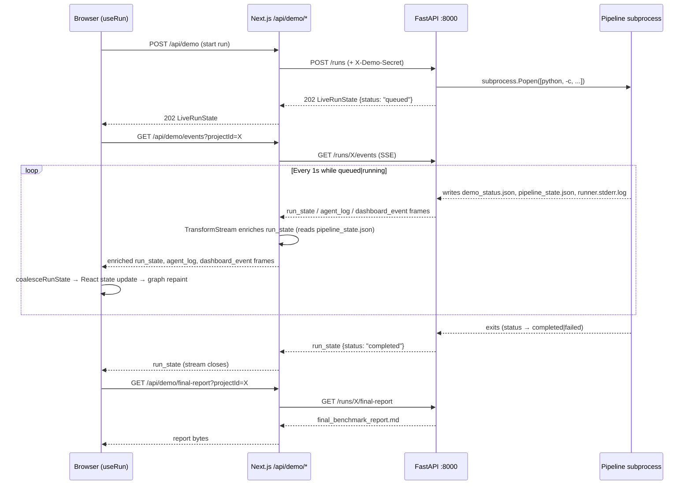

> **ReproLab Explainer** · [Index](./00-start-here.md) · [‹ Prev](./07-state-events-persistence.md)

# 08 — Frontend & Operations

*The lab UI, the server-side proxy that bridges it to the backend, and the configuration, CLI, and deployment surface that keeps it all running.*

## In one paragraph

The lab UI is a Next.js 16 server component at `/lab?projectId=<id>` that makes the URL the single source of truth for a run — a refresh or shared link reopens exactly that run, and `localStorage` auto-resumes an in-flight run on a bare `/lab`. All backend traffic is brokered through Next.js API routes under `/api/demo/*`: the browser never touches the FastAPI service directly, eliminating CORS entirely. The live run experience is driven by a **Server-Sent Events** stream that `live_runs.py` produces (three frame types: `run_state`, `agent_log`, `dashboard_event`); a `TransformStream` in the events proxy enriches every `run_state` frame by reading `pipeline_state.json` from disk before forwarding it to the client. The backend is configured entirely through `REPROLAB_*` environment variables loaded by `backend/config.py`; two CLIs cover headless and PaperBench evaluation; the system ships as a three-stage Docker image with Railway as the tested cloud target.

## Why this exists

Without the UI layer, ReproLab is a Python subprocess and a directory of JSON files. The lab UI turns those files into a live workflow graph that shows which pipeline stages are complete, which gate passed or failed, and what each agent said in the last tool call. Without the server-side proxy, browser CORS would block SSE connections from `localhost:3000` to `localhost:8000` and make arXiv PDF fetches impossible (arXiv does not send `Access-Control-Allow-Origin`). Without the operations surface — config vars, CLIs, Docker, Railway — the system cannot be deployed, reproduced on another machine, or run headlessly in CI.

---

## Part 1 — The Lab UI

### The page entry point: `?projectId=` as source of truth

`frontend/src/app/lab/page.tsx` is a **server component** (it runs once per request on the Next.js server, not in the browser). It reads the `?projectId=` query param and, if present, calls `fetchRunById` to hydrate the run before the page is sent to the client (`lab/page.tsx:22-26`). Four fetches run in parallel: the run state, recent runs for the sidebar, the pipeline topology, and the available models.

```
GET /lab?projectId=abc123
  ↓ server component (Node.js)
  fetchRunById("abc123")          → GET http://127.0.0.1:8000/runs/abc123 → enrichOrTimeout()
  fetchRecentRuns(8)              → GET /api/runs/recent
  fetchTopology()                 → GET /api/pipeline/topology
  fetchModels()                   → GET /api/models
  ↓ SSR result
  <LabShell initialRun={...} />   → hydrated React tree sent to browser
```

The `force-dynamic` export (`lab/page.tsx:12`) opts every request out of Next.js static caching. A run's URL is stable; sharing it or refreshing restores that run. A stale `?projectId=` link that 404s on the backend falls through cleanly — `fetchRunById` never throws, returning `null` on any error (`server-run.ts:38-62`), and the client falls back to the upload view.

When the page is opened without a `?projectId=` (bare `/lab`), the `useRun` hook checks `localStorage` for a key `reprolab:lastRun` on mount and immediately fetches that run if found (`use-run.ts:151-186`). This means a user who closes the browser mid-run and returns later automatically resumes the in-flight view — no bookmarking required.

### `LabShell` — the client component tree

`LabShell` (in `lab-shell.tsx`) is a `"use client"` component that owns all interactivity. Its structure:

```
LabShell
  PresentationModeProvider        ("internal" for /lab, "demo" for /demo)
    TopologyProvider              (wrapped only when topology is non-null)
      LabSidebar                  navigation + recent runs list
      main
        UploadView                when run === null
        WorkflowView              when run !== null && topology !== null
          PanWrap (canvas)        panning, NodeCard nodes, GateChips
          RightPanel              selected-node info or RunOverview
          TelemetryStrip          last-N agent telemetry records
```

Every interactive gesture in the workflow (clicking a node, keyboard j/k navigation) is handled inside `WorkflowView`. The `PresentationMode` context controls which label each node shows — `internal_label` for team use, `demo_label` for the public demo surface.

### The workflow graph: `PipelineTopology` → `stateMapForRun`

The topology (nodes, edges, gates, stages) is fetched from `GET /pipeline/topology` and stored in `TopologyProvider`. It never hardcodes node positions; layout is computed by `lib/pipeline/layout.ts::layoutTopology()`. The backend serves the canonical topology from `backend/agents/topology.py::default_topology()`.

`stateMapForRun` (`node-config.ts:34-161`) translates a backend `PipelineStage` string (e.g. `gate_1_passed`) into a per-node `{done | running | upcoming}` triple for every node in the topology. It covers all 14 stages in order; adding a 15th in `topology.py` automatically extends the mapping without a frontend edit because the function reads the topology's node list dynamically (`node-config.ts:39`).

### Progress strip, gate chips, timeline

**`ProgressStrip`** (`progress-strip.tsx`) ticks at 1 Hz via `setInterval`, parsing the raw log text using regexes (`STAGE_START_RE`, `STAGE_DONE_RE`, `STAGE_FAIL_RE`, `ACTIVITY_RE` — `progress.ts:53-56`) to extract the current stage label, last activity, and elapsed time. It detects **stall** when no log activity has appeared for 90 seconds (`progress.ts:18`), coloring the bar amber and surfacing a warning.

**`GateChips`** (`gate-chips.tsx`) renders one chip per gate as a CSS-positioned overlay on the canvas. Each chip receives the backend `GateDecision` and maps its `status` string through `normalizeGateStatus` (implemented in `pipeline-dashboard.ts:1219-1244`) to the five UI states: `pending`, `running`, `passed`, `caveat`, `failed`. The backend emits six possible `GateStatus` values; `verified_with_caveats` and `partial_reproduction` both land on `caveat`.

**`TimelinePanel`** (`timeline-panel.tsx`) renders one card per agent invocation from `telemetry[]`. It supports a toggled "Errors only" filter and displays agent ID, model, message count, output chars, and duration — the exact fields operators need when scanning for "what's slow or what failed" (`timeline-panel.tsx:18-23`).

---

## Part 2 — The Bridge

### Server-side proxy: no CORS, no credential leaks

All Next.js API routes under `/api/demo/*` are `"nodejs"` runtime handlers that call the backend **from the server side** (`REPROLAB_BACKEND_URL`, defaulting to `http://127.0.0.1:8000`). The browser never makes a cross-origin request. The backend URL is a server env var — it never reaches the client bundle.

| Route | Method(s) | What it does |
|---|---|---|
| `/api/demo` | GET, POST, DELETE | Start, poll, or stop a run |
| `/api/demo/events` | GET | SSE proxy with enrichment transform |
| `/api/demo/arxiv` | POST | Proxy arXiv/URL fetch to `POST /runs/arxiv` |
| `/api/demo/resume` | POST | Proxy to `POST /runs/{id}/resume` with config overrides |
| `/api/demo/source-pdf` | GET | Passthrough of `GET /runs/{id}/source-pdf` |
| `/api/demo/final-report` | GET | Passthrough of `GET /runs/{id}/final-report` |

The multipart PDF upload at `POST /api/demo` is streamed directly through without being parsed by the Next.js layer — calling `request.formData()` in Node triggers the undici multipart parser which fails on real-size uploads (`route.ts:140-160`). Instead, the raw `request.body` is forwarded with `duplex: "half"` so the body is fully drained before the backend response arrives.

### The demo gate: `REPROLAB_DEMO_SECRET`

`proxy.ts` exports a `proxy` function (Next.js 16's equivalent of middleware) that guards the `/demo` and `/api/demo/*` path prefixes when `REPROLAB_DEMO_SECRET` is set (`proxy.ts:40-41`). The gate compares a `reprolab_session` cookie against a SHA-256 digest of the secret via constant-time comparison (`demo-gate.ts:19-33`). The cookie is issued by `POST /api/unlock`. When the env var is empty, the gate is disabled for local dev (`proxy.ts:17`). The `/lab` route is explicitly not gated — it is open for internal use regardless of the demo-secret setting (`proxy.ts:35-41`).

The backend mirrors this gate: `POST /runs`, `POST /runs/upload`, and `POST /runs/arxiv` all check an `X-Demo-Secret` header via `_enforce_demo_gate` (`app.py:28-38`). The Next.js routes inject that header from `gateSecret()` server-side (`route.ts:22-24`), so the backend gate is unreachable from the browser.

### The SSE event stream

The pipeline subprocess writes to three files in its run directory as it progresses: `demo_status.json` (status transitions), `runner.stderr.log` (raw log), and `dashboard_events.jsonl` (structured agent events). `FileLiveRunService.stream_events` in `live_runs.py` polls all three at 1-second intervals and emits SSE frames:

| Frame type | When emitted | Content |
|---|---|---|
| `run_state` | Initial emit + whenever `demo_status.json` changes | Full `LiveRunState` JSON |
| `agent_log` | Whenever the log grows | Delta `text` + full `log` |
| `dashboard_event` | For each new line in `dashboard_events.jsonl` | Structured agent activity |
| `heartbeat` | Every 15 seconds while running | `{projectId, status}` |

The stream is opened via `GET /runs/{project_id}/events` and returned as a `StreamingResponse` (`app.py:319-329`). The loop exits when the run status leaves `{queued, running}` (`live_runs.py:340`).

The `/api/demo/events` Next.js route (`events/route.ts`) wraps this stream in a `TransformStream` before forwarding it to the browser. The transform:

1. Buffers chunks into complete SSE frames (split on double-newline).
2. For every `run_state` frame, calls `enrichWithTimeout(state)` (250ms cap) to read `pipeline_state.json` from disk and invoke `buildLiveDemoDashboard`, populating the `payload` field before forwarding.
3. For every other frame type (`agent_log`, `dashboard_event`, `heartbeat`), forwards the original frame unchanged and fire-and-forgets a synthetic `run_state` emission if the enriched state hash changed — this is what keeps the graph updating when the stage transitions without the status JSON changing (`events/route.ts:117-151`).
4. An `interval` running every 1 second emits a synthetic enriched `run_state` if 3 seconds have passed since the last forward and the hash changed — covering the gap between the backend's poll and the client's display (`events/route.ts:197-203`).

The enrichment hash (`stableEnrichedHash`) excludes `generatedAt`, `lastUpdated`, and `timestamp` keys so a regenerated `LiveDemoPayload` with an updated timestamp doesn't trigger a spurious synthetic emit on every tick (`events/route.ts:36-43`).

On the client, `coalesceRunState` (`use-run.ts:83-100`) merges every incoming `run_state` frame onto the previous one. When the new frame has `payload === null` (the 250ms enrichment timed out), the previous enriched payload is carried forward so the graph never visibly regresses.



---

## Part 3 — Operations

### Configuration: `backend/config.py`

All settings are read via `pydantic-settings` with the `REPROLAB_` prefix (`config.py:13`). A `.env` file at the repo root is loaded automatically. The settings are cached after the first call to `get_settings()` (`config.py:197-205`).

**Provider / model group**

| Env var | Default | Purpose |
|---|---|---|
| `ANTHROPIC_API_KEY` / `REPROLAB_ANTHROPIC_API_KEY` | `""` | Claude API key (either form accepted) |
| `OPENAI_API_KEY` / `REPROLAB_OPENAI_API_KEY` | `""` | OpenAI API key |
| `REPROLAB_LLM_PROVIDER` | `anthropic` | Default provider for all agents |
| `REPROLAB_ANTHROPIC_DEFAULT_MODEL` | `claude-sonnet-4-6` | Fast model for most stages |
| `REPROLAB_ANTHROPIC_REASONING_MODEL` | `claude-opus-4-7` | Slow model for complex reasoning |
| `REPROLAB_PROVIDER_FALLBACK_DISABLED` | `false` | Disable cross-provider fallback chain |
| `REPROLAB_AGENT_PROVIDER_OVERRIDES` | `{}` | Per-agent provider overrides (JSON) |
| `REPROLAB_AGENT_WALL_CLOCK_OVERRIDES` | `{}` | Per-agent wall-clock caps in seconds (JSON) |

**Sandbox group**

| Env var | Default | Purpose |
|---|---|---|
| `REPROLAB_DEFAULT_SANDBOX` | `docker` | Default sandbox surfaced in the UI form |
| `REPROLAB_FORCE_SANDBOX` | `docker` | Overrides every run's sandbox regardless of client request |
| `REPROLAB_RUNS_ROOT` | `<repo>/runs` | Root directory for all run artifacts |

**Track 3 / rubric verifier**

| Env var | Default | Purpose |
|---|---|---|
| `REPROLAB_RUBRIC_VERIFIER_ENABLED` | `true` | Enable self-improvement loop |
| `REPROLAB_RUBRIC_TARGET_SCORE` | `0.70` | Threshold for the verifier's 0–1 score |
| `REPROLAB_RUBRIC_MAX_IMPROVEMENT_ITERATIONS` | `2` | How many improvement loops before the run ends |

**Track 4 / environment build validation**

| Env var | Default | Purpose |
|---|---|---|
| `REPROLAB_ENVIRONMENT_BUILD_VALIDATION_ENABLED` | `true` | Validate and repair the Dockerfile at `ENVIRONMENT_BUILT` |
| `REPROLAB_ENVIRONMENT_BUILD_MAX_ATTEMPTS` | `3` | Repair attempts before failing the stage |

**RunPod group** (`REPROLAB_RUNPOD_*`): API key, GPU type, image, SSH key path, boot timeout, pod ID — all optional; only needed when `sandbox=runpod`. The key vars are `RUNPOD_API_KEY`, `REPROLAB_RUNPOD_GPU_TYPE` (default: RTX 4090), and `REPROLAB_RUNPOD_SSH_KEY_PATH`.

**Demo gate**: `REPROLAB_DEMO_SECRET` (empty = gate disabled; any non-empty string enables it on `/demo` and `POST /runs*`). `REPROLAB_BACKEND_URL` (default `http://127.0.0.1:8000`) tells the Next.js proxy where the FastAPI service lives.

### Two CLIs

**`backend/cli.py`** (`python -m backend.cli`) is the research pipeline CLI. Three subcommands:
- `ingest <pdf|arxiv-id|doi>` — intake → parse → index, writes to SQLite event store.
- `inspect <project_id>` — prints materialized workspace variables.
- `reproduce <pdf>` — full pipeline: ingest → workspace → agent orchestrator.

This is the headless path for running ReproLab without the web frontend, and the target for CI-driven reproduction checks.

**`backend/cli_paperbench.py`** (`python -m backend.cli_paperbench`) drives PaperBench evaluation:
- `list` — lists available bundles in `third_party/paperbench/`.
- `summary --paper-id <id>` — prints rubric summary for a bundle.
- `run --paper-id <id> --seeds N` — runs the pipeline N times with different seeds, persisting results to `runs/paperbench/<group>/status.json`.

No API key is required for `list` and `summary`. The `run` subcommand needs LLM credentials.

### Docker: three stages, one socket trade-off

The `Dockerfile` has three named stages (`python-deps`, `frontend`, `runtime`) that produce a single final image built on `python:3.12-slim`:

1. **`python-deps`**: installs all Python dependencies into `/opt/venv` from `backend/requirements.txt`. This layer caches across source edits because the manifest is copied before the source (`Dockerfile:44-45`).
2. **`frontend`**: runs `npm ci` and `next build` on `node:20-bookworm-slim`. The compiled `.next/`, `node_modules/`, and config files are all that the runtime stage needs.
3. **`runtime`**: slim Python base, copies the venv from stage 1 and the Next.js build from stage 2. Installs Node 20, tini, curl, docker CLI, and openssh-client (`Dockerfile:86-95`). Exposes ports 8000 and 3000.

The final image contains both the backend (uvicorn) and frontend (`next start`) in one container. `docker/entrypoint.sh` starts both processes with `&`, then uses `wait -n` to detect if either child dies and tears down the other. `tini` is PID 1 for correct signal forwarding.

The critical trade-off: `docker-compose.yml` mounts `/var/run/docker.sock` from the host (`docker-compose.yml:28-30`). This lets the `LocalDockerBackend` spawn sandbox containers against the host daemon — but it grants the container effective root on the host's Docker socket. This is explicitly noted as local-dev only (`Dockerfile:14-15`).

### Railway deployment

`railway.json` configures Railway with four key settings (`railway.json:1-14`):
- `builder: DOCKERFILE` — uses the repo's `Dockerfile` rather than Nixpacks auto-detection.
- `healthcheckPath: /health` — Railway polls `GET /health` to decide if a deploy succeeded. That route is served by the Next.js frontend (`frontend/src/app/health/route.ts`), which proxies to the backend's own `GET /health` and returns `200 ok` only when *both* processes are healthy — the frontend is serving and the FastAPI backend answers within 3 s (`frontend/src/app/health/route.ts:11`). FastAPI keeps its own `/health` on `:8000` for the internal Docker Compose healthcheck. Railway's 300-second deploy timeout must therefore cover both boot sequences.
- `restartPolicyType: ON_FAILURE`, `maxRetries: 3`.
- `numReplicas: 1` — a single-volume constraint; multiple replicas would race on the `runs/` directory.

The Railway YOLO launch (2026-05-18) taught three operational lessons: `REPROLAB_FORCE_SANDBOX=local` is required on Railway because there is no Docker daemon; `REPROLAB_PROVIDER_FALLBACK_DISABLED=true` prevents a confusing 401 when an invalid OpenAI key in env triggers the fallback chain after an Anthropic hiccup; and `PORT` must match Railway's target port (8080 on that deploy, though the entrypoint defaults to 3000).

### `start.sh` — the developer preflight launcher

`start.sh` is the local dev entry point. It:
1. Defaults `REPROLAB_DEFAULT_SANDBOX` to `runpod` (for the GPU-first developer setup).
2. Derives `REPROLAB_RUNPOD_SSH_PUBLIC_KEY` from the private key path if not set (`start.sh:52-67`).
3. Optionally runs `scripts/runpod_check.sh` to validate RunPod credentials before spending time on a pipeline that will fail at pod-boot time. Set `START_SKIP_PREFLIGHT=1` to bypass. Set `START_FULL_SMOKE=1` to boot an actual RTX 4090 pod, run `nvidia-smi`, and destroy it — the only reliable test that the GPU is actually bookable.
4. Executes uvicorn with `--reload` (`start.sh:111`). Note: `start.sh` launches only the backend; the frontend must be started separately with `npm run dev` in `frontend/`.

### Observability: run logging

`backend/observability/run_logging.py` installs two `FileHandler`s on the Python root logger when `REPROLAB_LOG_DIR` or `REPROLAB_RUNS_ROOT` is set:
- `pipeline.log` — human-readable `%(asctime)s %(levelname)s %(name)s :: %(message)s` lines.
- `pipeline.jsonl` — one JSON record per line with `ts`, `level`, `logger`, `msg` fields, streamed-parseable without loading the full file.

Both handlers use `delay=True` (file opened lazily on first emit) so the files are not created until the first `logging.info()` fires — verifier scripts checking for "zero-byte text files" won't be fooled by an empty log.

A second layer, `AgentTranscriptRecorder`, captures per-agent invocations into `<project_dir>/agents/<NN>-<agent_id>/` directories containing `prompt.md`, `trace.log`, `tool_calls.jsonl`, `usage.json`, `result.txt`, and `meta.json`. The recorder is threaded through the orchestrator via a `ContextVar` (`run_logging.py:334-366`) so it never appears in agent public signatures. All recorder I/O is best-effort: an `OSError` degrades silently without interrupting the agent.

---

## How it connects

- **[`./02-the-pipeline.md`](./02-the-pipeline.md)** — the `PipelineStage` enum whose 14 values `stateMapForRun` translates into graph node states. Stage transitions are what cause `demo_status.json` to change and trigger new SSE `run_state` frames.
- **[`./04-verification-and-trust.md`](./04-verification-and-trust.md)** — the three gate decisions (`gate_1`, `gate_2`, `gate_3`) in `pipeline_state.json` that `buildLiveDemoDashboard` reads and `GateChips` renders. The `GateStatus` enum's six values normalize to the five chip states displayed here.
- **[`./05-sandboxes-and-environments.md`](./05-sandboxes-and-environments.md)** — `REPROLAB_FORCE_SANDBOX` and the `sandbox` param that `POST /runs` accepts override the execution environment the subprocess spawns. The `/var/run/docker.sock` mount in `docker-compose.yml` is the host-docker connection that `LocalDockerBackend` depends on.
- **[`./06-ingestion.md`](./06-ingestion.md)** — `backend/cli.py`'s `ingest` and `reproduce` commands drive the intake/parse/index pipeline that is also the first step of any lab run. The arXiv proxy (`POST /api/demo/arxiv` → `POST /runs/arxiv`) calls `start_uploaded_run` with bytes fetched server-side, the same code path as a manual PDF upload.
- **[`./07-state-events-persistence.md`](./07-state-events-persistence.md)** — `pipeline_state.json`, `demo_status.json`, `dashboard_events.jsonl`, and `runner.stderr.log` are written by the pipeline subprocess and read by the SSE enrichment layer. The `pipeline_state.json` writes are atomic — `save_checkpoint` writes a `.tmp` file then `os.replace`s it (`orchestrator.py:294`) — and `server-payload.ts` additionally keeps a 64-entry LRU cache of the last good parse, so a momentarily unreadable read or an enrichment timeout reuses it rather than regressing the UI.

---

## Production Hardening

1. **Demo fixtures share the live-run code path.** `_write_demo_codebase_artifacts` in `live_runs.py` writes a hardcoded `paperbench_comparison.json` — fixed CartPole-v1 rubric scores and a `reproduced_with_caveats` verdict — for fixture/demo runs. It makes for a reliable demo, but the benchmark-comparison UI renders that same `paperbench_comparison.json` filename for real runs too, so scripted numbers can be mistaken for genuine pipeline output. Fix: write demo fixtures under a clearly separate path, or tag them with an explicit `is_fixture` flag the UI surfaces, so a viewer can never confuse a canned demo with a real reproduction.

2. **Single-process uvicorn in dev (`start.sh:111`).** The `--reload` flag starts a separate reloader process and a worker process with separate `get_settings()` calls. Both processes write a `_create_app_pid{n}.txt` marker to diagnose divergence (`app.py:78-86`), but a production uvicorn must run without `--reload` and with `--workers 1` (SQLite and the file-backed `FileLiveRunService` are not multi-process safe). The `docker/entrypoint.sh` already drops `--reload` — but there is no guard preventing someone from accidentally running the dev launcher in a production environment.

3. **The demo gate covers only `/demo` and `/api/demo/*`.** `proxy.ts:40-41` deliberately leaves `/lab` and `/library` ungated. If the lab is public-facing with a `REPROLAB_DEMO_SECRET`, anyone who knows the `/lab` URL can reach the workflow view and start a run by calling `/api/demo` directly (the backend gate requires `X-Demo-Secret`, but the secret is injected server-side — the client has no access to it). The actual run-start endpoints are gated at the backend level; the UI gate is a demo convenience, not a security boundary.

4. **The `agentStartIndex` timestamp scheme breaks on restarted agents.** `lab-shell.tsx:61-76` indexes each agent's start time as the earliest `started_at` across all telemetry records, then computes per-log-line timestamps as `agent_start + elapsed_seconds`. A restarted agent (retry or manual resume) has two `started_at` values; the second invocation's log lines carry elapsed seconds relative to the second start but the index anchors to the first — so post-restart lines appear in the past. Fix: scope the telemetry index to the relevant invocation sequence, or use the orchestrator's wall-clock absolute timestamps once they are available.

5. **Railway `numReplicas: 1` is a hard constraint while `runs/` is on a single volume.** Two replicas would race on `demo_status.json` writes. Horizontal scaling requires either moving run state to a shared store (Redis, Postgres, S3) or sharding runs by replica. The file-backed `FileLiveRunService` would need to be replaced or supplemented with a lock-backed service. This is the primary architectural gate between the current demo and a production multi-tenant deployment.

---

## Key files

| File | Role |
|---|---|
| `frontend/src/app/lab/page.tsx` | Server component: SSR-hydrates run, topology, models from `?projectId=` |
| `frontend/src/components/lab/lab-shell.tsx` | Client component tree root: `LabShell`, `WorkflowView`, `RightPanel`, `FailurePanel` |
| `frontend/src/components/lab/progress-strip.tsx` | 1Hz elapsed timer, stall detection (90s threshold), log-parsed stage label |
| `frontend/src/components/lab/gate-chips.tsx` | Gate pass/caveat/fail overlay on the canvas edges |
| `frontend/src/components/lab/timeline-panel.tsx` | Per-agent-invocation telemetry table from `agent_telemetry.jsonl` |
| `frontend/src/components/lab/node-config.ts` | `stateMapForRun` — maps all 14 `PipelineStage` values to `{done, running, upcoming}` |
| `frontend/src/hooks/use-run.ts` | `useRun`: SSE lifecycle, `coalesceRunState`, localStorage auto-resume |
| `frontend/src/lib/demo/server-run.ts` | `fetchRunById`, `enrichOrTimeout`, `backendBaseUrl` — server-only |
| `frontend/src/lib/demo/server-payload.ts` | `enrichRunStateWithPayload`, 64-entry LRU cache of `pipeline_state.json` parses |
| `frontend/src/lib/demo/pipeline-dashboard.ts` | `buildLiveDemoDashboard`, `normalizeGateStatus`, `pathStateMap` |
| `frontend/src/lib/demo/progress.ts` | `computeProgress`, `PIPELINE_STAGES`, `STALL_THRESHOLD_SECONDS` |
| `frontend/src/lib/pipeline/topology.ts` | `PipelineTopology` TypeScript types |
| `frontend/src/app/api/demo/route.ts` | GET/POST/DELETE proxy to FastAPI; enriches GET response |
| `frontend/src/app/api/demo/events/route.ts` | SSE enrichment `TransformStream`; synthetic idle emission; `stableEnrichedHash` |
| `frontend/src/app/api/demo/arxiv/route.ts` | Proxy for arXiv/URL paper fetch (sidesteps CORS) |
| `frontend/src/app/api/demo/resume/route.ts` | Proxy for checkpoint-resume with config overrides |
| `frontend/src/app/api/demo/source-pdf/route.ts` | PDF passthrough |
| `frontend/src/app/api/demo/final-report/route.ts` | Final report passthrough |
| `frontend/src/proxy.ts` | Next.js 16 proxy: demo-gate guard on `/demo` and `/api/demo/*` |
| `frontend/src/lib/auth/demo-gate.ts` | `gateSecret()`, `sessionToken()` (SHA-256), `safeEqual()` (constant-time) |
| `backend/services/events/live_runs.py` | `FileLiveRunService`: subprocess spawn, `stream_events` SSE generator |
| `backend/app.py` | FastAPI app factory: all HTTP endpoints |
| `backend/config.py` | `Settings` (pydantic-settings, `REPROLAB_*` prefix), `get_settings()` |
| `backend/cli.py` | `ingest` / `inspect` / `reproduce` CLI |
| `backend/cli_paperbench.py` | `list` / `summary` / `run` PaperBench CLI |
| `backend/observability/run_logging.py` | Root logger `pipeline.log` + `pipeline.jsonl`; `AgentTranscriptRecorder` |
| `Dockerfile` | Three-stage build: python-deps → frontend → runtime |
| `docker/entrypoint.sh` | Boots uvicorn + next start, signal-forwards, watchdog on first death |
| `docker-compose.yml` | Local dev: docker socket mount, runs volume, `.env` read-only mount |
| `railway.json` | Railway config: DOCKERFILE builder, `/health` healthcheck, 1 replica |
| `start.sh` | Developer launcher: RunPod preflight, SSH key derivation, uvicorn --reload |

---

**The ReproLab Explainer** — jump to any chapter:

[**00 · Start Here**](./00-start-here.md)  ·  [**01 · Overview**](./01-overview.md)  ·  [**02 · The Pipeline**](./02-the-pipeline.md)  ·  [**03 · Agents & Runtime**](./03-agents-and-runtime.md)  ·  [**04 · Verification & Trust**](./04-verification-and-trust.md)  ·  [**05 · Sandboxes**](./05-sandboxes-and-environments.md)  ·  [**06 · Ingestion**](./06-ingestion.md)  ·  [**07 · State & Events**](./07-state-events-persistence.md)  ·  ▸ **08 · Frontend & Ops**

‹ [**07 · State & Events**](./07-state-events-persistence.md)
