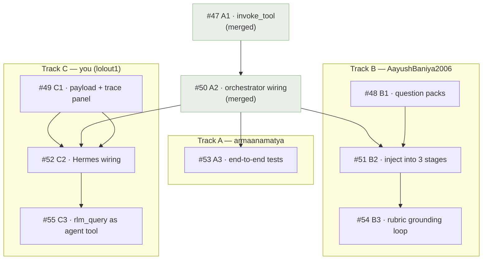

> **ReproLab** · Work Plan — companion to the [Explainer series](./00-start-here.md)

# RLM Integration — Work Plan & Who Does What

*The current productionization workstream: wiring the RLM grounding system into the pipeline. Who owns what, in plain terms. Source of truth: the [open GitHub issues](https://github.com/armaanamatya/openresearch/issues).*

## What we're building (in one paragraph)

ReproLab has a **Recursive Language Model (RLM)** query tool — it answers a focused question about a big document (the paper, experiment logs) by recursively chunking and searching it, and returns a **cited** answer. It is already built and tested, but **nothing in the pipeline calls it** (see [Chapter 07](./07-state-events-persistence.md)). This project wires it in. The payoff: today, verification grades rubric items against the *agent's summary* of the paper — if the agent imagined a claim, the false positive slips through ([Chapter 04](./04-verification-and-trust.md)). With RLM, the pipeline re-checks claims against the **real paper text, with citations** — turning the trust layer from "vibes" into "evidence."

## Two patterns

| Pattern | Who drives the query | Used by |
|---|---|---|
| **Pattern A** | The orchestrator — fixed questions per stage, deterministic | Early stages + rubric verification |
| **Pattern B** | The agent itself — calls `rlm_query` as a tool, budget-capped | Improvement-path agents |

## The three tracks

The work is three tracks of three issues each. Track A's plumbing (#47, #50) is already merged; everything below is what's left.

| Track | Owner | Theme | Issues (in order) |
|---|---|---|---|
| **A — Infrastructure** | **armaanamatya** | Plumbing + end-to-end tests | #53 |
| **B — Stage Injection** | **AayushBaniya2006** | Pattern A — feed cited evidence into stages | #48 → #51 → #54 |
| **C — Observability** | **lolout1 — you** | Make RLM visible & auditable; Pattern B | #49 → #52 → #55 |

## How the work connects

Boxes marked *(merged)* are already done — the project starts from the first box in each track.

## ▶ What you have to do — Track C (Observability)

Your three issues, in order. Each builds on the last.

### 1 · #49 — RLM-C1 · Payload schema + frontend trace panel  ← start here, unblocked

**Plain terms:** get the plumbing and the UI ready to *carry and show* RLM evidence — before the evidence starts flowing.

- Add an optional `rlm_evidence` field to the two Hermes audit payload builders (`backend/hermes_audit/payloads.py`) — backward-compatible: absent → behaves exactly as today.
- Build a new frontend panel, `rlm-trace-panel.tsx`, showing RLM telemetry: recursion depth, LLM calls, chunks examined, citations.
- Surface the `rlm_query_executed` event in the frontend event contract.
- Add citations to the existing Hermes audit panel.

**Done when:** payload builders accept `rlm_evidence` (and omit it when not given), the trace panel renders from mock data, all tests pass.

### 2 · #52 — RLM-C2 · Hermes prompt + audit wiring  *(after #49)*

**Plain terms:** actually feed the cited paper evidence to the Hermes auditor, so its verdicts are backed by the paper instead of guesswork.

- Add a "Grounded Evidence" section to the Hermes prompt (`backend/hermes_audit/client.py`) — rendered only when evidence is present.
- Extend `_audit_step()` and `_audit_checkpoint()` to accept and forward `rlm_evidence`.
- Make Hermes cross-check each `unsupported_claim` against the RLM evidence.

**Tip:** you can start the prompt-template part right after #49 — it needs nothing else.
**Done when:** the Hermes prompt shows the evidence section, audit calls forward evidence, tests pass.

### 3 · #55 — RLM-C3 · `rlm_query` as an agent tool (Pattern B)  *(after #52)*

**Plain terms:** let improvement-path agents ask the paper their own questions mid-task — with a hard budget so they can't run up the bill.

- Register `rlm_query` as a tool in the agent registry and the Claude runtime.
- Route tool calls through the budgeted `_rlm_query()` helper (not the raw tool) so budget + telemetry are enforced.
- Return a clean structured error when the budget is exhausted — no crash.
- Expose it to **improvement-path agents only** — no other stage.

**Done when:** the tool is registered, budget-enforced, improvement-path-only, tests pass.

## What everyone else has to do

### AayushBaniya2006 — Track B (Stage Injection)

Feeding cited evidence into the pipeline (Pattern A).

| # | Issue | Plain terms |
|---|---|---|
| **#48** | B1 · Question packs | Write `backend/agents/rlm_questions.py` — the fixed lists of questions the orchestrator asks the paper, one pack per stage. *Unblocked — can start now.* |
| **#51** | B2 · Inject into 3 stages | Before paper-understanding, artifact-discovery, and env-detective run, pre-answer those questions and hand the agent cited facts. Gated behind `REPROLAB_RLM_ENABLED=1`. *(after #48)* |
| **#54** | B3 · Rubric grounding loop | Check every rubric item against the real paper at Gate 2 & 3; flag items the paper never actually claimed. **The single highest-value piece — it kills verification false positives.** *(after #51)* |

### armaanamatya — Track A (Infrastructure)

The plumbing is merged (#47, #50). One issue remains:

| # | Issue | Plain terms |
|---|---|---|
| **#53** | A3 · End-to-end tests | Prove the whole RLM path works — orchestrator → `_rlm_query` → tool → event — deterministically, with a `StubLlm` and zero API calls. *Unblocked — can start now.* |

## Start order

Everyone can begin **today** — the first issue in each track is unblocked:

- **You** → **#49**
- **Aayush** → **#48**
- **Armaan** → **#53**

Then each track flows top-to-bottom (C1→C2→C3, B1→B2→B3). **One coordination point:** the `rlm_evidence` schema you define in **#49** is the shape Aayush's #51/#54 produce and your #52 consumes — agree on it early so the three of you don't drift.

---

# Part 2 — Track C: Review & Implementation Plan

> Your three issues (#49, #52, #55) reviewed against the **actual current code** on the `replix_merge` branch — what is genuinely buildable today, what is blocked and why, and implementation options for you to choose from. An independent **Codex adversarial review** is running in parallel and will be appended at the end of this doc.

## The headline: the foundation your issues stand on is not merged

Issues #52 and #55 are written as if two earlier issues are already done:

- **#47 (RLM-A1)** — `WorkspaceAppService.invoke_tool()`, the method that turns a tool call into a `ToolInvoked` event.
- **#50 (RLM-A2)** — the orchestrator helpers `_rlm_query()`, `_rlm_calls_remaining`, and `_rlm_evidence_for_stage()`.

Every Track C issue body lists these as already-merged blockers. **They are not on this branch.** A direct search of `backend/` finds **zero** occurrences of `_rlm_query`, `invoke_tool`, `_rlm_calls_remaining`, or `_rlm_evidence_for_stage`. This matches what [Chapter 07](./07-state-events-persistence.md) of the Explainer already noted — the RLM tool is *"dormant — invoked by zero production code paths."*

Where is that foundation, then? PR **#46**'s own description says it plainly: *"A separate PR (`agent-eval-integ`) carries the RLM-as-tool integration … `WorkspaceAppService.invoke_tool` + orchestrator `_rlm_query` helper."* And a `git fetch` just pulled a remote branch `origin/feat/rlm-a1-invoke-tool-openai-client` — that is issue #47's branch. **So the foundation exists, on unmerged feature branches — it has simply not landed on the branch you would build on.**

This one fact is the most important input to your plan. It does not block all of Track C — but it dictates the order you should work in.

## What exists vs. what's missing — the evidence

| Symbol your issues use | Needed by | On `replix_merge`? |
|---|---|---|
| `build_step_audit_payload`, `build_checkpoint_audit_payload` | #49 | ✅ Exist — `backend/hermes_audit/payloads.py:8`, `:27` |
| `rlm_query_executed` event | #49 | ✅ Exists — `backend/schemas/events.py:17` |
| `RlmQueryTool` (the RLM engine itself) | all | ✅ Exists — `backend/services/context/workspace/tools/rlm_query.py` |
| `_audit_step`, `_audit_checkpoint` | #52 | ✅ Exist — `backend/agents/orchestrator.py:1052`, `:1076` (~14 call sites) |
| `_rlm_query()` orchestrator helper | #52, #55 | ❌ **Absent** (issue #50) |
| `_rlm_calls_remaining` budget counter | #55 | ❌ **Absent** (issue #50) |
| `_rlm_evidence_for_stage()` | #52 | ❌ **Absent** (issue #50) |
| `WorkspaceAppService.invoke_tool()` | #52, #55 | ❌ **Absent** (issue #47) |

The pattern is clean: **everything #49 touches exists; everything #52 / #55 *uniquely* need is missing.**

## Your three issues, re-graded

### #49 — RLM-C1 — ✅ Fully buildable today

What it really is: *make the pipes and the dashboard ready to carry RLM evidence, before any evidence flows.* Two halves:

- **Backend** — add an optional `rlm_evidence` parameter to the two payload builders. This is a pure, additive, backward-compatible change: when the caller passes nothing, the payload is byte-identical to today. Both builders exist (`payloads.py:8`, `:27`), so there is concrete code to edit.
- **Frontend** — a new `rlm-trace-panel.tsx` (renders RLM telemetry: depth, calls, chunks, citations), map the `rlm_query_executed` event in `contract.ts`, and add citation rendering to the existing `hermes-audit-panel.tsx`. The event already exists in the enum, so the frontend plumbing has a real target.

Nothing here needs `_rlm_query` or `invoke_tool`. **#49 is genuinely unblocked and is the correct place to start.** The one subtlety: the `rlm_evidence` *schema* you define here becomes a contract three other issues depend on — treat it as an interface, not a throwaway.

### #52 — RLM-C2 — ⚠️ Buildable, but inert until the foundation lands

What it really is: *feed cited paper evidence into the Hermes auditor's prompt.* The structural targets exist — `_audit_step` / `_audit_checkpoint` are real, with ~14 call sites, and the Hermes prompt is built in `hermes_audit/client.py`. So you **can** write the signature extensions and the "Grounded Evidence" prompt section, and unit-test them with hand-fed evidence. (Note: the signature change is additive but touches ~14 sites — budget for that.)

The catch: #52's *purpose* is to forward `rlm_evidence` the orchestrator collected via `_rlm_query()`. That helper doesn't exist, and the evidence is also produced by Track B (#51/#54). So #52 can be **code-complete and unit-tested**, but it will not move real evidence — and cannot be integration-tested — until #50 and Track B land. The issue itself concedes this: *"you can start the Hermes prompt template work immediately … the `_audit_step` call-site wiring needs #50 merged."*

### #55 — RLM-C3 — ⛔ Hard-blocked as specified

What it really is: *let improvement-path agents call `rlm_query` themselves, with a budget.* Its core deliverable — routing tool calls through `_rlm_query()` so `_rlm_calls_remaining` is enforced — names two symbols that do not exist. You cannot build #55 to its spec on this branch. It is genuinely last, and genuinely blocked.

## Implementation Plan — pick an option

The decision reduces to one question: **how do you handle the missing foundation?** Three honest options.

### Option 1 — Unblock first

Land the foundation before building on it. Do **#49 now** (it needs nothing). In parallel, get the `agent-eval-integ` / `feat/rlm-a1-*` branches **merged into `replix_merge`**, coordinating with whoever owns Track A. Once `_rlm_query` / `invoke_tool` are on the branch, build **#52 → #55** in clean order, each fully integration-testable.

- **Pros:** correct, clean order; #52 and #55 are each *fully* testable and deliver real value the moment they're done; no interface guesswork; no rework.
- **Cons:** #52/#55 are gated on a merge you don't own; if `agent-eval-integ` is stale or conflicts with the recent gate refactors (#45/#46), that merge is its own mini-project; slowest path to having your *real* work underway.

### Option 2 — Build against the interface  *(recommended)*

Do **#49 now**. For **#52/#55**, first **read the `feat/rlm-a1-*` and `agent-eval-integ` branches** to extract the *exact* signatures of `_rlm_query()`, `invoke_tool()`, and `_rlm_calls_remaining`. Code #52/#55 against those signatures, unit-tested with a small mock/stub that matches them. Integration-test once the foundation merges. This is exactly the workflow issues #51/#52 explicitly invite — *"start coding against the interface … use a mock that returns `None`."*

- **Pros:** you never idle — continuous progress; #49 ships real value now; #52/#55 reach code-complete + unit-tested, waiting only for integration; matches the issues' intended parallel workflow.
- **Cons:** you're committing to a contract from an unmerged branch — if its real signature drifts, you rework; #52/#55 can't be *proven* end-to-end until the foundation lands; both edit `orchestrator.py`, so expect merge conflicts when `agent-eval-integ` arrives — keep your diffs small and localized.

### Option 3 — Ship #49, then hold

Do **#49** as a complete, shippable deliverable. Then **stop Track C** until the foundation is genuinely merged — don't start #52/#55 on sand. Pick up other work (or help land the foundation) in the meantime.

- **Pros:** lowest risk — you only build what is fully buildable *and* testable; zero rework; #49 is a clean, valuable, self-contained PR; it surfaces the foundation problem to the team instead of papering over it.
- **Cons:** you go idle on Track C after one issue; if nobody drives the foundation merge, Track C stalls; leaves the parallelism the issues invite on the table.

### At a glance

| | Option 1 — Unblock first | Option 2 — Against the interface | Option 3 — #49 then hold |
|---|---|---|---|
| Start #49 now | Yes | Yes | Yes |
| #52/#55 progress before foundation merges | None | Code-complete (unit-tested) | None |
| Rework risk | Lowest | Medium (interface drift) | Lowest |
| Keeps you busy | Partially | Fully | No (after #49) |
| Depends on others | Heavily (the merge) | Lightly (eventual merge) | Heavily (the merge) |
| Best if… | the foundation merge is imminent | you want maximum throughput | you have other work to pick up |

## My recommendation

**Option 2** — with one discipline: don't mock a *guessed* interface, mock the *real* one. Concretely:

1. **Start #49 today.** It is unconditionally unblocked, backward-compatible, and the `rlm_evidence` schema you define is the contract the rest of Track C (and Track B) keys on. Getting it right and merged early de-risks everyone.
2. **Before touching #52/#55, read the foundation branches** — `origin/feat/rlm-a1-invoke-tool-openai-client` and whichever branch carries `_rlm_query` (`agent-eval-integ`). Copy the *exact* signatures of `_rlm_query()`, `_rlm_calls_remaining`, and `invoke_tool()` into a short interface note, and build #52/#55 against those — not against the issue's pseudocode.
3. **Push, in parallel, for the foundation to be merged.** That is the real critical path for Track C, and it is not your issue — flag it now so it doesn't silently stall the project.
4. Keep #52/#55 diffs **small and localized** in `orchestrator.py`. `agent-eval-integ` edits the same file; PR #46 notes the branches were *designed* to touch non-overlapping regions — honor that to keep the eventual merge clean.

This keeps you productive from day one, ships #49's real value immediately, and gets #52/#55 to the finish line the moment the foundation lands — while being honest that the foundation, not your code, is Track C's true bottleneck.

## Adversarial Review (Codex)

*Findings from an independent **Codex** red-team review of #49 / #52 / #55, run 2026-05-19. Read-only — no code was modified. Severity tags are Codex's own. Every new claim this plan relies on (the citation-type mismatch, the Hermes prompt structure, the `HermesAuditReport` shape) was spot-checked against the code and **verified accurate**.*

### #49 — RLM-C1

- **HIGH** — The backend payload work is not present yet. `build_step_audit_payload` exists with signature `project_id, target, state_snapshot, structured_output, trace_text, artifact_paths` and **no** `rlm_evidence` parameter (`backend/hermes_audit/payloads.py:8-16`); `build_checkpoint_audit_payload` also lacks it (`:27-35`).
- **HIGH** — The event exists but is not wired into live state. The backend enum has `rlm_query_executed` (`backend/schemas/events.py:12-18`) and the frontend `QueryExecutedEvent` includes it (`frontend/src/lib/events/contract.ts:161-168`) — but `DashboardSnapshot` has no RLM trace field (`contract.ts:128-138`), and `_snapshot_from_dashboard_events` handles only lifecycle / reasoning / shared-state / gate / context / Hermes / concept events (`backend/services/events/live_runs.py:1429-1472`). No reducer consumes the event.
- **HIGH** — The citation schema is misaligned. Backend `Citation` is `source_id / chunk_id / quote / locator / confidence` (`backend/schemas/citations.py:38-42`); frontend `Citation` is `id / label / sourceType / excerpt / trustLevel` (`contract.ts:32-38`). No mapping layer exists.
- **MEDIUM** — `frontend/src/components/lab/rlm-trace-panel.tsx` and its test do not exist (this issue creates them).
- **MEDIUM** — The Hermes audit panel cannot render RLM citations as-is — it reads only `run.payload?.hermes` and renders summaries / findings (`hermes-audit-panel.tsx:7-49`); no citation render slot.
- **MEDIUM** — The frontend payload mapper drops audit evidence: `HermesAuditReportLike` carries `evidence_refs` (`pipeline-dashboard.ts:110-118`) but `HermesAuditView` omits it (`:132-142`).

### #52 — RLM-C2

- **CRITICAL** — Blocked on unmerged work: `_rlm_query` and `_rlm_evidence_for_stage` do not exist on this branch.
- **CRITICAL** — `_audit_step()` and `_audit_checkpoint()` do not accept or forward RLM evidence — `_audit_step` takes only `state, target, structured_output` (`orchestrator.py:1052-1067`); `_audit_checkpoint` takes `state, target, evidence_bundle, trace_text` (`:1076-1091`).
- **HIGH** — The Hermes prompt is **not** a template. `_build_prompt` (`hermes_audit/client.py:238-260`) dumps the entire payload as JSON with no section structure — the spec's "inject a Grounded Evidence section" assumes an injection point that does not exist.
- **HIGH** — `HermesAuditReport` cannot attach per-claim citations: `unsupported_claims` is `list[str]` and only a report-level `evidence_refs` exists (`hermes_audit/models.py:46-78`). Per-claim citations need a model change.
- **MEDIUM** — No test coverage for the proposed wiring; `tests/test_hermes_rlm_wiring.py` does not exist.

### #55 — RLM-C3

- **CRITICAL** — Blocked on unmerged work: `_rlm_calls_remaining` and `WorkspaceAppService.invoke_tool` are not in the codebase (docs-only references). Both are prerequisites for Pattern B.
- **HIGH** — `WorkspaceAppService` exists (`workspace/service.py:89`) but exposes only lifecycle / enrichment / view methods — **no tool-invocation surface**.
- **HIGH** — Registry assumption is half-true: `_TOOL_DESCRIPTIONS` exists (`registry.py:257-265`) but `improvement-path` has only `Read/Write/Edit/Bash` (`:210-218`). Adding `RlmQuery` needs registry changes *and* `AgentSpec.to_runtime_spec()` work — `ToolSpec` supports `input_schema` (`runtime/base.py:89-94`) but it is never populated.
- **HIGH** — The Claude runtime has no local-tool dispatch path — it only detects SDK tool-use blocks (`claude_runtime.py:74-93`) and merges tool *names* (`:180-193`). MCP registration is Apify-specific (`:146-177`), not a generic local-tool path. Pattern B requires building this mechanism.
- **MEDIUM** — `agent_spec.tools.append("RlmQuery")` is risky: `AgentSpec` is frozen but `tools` is a mutable `list[str]`, and `_build_runtime_spec()` reuses the global `AGENT_REGISTRY` every invocation (`orchestrator.py:480-500`). Mutating it mid-run is a latent concurrency bug — copy the spec per run instead.

### Cross-cutting

- All four foundation symbols (`_rlm_query`, `_rlm_calls_remaining`, `_rlm_evidence_for_stage`, `WorkspaceAppService.invoke_tool`) are absent on `replix_merge` — they are the unmerged `agent-eval-integ` artifacts referenced by PR #46.
- `rlm_query_executed` exists in both enums but is **dead** — no reducer or producer handles it.
- Severity ranking: **#55 > #52 > #49**. Do not start #52 or #55 until `agent-eval-integ` is merged.

### Net effect on the plan

The Codex review **confirms the core finding** — the four foundation symbols are absent, so #52 and #55 cannot integrate on `replix_merge` until `agent-eval-integ` lands. The recommended **Option 2** stands unchanged. What the review *adds* is scope: each issue is bigger than its spec implies.

- **#49 is the most underestimated — treat it as two deliverables.** (a) The **schema/contract** — add the `rlm_evidence` field. (b) The **plumbing** — a *citation mapping layer* (backend and frontend `Citation` types share zero fields — verified), wiring `rlm_query_executed` through `DashboardSnapshot` + `_snapshot_from_dashboard_events` (the event is declared but dead), and fixing the frontend mapper that currently drops `evidence_refs`.
- **#52 carries a model change, not just wiring.** The Hermes prompt is a raw JSON dump in `_build_prompt` (verified) — you will add structured prompt construction, not "inject a section." And `HermesAuditReport.unsupported_claims` is `list[str]` (verified) — per-claim citations require changing that model.
- **#55 needs a new runtime capability.** There is no local-tool dispatch path in the Claude runtime at all. Pattern B is not "register a tool" — it is "build the mechanism by which a locally-implemented tool can be called," then register one. And copy the agent spec per run — never mutate the shared `AGENT_REGISTRY`.

**Bottom line:** the option choice is unchanged — start **#49** now, build **#52/#55** against the real interface, push to land the foundation. But **scope #49 as a two-part issue**, expect #52 and #55 to each carry a model/runtime change beyond the issue text, and raise the **citation-mapping gap** with Aayush (Track B) and the `agent-eval-integ` owner — it is a shared contract that currently has no owner.

---

**See also:** the [ReproLab Explainer](./00-start-here.md) — the nine-part walkthrough of the system this plan productionizes.
