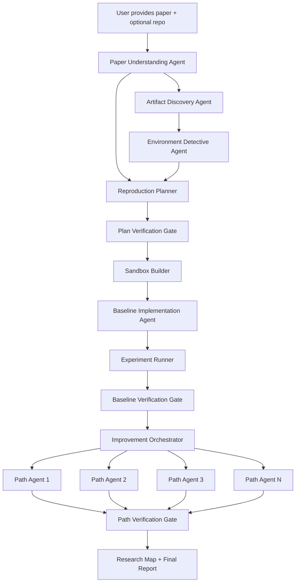

# ReproLab Agent PRD

## Overview

**Working name:** ReproLab Agent

**One-line summary:** ReproLab is an autonomous research agent system that takes an ML or software-only robotics paper, reconstructs its implementation environment, reproduces the paper's core algorithm on the same dataset and specifications, then launches multiple improvement agents whose results are independently verified by a supervisor-led verification team.

**Track Fit:** ReproLab fits the Agents Track — it accepts a high-level research goal, breaks reproduction into concrete steps, reads papers/repos/configs/datasets, uses external tools (Docker, Git, package managers), makes decisions under ambiguity, recovers from failures, and produces runnable environments, code, logs, metrics, plots, diffs, and verified reports.

**Target users:** ML researchers, robotics researchers (simulation/offline), research engineers, AI labs, graduate students, R&D teams evaluating whether a paper is worth building on.

**Problem:** Papers omit implementation details, depend on brittle environments, use underspecified data pipelines, and leave reproduction to humans. Repositories may be broken, incomplete, outdated, or misaligned with the paper.

**Goal:** Turn a paper into a reproducible, auditable, extensible experiment workspace. Outputs: Docker image, reproduction codebase, dataset scripts, logs, metrics, plots, commit diff, command history, assumption ledger, reproducibility score, verified baseline report, N improvement branches with verified outcomes, and a research map of promising paths, dead ends, and next experiments.

## Chat Requirements Traceability

This section verifies that the PRD reflects the key product decisions from the planning conversation.

| Chat requirement or decision | PRD coverage | Status |
| --- | --- | --- |
| Build an auto research agent that reproduces papers and experiments. | Product Summary, Product Goal, Definition Of Reproduction. | Captured |
| Start with ML and software-only robotics papers, not every possible field. | Scope Decision, MVP Scope, Out Of MVP Scope. | Captured |
| Reproduction means same algorithm/contribution, same dataset, and same specifications where discoverable. | Definition Of Reproduction, Reproduction Contract, Data & Metrics Verifier. | Captured |
| Work with or without a GitHub reference codebase. | MVP Scope, Paper Understanding Agent, Artifact Discovery Agent. | Captured |
| Discover environment, system configs, package versions, and runtime details. | Environment Detective Agent, Compute Strategy, Artifact Schema. | Captured |
| Use Docker sandboxes so agents can safely code and run experiments. | High-Level Architecture, Sandbox Builder, Git And Sandbox Strategy, Experiment Safety. | Captured |
| Handle paper ambiguity and read between the lines without hiding assumptions. | Assumption Ledger, Context Management, Human-In-The-Loop Policy. | Captured |
| After reproduction, support a simple "improve it" prompt that launches N improvement agents. | Improvement Orchestrator, Improvement Path Agents, MVP Flow. | Captured |
| Preserve wrong directions and negative results as valuable research output. | Negative Results Are Product Features, Research Map, Success Metrics. | Captured |
| Add four verifier agents plus a supervisor agent. | Verification Team, Verification Gates. | Captured |
| Require hard artifacts: Docker, logs, metrics, plots, diff, command history. | Hard Artifact Requirements, Artifact Schema, Artifact & Diff Verifier. | Captured |
| Use branch/worktree-style isolation for competing pathways. | Git And Sandbox Strategy, Production Roadmap Phase 2. | Captured, with worktree management planned after MVP |
| Derive improvement paths from failures, ablations, related work, bottlenecks, expected value, and compute cost. | Improvement Orchestrator. | Captured |
| Treat old CUDA/PyTorch/package breakage as a separate agent problem. | Environment Detective Agent, Key Risks. | Captured |
| Explore local Docker first, then SSH/cloud GPU later. | Compute Strategy, Production Roadmap Phase 3. | Captured |
| Discuss human-in-the-loop boundaries for cost, credentials, ambiguous assumptions, and risky actions. | Human-In-The-Loop Policy, Core System Design Decisions. | Captured |
| Index baseline paper context and field history for agent retrieval. | Research Context Index, Context Management, Implementation Details. | Captured |
| Use Recursive Language Models (RLM) for context exploration instead of vector-store retrieval. | Context Management, Research Context Index, Technology Stack. | Captured |
| Define how agents communicate and pass structured outputs to each other. | Inter-Agent Communication Protocol, Context Management. | Captured |
| Consider graph-based context (Graphify) for structural code/paper analysis. | Knowledge Graph (Storage Layers), Technology Stack, Production Roadmap Phase 2. | Captured |
| Consider blackboard architecture for production-scale agent coordination. | Production Roadmap Phase 3. | Captured |
| Build a Next.js agent lab dashboard showing agents, reasoning, messages, and citations in real time. | UX Requirements, Technology Stack. | Captured |
| Make citations mandatory for every agent decision, not optional. | Mandatory Citation Policy, Exploration Audit Trail, UX Requirements (Citation Explorer). | Captured |
| Use dynamic confidence thresholds based on actual result complexity, not fixed numbers. | Dynamic Confidence Threshold, Reproducibility Score. | Captured |
| Use PaperCoder for code generation when no reference repo exists. | Baseline Implementation Agent Mode 2, Technology Stack, Implementation Details. | Captured |
| Add production-grade trust, safety, versioning, cost, and evaluation controls. | Trust, Safety, And Evaluation, Implementation Details, Success Metrics. | Captured |

Unresolved items from the conversation are intentionally preserved as open product questions: the first demo paper, exact runtime budget, dataset-size threshold, GPU cost threshold, verifier voting rules, and the confidence threshold for labeling a result verified.

Post-validation additions not in the original conversation: two-mode Baseline Implementation Agent (adapt vs. implement from paper), shared state write protocol, explicit Research Map ownership assigned to the Supervisor Verification Agent, simulator version support in the Environment Detective Agent, `provenance.json` in the artifact schema, and clarification of open question 17.

Pre-build decisions locked after validation: demo papers are PPO (CartPole-v1) and MixMatch (CIFAR-10); agent orchestration framework is Claude Agent SDK; context exploration uses a unified REPL workspace with raw variables + `rlm_query()` + `semantic_search()` + `graph_query()` + `web_search()` + `notebook_query()`; metadata store is SQLite; SSH/cloud GPU support is deferred to Phase 3 and out of scope for the hackathon build.

## Scope Decision

### MVP Scope

For the MVP, the system targets:

- ML papers.
- Robotics papers that do not require physical hardware.
- Simulation-based robotics papers where environments are installable.
- Public datasets or user-provided datasets.
- Papers with or without GitHub reference code.

### Out Of MVP Scope

The MVP does not target:

- Wet lab reproduction.
- Physical robot execution.
- Private datasets without user-provided credentials.
- Multi-node training jobs.
- Exact reproduction of closed-source proprietary systems.
- Fully autonomous spending of GPU credits.

## Technology Stack

These decisions are locked for the hackathon build. They are not open questions.

| Layer | Choice | Reason |
| --- | --- | --- |
| Agent orchestration | Claude Agent SDK (`claude-agent-sdk`, Python) | Native subagent spawning, built-in tool execution, session isolation, hooks for audit trail |
| LLM | `claude-sonnet-4-6` for all agents | Best balance of capability and speed for multi-agent workloads |
| Context exploration (Layer 1) | Recursive Language Models (RLM) | Primary exploration: context stored as REPL variables; agents programmatically explore, partition, and recursively sub-query; ~2-3k tokens per query; based on [arXiv:2512.24601](https://arxiv.org/abs/2512.24601) |
| Context discovery (Layer 2) | Chroma | Fallback and fuzzy discovery: semantic search for conceptual similarity, cross-document connections, and content the agent didn't know to look for |
| Knowledge graph (Layer 3, Phase 2) | [Graphify](https://github.com/safishamsi/graphify) | Structural knowledge graph from code + docs + papers via Tree-sitter AST + LLM semantic extraction; NetworkX + Leiden community detection; ~1.7k tokens/query vs ~123k naive (71.5x reduction) |
| RLM implementation | [alexzhang13/rlm](https://github.com/alexzhang13/rlm) or [ysz/recursive-llm](https://github.com/ysz/recursive-llm) | Official and community implementations; LiteLLM-based, works with Claude via API |
| Code generation (no-repo path) | [PaperCoder / Paper2Code](https://github.com/going-doer/Paper2Code) | Multi-agent paper→code framework; used in Baseline Implementation Agent Mode 2 when no reference repo exists; [arXiv:2504.17192](https://arxiv.org/abs/2504.17192) |
| External search | Web search + Google NotebookLM | Agents use `web_search()` for field conventions, benchmark standards, and ambiguity resolution; `notebook_query()` for cross-referencing across project sources loaded into NotebookLM |
| Metadata store | SQLite | Zero-config, file-based, sufficient for single-machine MVP |
| Frontend | Next.js (React) | Real-time agent lab dashboard showing agent topology, reasoning, messages, and citations |
| Real-time events | WebSocket or SSE from Python backend to Next.js frontend | Stream agent activity, reasoning steps, and inter-agent messages as they happen |
| Container runtime | Docker (local) | Sandbox isolation; cloud GPU deferred to Phase 3 |
| Language | Python 3.11 (backend), TypeScript (frontend) | Compatible with all dependencies for both demo papers |

### Claude Agent SDK Patterns

Install:

```bash
pip install claude-agent-sdk
```

Define all agents upfront and pass them to the root `query()` call. Include `"Agent"` in `allowed_tools` for any agent that spawns subagents.

```python
from claude_agent_sdk import query, ClaudeAgentOptions, AgentDefinition

async for message in query(
    prompt="Reproduce the paper at paper.pdf",
    options=ClaudeAgentOptions(
        allowed_tools=["Read", "Write", "Edit", "Bash", "WebSearch", "WebFetch", "Agent"],
        agents={
            "paper-understanding": AgentDefinition(
                description="Extracts claims, datasets, metrics, and ambiguities from a research paper.",
                prompt="You are the Paper Understanding Agent. ...",
                tools=["Read", "Bash"],
            ),
            "artifact-discovery": AgentDefinition(
                description="Finds repositories, datasets, and dependency clues for a paper.",
                prompt="You are the Artifact Discovery Agent. ...",
                tools=["WebSearch", "WebFetch", "Bash"],
            ),
            "environment-detective": AgentDefinition(
                description="Infers and builds the Docker environment for a paper.",
                prompt="You are the Environment Detective Agent. ...",
                tools=["Read", "Write", "Bash", "WebSearch"],
            ),
            "baseline-implementation": AgentDefinition(
                description="Implements or adapts the paper baseline inside a Docker sandbox.",
                prompt="You are the Baseline Implementation Agent. ...",
                tools=["Read", "Write", "Edit", "Bash"],
            ),
            "experiment-runner": AgentDefinition(
                description="Executes experiments and captures all artifacts.",
                prompt="You are the Experiment Runner. ...",
                tools=["Bash", "Read", "Write"],
            ),
            "method-fidelity-verifier": AgentDefinition(
                description="Verifies implementation matches the paper method.",
                prompt="You are the Method Fidelity Verifier. You do not write code. ...",
                tools=["Read", "Bash"],
            ),
            "environment-verifier": AgentDefinition(
                description="Verifies the Docker environment is reproducible.",
                prompt="You are the Environment and Execution Verifier. ...",
                tools=["Read", "Bash"],
            ),
            "data-metrics-verifier": AgentDefinition(
                description="Verifies correct data usage and metric validity.",
                prompt="You are the Data and Metrics Verifier. ...",
                tools=["Read", "Bash"],
            ),
            "artifact-diff-verifier": AgentDefinition(
                description="Verifies all required artifacts exist and prove the claim.",
                prompt="You are the Artifact and Diff Verifier. ...",
                tools=["Read", "Bash"],
            ),
            "supervisor-verifier": AgentDefinition(
                description="Assigns verification tasks, resolves disagreements, decides final status, and generates the Research Map.",
                prompt="You are the Supervisor Verification Agent. ...",
                tools=["Read", "Agent"],
            ),
            "improvement-orchestrator": AgentDefinition(
                description="Selects N improvement hypotheses from evidence and launches path agents in parallel.",
                prompt="You are the Improvement Orchestrator. ...",
                tools=["Read", "Bash", "Agent"],
            ),
            "improvement-path": AgentDefinition(
                description="Executes one improvement hypothesis in an isolated branch and sandbox.",
                prompt="You are an Improvement Path Agent. Work only in your assigned branch. ...",
                tools=["Read", "Write", "Edit", "Bash"],
            ),
        },
    ),
):
    if hasattr(message, "result"):
        print(message.result)
```

Key SDK behaviors to rely on:

- Each subagent runs in its own session thread with isolated conversation history.
- The orchestrator passes context via the prompt string; subagents do not inherit the parent's conversation.
- Parallel subagent calls are supported: the improvement orchestrator can launch all path agents in one `Agent` tool call batch.
- Sessions can be resumed with `resume=session_id` across script restarts.
- Hooks (`PostToolUse`) on the root session provide a global audit trail of all tool calls across all agents.

## Demo Papers

Two papers are pre-selected for the hackathon MVP. Both run on CPU. Both have known ambiguities that demonstrate the assumption ledger. Environments are pre-solved below.

### Paper 1: PPO — CartPole-v1

**Reference:** Schulman et al., 2017. "Proximal Policy Optimization Algorithms." arXiv:1707.06347.

**Environment spec (pre-solved):**

```dockerfile
FROM python:3.11-slim
RUN pip install torch==2.2.0 --index-url https://download.pytorch.org/whl/cpu
RUN pip install gymnasium==0.29.1 numpy==1.26.4
```

No dataset download required. CartPole-v1 is bundled with Gymnasium.

**Key ambiguities the assumption ledger must capture:**

These 8 details are not in the PPO paper and trip up every naive reproduction:

| Assumption ID | Detail | Chosen value | Risk |
| --- | --- | --- | --- |
| A001 | Adam epsilon | `1e-5` (paper uses PyTorch default `1e-8`) | high |
| A002 | Weight initialization | Orthogonal: `sqrt(2)` hidden, `0.01` policy head, `1.0` value head | high |
| A003 | Learning rate schedule | Linear decay from LR to 0 over all timesteps | medium |
| A004 | Advantage normalization | Per-minibatch, not full-batch | medium |
| A005 | Value loss clipping | Clipped matching policy clip range | medium |
| A006 | Gradient clipping | Global L2 norm capped at `0.5` | medium |
| A007 | GAE lambda | `0.95` | low |
| A008 | Entropy bonus coefficient | `0.01` | low |

**Baseline target metric:** Mean episode reward ≥ 475 over 100 episodes on CartPole-v1 within 500k timesteps on CPU.

**Obvious improvement paths for hackathon:**
1. Tune entropy coefficient to prevent premature convergence.
2. Test separate vs. shared actor-critic network.
3. Test GAE lambda sensitivity (0.90 vs. 0.95 vs. 0.99).

---

### Paper 2: MixMatch — CIFAR-10

**Reference:** Berthelot et al., 2019. "MixMatch: A Holistic Approach to Semi-Supervised Learning." NeurIPS 2019. arXiv:1905.02249.

**Reference implementation:** [fbuchert/mixmatch-pytorch](https://github.com/fbuchert/mixmatch-pytorch)

**Environment spec (pre-solved):**

```dockerfile
FROM python:3.11-slim
RUN pip install torch==2.2.0 torchvision==0.17.0 --index-url https://download.pytorch.org/whl/cpu
RUN pip install numpy==1.26.4 tqdm tensorboard
```

CIFAR-10 downloads automatically via `torchvision.datasets.CIFAR10`. Approximately 170 MB.

**Key hyperparameters (paper + implementation):**

| Parameter | Value | Source |
| --- | --- | --- |
| Model | Wide-ResNet-28-2 | Paper |
| Labeled samples | 250 (25 per class) | Paper |
| Unlabeled batch size | 64 | Repo default |
| Labeled batch size | 64 | Repo default |
| Epochs | 1024 | Repo default |
| Learning rate | 0.002 | Repo |
| Temperature T | 0.5 | Paper |
| MixUp alpha | 0.75 | Paper |
| Augmentations K | 2 | Paper |
| EMA decay | 0.999 | Paper |
| Unsupervised loss weight λ_u | 75 (ramped up) | Paper |

**Key ambiguities the assumption ledger must capture:**

| Assumption ID | Detail | Chosen value | Risk |
| --- | --- | --- | --- |
| B001 | Unsupervised loss weight ramp-up schedule | Linear over first 16384 steps | medium |
| B002 | EMA model used for evaluation vs. training model | EMA model | medium |
| B003 | Number of augmentation views K | 2 (paper says "K augmentations") | low |
| B004 | Weight decay | `0.00004` (repo default, not stated in paper) | medium |

**Reduced run for hackathon demo:** 100 epochs instead of 1024. Label this `reduced_run: true` in metrics.json. Expected accuracy at 100 epochs: ~70–75% (vs. paper's ~93.6% at full run).

**Obvious improvement paths for hackathon:**
1. Increase K from 2 to 4 augmentations.
2. Adjust temperature T from 0.5 to 0.3 (sharper sharpening).
3. Tune λ_u ramp-up schedule length.

## Definition Of Reproduction

For this product, reproduction means:

- The same core algorithm or contribution from the paper is implemented.
- The same dataset or officially specified benchmark is used.
- The same relevant specifications are followed where discoverable.
- Missing details are explicitly inferred, tested, or marked uncertain.
- The result is runnable and auditable, even if the final metric differs from the paper.

Success is not defined as "the agent says it worked." Success requires hard artifacts plus independent verification.

## Hard Artifact Requirements

Every reproduction or improvement pathway must produce:

- Runnable Docker image or Dockerfile.
- Build logs.
- Run logs.
- Metrics file.
- Plots.
- Commit diff.
- Exact command history.
- Environment specification.
- Assumption ledger.
- Verification report.

## High-Level Architecture



## Core System Design Decisions

### 1. Builder Agents And Verifier Agents Are Separate

Builder agents create code, environments, experiments, and improvements.

Verifier agents audit the artifacts independently. They should not simply inherit the builder's reasoning. They evaluate formal artifacts: paper claim maps, Dockerfiles, logs, metrics, plots, diffs, command history, and assumption ledgers.

This reduces hallucinated success and makes the system more trustworthy.

### 2. Verification Is A Gated Layer

The verification team is added after every meaningful artifact-producing stage:

1. Before execution, to verify the reproduction plan.
2. After baseline reproduction, to verify Docker, code, data, metrics, logs, plots, and command history.
3. After each improvement pathway, to verify that the solution is real, comparable, and not cheating.
4. Before the final report, to synthesize pass/fail/confidence judgments.

### 3. Every Agent Works In Isolation

Each reproduction or improvement path gets:

- Its own Git branch.
- Its own Docker sandbox.
- Its own command history.
- Its own metrics output.
- Its own logs.
- Its own artifact directory.

The canonical baseline becomes read-only after verification.

### 4. Assumptions Are First-Class Objects

Every inferred detail is recorded in an assumption ledger.

Example:

```json
{
  "assumption": "Learning rate warmup is not specified in the paper.",
  "chosen_value": "5 epochs",
  "evidence": ["Official repo config uses warmup_epochs=5"],
  "risk": "medium",
  "verified_by": "method_fidelity_verifier"
}
```

### 5. Negative Results Are Product Features

The system should not only search for winning directions. It should also map wrong directions.

Each failed experiment is stored with:

- Hypothesis.
- Implementation diff.
- Run command.
- Logs.
- Failure mode.
- Likely cause.
- Recommendation.

This makes dead ends useful instead of invisible.

### 6. Human Approval Is Required For Costly Or Risky Actions

The system should be autonomous until it hits a decision involving cost, legality, ambiguity, credentials, or compute risk.

User approval is required for:

- Downloading large datasets over a configured size threshold.
- Spending GPU credits.
- Running jobs over a configured time threshold.
- SSHing into cloud GPU machines.
- Using unofficial repositories when official code is unavailable.
- Accepting high-risk assumptions.
- Using substitute datasets.
- Running code from untrusted repositories.
- Uploading artifacts to external services.

## Agent System

### Paper Understanding Agent

Inputs:

- Paper PDF.
- Optional GitHub repository.
- Optional user notes.

Responsibilities:

- Extract the paper's core contribution.
- Identify claimed results.
- Identify datasets.
- Identify metrics.
- Extract model architecture.
- Extract training recipe.
- Extract evaluation protocol.
- Identify hardware and environment clues.
- Identify missing or ambiguous details.

Outputs:

- Paper claim map.
- Experiment setup summary.
- Contribution summary.
- Dataset requirements.
- Metrics specification.
- Tables or figures to reproduce.
- Ambiguity list.

### Artifact Discovery Agent

Responsibilities:

- Find official GitHub repositories.
- Find forks.
- Find Papers with Code entries.
- Find dataset pages.
- Find model weights.
- Find Dockerfiles.
- Find requirements files.
- Inspect GitHub issues for broken setup clues.
- Find related implementations.
- Identify version clues from commit dates, package files, and documentation.

Outputs:

- Artifact index.
- Source confidence scores.
- Repo recommendation.
- Dataset links.
- Dependency clues.
- Risk notes.

### Environment Detective Agent

This is a dedicated agent because old environments, CUDA versions, dependency conflicts, and dead links will be one of the hardest technical problems.

Responsibilities:

- Infer Python version.
- Infer CUDA, cuDNN, PyTorch, TensorFlow, JAX, or framework compatibility.
- Infer simulator version for robotics papers. Common simulators include MuJoCo, PyBullet, Isaac Gym, Isaac Lab, Gymnasium, Brax, and Webots. Simulator versioning is as fragile as CUDA versioning and must be treated with the same rigor.
- Recover old package versions from requirements files, setup.py, conda environment files, commit dates, and GitHub issues.
- Build Dockerfile including base image, system packages, simulator installation, Python environment, and framework versions.
- Try install variants when the first approach fails.
- Diagnose build failures and record attempted approaches.
- Maintain environment assumptions.
- Produce a reproducible environment spec.

Outputs:

- Dockerfile.
- Environment lockfile.
- Build logs.
- Compatibility notes including framework and simulator version matrix.
- Environment assumptions.
- Known unresolved risks.

### Reproduction Planner

Responsibilities:

- Turn the paper claim map and discovered artifacts into an execution plan.
- Define what reproduction means for this paper.
- Create a smoke-test plan.
- Create a full or budgeted run plan.
- Define expected outputs.
- Define verification package requirements.

Outputs:

- Reproduction contract.
- Execution plan.
- Dataset plan.
- Evaluation plan.
- Verification checklist.

### Baseline Implementation Agent

This agent operates in one of two modes depending on whether a reference repository was found.

#### Mode 1: Adapt Existing Repository

Used when the Artifact Discovery Agent found an official or maintained repository.

Responsibilities:

- Clone the repository at the identified commit or release tag.
- Adapt existing code to match the paper's exact experimental setup.
- Apply any fixes needed for environment compatibility.
- Record all changes as a diff against the original repository.

#### Mode 2: Implement From Paper (via PaperCoder)

Used when no usable repository exists. This mode delegates code generation to [PaperCoder](https://github.com/going-doer/Paper2Code) ([arXiv:2504.17192](https://arxiv.org/abs/2504.17192)), a proven multi-agent framework for turning ML papers into code repositories. PaperCoder is benchmarked on ICLR/ICML/NeurIPS papers with 77% human preference and ~0.81% of generated lines needing modification.

PaperCoder pipeline (runs inside this agent):

1. **Planning**: Constructs a high-level roadmap, system architecture diagrams, file dependencies, and config files from the paper.
2. **Analysis**: Interprets implementation-specific details (hyperparameters, data pipeline, training loop).
3. **Generation**: Produces modular, dependency-aware code repository.

ReproLab feeds PaperCoder:

- Paper PDF.
- Paper Claim Map (from Paper Understanding Agent).
- Reproduction Contract (from Reproduction Planner).
- Environment Spec (from Environment Detective Agent).

ReproLab wraps PaperCoder's output:

- Wrap generated code in the Docker environment built by the Environment Detective.
- Diff PaperCoder's implementation assumptions against the paper text and log them in the assumption ledger with risk levels.
- Add citations for every implementation decision PaperCoder made (map back to paper sections).
- Flag the entire run as `implement_from_paper` so verifiers apply stricter method fidelity review.
- Log all generated code as artifacts with provenance pointing to PaperCoder.

This mode generates more assumptions and should automatically raise the baseline assumption risk to at least `high`. The Method Fidelity Verifier must review PaperCoder's implementation choices carefully against the paper text, since PaperCoder optimizes for faithful code generation but does not track assumptions or verify its own output.

#### Shared Rules For Both Modes

- Work only inside the assigned sandbox.
- Generate standard run artifacts.
- Commit changes.
- Preserve command history.
- Must not silently change evaluation metrics.
- Must not substitute datasets without approval.
- Must not edit verified artifacts after submission.
- Must produce machine-readable metrics.

### Experiment Runner

Responsibilities:

- Execute install checks.
- Execute unit tests when available.
- Execute smoke tests.
- Execute tiny data runs.
- Execute full or budgeted runs.
- Generate metrics.
- Generate plots.
- Capture logs.
- Capture command history.

### Improvement Orchestrator

After baseline verification, this agent chooses N improvement paths.

Path selection should be based on:

- Baseline failure modes.
- Paper ablation table.
- Related papers.
- Known bottlenecks.
- Expected value.
- Compute cost.
- Novelty.
- User constraints.

The orchestrator should avoid random brainstorming. It should turn evidence into specific hypotheses.

### Improvement Path Agents

Each path agent receives a narrow task brief and works in its own branch and sandbox.

Possible improvement paths:

- Hyperparameter optimization.
- Architecture modification.
- Loss or objective change.
- Data augmentation.
- Training stability.
- Efficiency or latency.
- Ablation-driven simplification.
- Robotics simulation policy improvement.

Each path agent must return:

- Hypothesis.
- Implementation diff.
- Run commands.
- Metrics.
- Plots.
- Failure notes.
- Recommendation.

## Verification Team

The verification team is a separate layer composed of four verifier agents and one supervisor agent.

### Supervisor Verification Agent

Responsibilities:

- Assign verification tasks.
- Resolve disagreements between verifier agents.
- Decide final status.
- Produce final verification summary.
- Block invalid baseline or improvement claims.
- Generate the Research Map after all improvement path verifications are complete.

**Disagreement resolution rule:** The supervisor has full override authority. There is no voting system. When verifiers disagree, the supervisor reads all verifier reports and artifact evidence, makes a final binding decision, and records the reasoning in the Decision Log. Individual verifier findings are advisory; only the supervisor's decision is authoritative.

This rule exists because voting across four verifiers with different scopes (method, environment, data, artifacts) produces incoherent outcomes — a 3-1 vote on a method fidelity question is meaningless if the dissenting vote is from the artifact verifier. Centralized authority with mandatory reasoning is cleaner and more auditable.

Possible decisions:

- `verified`
- `verified_with_caveats`
- `partial_reproduction`
- `failed_reproduction`
- `blocked_requires_human`
- `invalid_claim`

The supervisor has authority to say:

- "This reproduction is not valid."
- "This improvement is not comparable."
- "This metric is inflated due to changed evaluation."
- "This pathway requires human approval."
- "Verifier X flagged an issue that Verifier Y missed. I am accepting Verifier X's finding."

### Verifier 1: Method Fidelity Verifier

Checks whether implementation matches the paper's algorithm.

Verifies:

- Model architecture.
- Loss function.
- Training loop.
- Optimizer and scheduler.
- Preprocessing.
- Evaluation protocol.
- Claimed contribution.

Outputs:

- Method fidelity score.
- Missing details.
- Mismatches.
- Severity labels.

### Verifier 2: Environment & Execution Verifier

Checks whether the run is reproducible.

Verifies:

- Dockerfile builds.
- Dependencies are pinned.
- CUDA, PyTorch, Python, or simulator versions are captured.
- Commands are executable.
- Seeds are set where relevant.
- Logs exist.
- Command history exists.
- Run can be repeated from scratch.

Outputs:

- Environment recovery score.
- Execution pass/fail.
- Rebuild instructions.
- Dependency risks.

### Verifier 3: Data & Metrics Verifier

Checks whether data and evaluation are valid.

Verifies:

- Correct dataset.
- Correct split.
- Correct preprocessing.
- No leakage.
- Correct metric calculation.
- Metric matches the paper's definition.
- Plots are generated from actual metrics.

Outputs:

- Data pipeline confidence.
- Metric validity score.
- Leakage or confounder warnings.

### Verifier 4: Artifact & Diff Verifier

Checks whether the artifacts prove the claim.

Verifies:

- Docker image or Dockerfile.
- Logs.
- Metrics file.
- Plots.
- Commit diff.
- Exact command history.
- Branch isolation.
- No hidden manual edits.
- Improvement diff is attributable to the path agent.

Outputs:

- Artifact completeness score.
- Audit trail status.
- Missing evidence.

## Verification Gates

### Gate 1: Plan Verification

Before coding, verifier agents inspect:

- Reproduction plan.
- Extracted claims.
- Dataset choice.
- Environment plan.
- Known ambiguities.
- Evaluation plan.

Goal:

- Catch bad plans before compute is wasted.

### Gate 2: Baseline Verification

After baseline run, verifier agents inspect:

- Docker build.
- Code diff.
- Logs.
- Metrics.
- Plots.
- Dataset setup.
- Command history.
- Assumption ledger.

Possible outcomes:

- Verified.
- Verified with caveats.
- Partial reproduction.
- Failed reproduction.
- Blocked, requires human approval.

### Gate 3: Improvement Verification

Each improvement path is verified independently.

An improvement is accepted only if:

- It uses the same dataset unless explicitly approved otherwise.
- It uses the same evaluation protocol unless explicitly approved otherwise.
- It compares against the verified baseline.
- It has logs, metrics, plots, diff, and command history.
- It does not exploit leakage.
- It does not secretly change the task.

## Inter-Agent Communication Protocol

ReproLab agents coordinate through the **orchestrator-mediated message passing** pattern, consistent with the Claude Agent SDK's subagent model. Agents do not talk to each other directly — the orchestrator is the message bus.

### Communication Model

In the Claude Agent SDK, each subagent:

- Runs in its own context window with its own tools.
- Receives a task description and input context from the orchestrator.
- Returns only its **final message** to the orchestrator — all intermediate tool calls stay inside the subagent.
- Cannot communicate directly with sibling agents.

The orchestrator mediates all coordination: it reads each agent's structured output, decides the next step, and passes relevant context to the next agent.

### Sequential Agent Pipeline

Builder agents execute in sequence. Each agent's structured output becomes input for the next.

```text
Orchestrator
  ├─→ Paper Understanding Agent
  │     writes: paper_claim_map, ambiguity_index
  │     returns: summary to Orchestrator
  │
  ├─→ Artifact Discovery Agent
  │     reads: paper_claim_map
  │     writes: artifact_index, repo_files, github_issues
  │     returns: summary to Orchestrator
  │
  ├─→ Environment Detective Agent
  │     reads: artifact_index, repo_files, github_issues
  │     writes: environment_spec, assumption_ledger entries
  │     returns: summary to Orchestrator
  │
  ├─→ Reproduction Planner
  │     reads: paper_claim_map, environment_spec, assumption_ledger
  │     writes: reproduction_contract
  │     returns: plan to Orchestrator → Gate 1 Verification
  │
  ├─→ Baseline Implementation Agent
  │     reads: reproduction_contract, repo_files, configs
  │     writes: baseline code, Dockerfile, commands
  │     returns: summary to Orchestrator
  │
  ├─→ Experiment Runner
  │     reads: baseline code, Dockerfile
  │     writes: runs/baseline/ artifacts (logs, metrics, plots)
  │     returns: results to Orchestrator → Gate 2 Verification
  │
  ├─→ Improvement Orchestrator
  │     reads: verified baseline, assumption_ledger, field_history
  │     writes: improvement hypotheses
  │     returns: N hypothesis briefs to Orchestrator
  │
  └─→ Improvement Path Agents (parallel)
        each reads: hypothesis brief, verified baseline commit
        each writes: runs/improvements/path_{id}/
        each returns: results to Orchestrator → Gate 3 Verification
```

### Parallel Agent Coordination

During the improvement phase, path agents run concurrently:

- Each path agent writes only to its own artifact directory (`runs/improvements/path_{id}/`).
- No path agent reads another path agent's directory during execution.
- All updates to shared ledgers (assumptions, experiments, decisions) go through the orchestrator's append API.
- The orchestrator collects all path agent results before triggering Gate 3 verification.

### Progressive Context Enrichment

As agents complete, their structured outputs are added back into the RLM Context REPL as new variables. This means downstream agents have access to the full enriched context built by upstream agents.

```python
# Initial REPL state (project start)
repl = {
    'paper_text': "...",
    'repo_files': {...},
    'configs': {...},
    # ... raw artifacts only
}

# After Paper Understanding Agent
repl['paper_claim_map'] = paper_understanding_output['claim_map']
repl['ambiguity_index'] = paper_understanding_output['ambiguities']

# After Artifact Discovery Agent
repl['artifact_index'] = artifact_discovery_output['artifacts']
repl['github_issues'] = artifact_discovery_output['issues']

# After Environment Detective Agent
repl['environment_spec'] = env_detective_output['spec']

# After Gate 2 verification
repl['baseline_metrics'] = verified_baseline['metrics']
repl['baseline_verification'] = verified_baseline['verification']

# By the time Improvement Agents run, the REPL contains everything:
# raw artifacts + claim map + environment spec + verified baseline + ...
```

This progressive enrichment means agents don't just consume context — they **build on it**. Each agent's output becomes a queryable REPL variable for every downstream agent.

### Message Format

Each agent returns a structured message to the orchestrator:

```json
{
  "agent_id": "environment_detective",
  "status": "completed",
  "structured_outputs": {
    "environment_spec": { "...": "..." },
    "assumptions_created": ["A001", "A002"],
    "decisions_made": ["D001"]
  },
  "summary": "Recovered Python 3.8, PyTorch 1.12, CUDA 11.3. Two assumptions created for unspecified cuDNN version and batch size.",
  "exploration_log": {
    "repl_queries": 12,
    "rlm_sub_queries": 4,
    "semantic_searches": 1,
    "tokens_used": 8400
  }
}
```

The orchestrator uses `structured_outputs` to update shared state and the REPL. The `summary` is what the orchestrator sees in its own context window. The `exploration_log` feeds the audit trail.

### Production Evolution: Blackboard Pattern

For the hackathon MVP, the orchestrator-mediated pattern is sufficient — the pipeline is well-defined and the number of agents is small.

In production (Phase 3+), the improvement phase could evolve to a **blackboard architecture** inspired by [bMAS](https://arxiv.org/abs/2510.01285):

- A shared blackboard replaces orchestrator-assigned tasks.
- Improvement agents monitor the blackboard and **self-select** tasks based on their capabilities.
- The orchestrator becomes a lightweight coordinator rather than a rigid controller.
- This scales better when N improvement agents is dynamic and large.

The blackboard pattern eliminates the bottleneck of a single orchestrator needing to understand every agent's capabilities and assign work accordingly. Agents volunteer based on what they can contribute.

## Context Management

The system should not dump the full paper, repo, and logs into every agent. That will be expensive, noisy, and unreliable.

Instead, the system uses a **unified Context REPL workspace** that gives every agent access to three exploration capabilities simultaneously — not as sequential fallback layers, but as tools the agent combines fluidly based on what the question demands.

The REPL is the single workspace. Inside it, agents have:

- **Raw variables** — all project artifacts loaded as Python variables. Agents write code to grep, filter, partition, and inspect directly. Based on [RLM (arXiv:2512.24601)](https://arxiv.org/abs/2512.24601) by Zhang, Kraska & Khattab. ~2-3k tokens per recursive query.
- **`semantic_search()`** — a function available in the REPL that queries the Chroma vector store for fuzzy conceptual similarity and cross-document discovery. Handles what programmatic search cannot: "what other approaches solve this problem similarly?"
- **`graph_query()`** — a function available in the REPL that queries the knowledge graph for structural relationships. Handles code architecture navigation: "what functions call `train()`?", "what configs set hyperparameters?" MVP uses relational tables; Phase 2 uses [Graphify](https://github.com/safishamsi/graphify) for automated graph construction.
- **`rlm_query()`** — a function that launches a recursive LLM sub-call over a specific context segment. Used to drill into results from any of the above.
- **`web_search()`** — a function that searches the web for external evidence. Used for resolving ambiguities, finding field conventions, checking benchmark standards, and discovering information not present in local artifacts.
- **`notebook_query()`** — a function that queries Google NotebookLM with project sources loaded. Each agent has access to a NotebookLM notebook pre-loaded with the paper, repo docs, and field history. Used for cross-referencing, summarization, and discovering connections across sources that the agent might miss with programmatic search alone.

**There is no fallback sequence.** Agents combine all six tools in whatever order the question demands:

```python
# One agent, one REPL session — all tools used together

# Graph: find structural relationships in the codebase
training_funcs = graph_query("function", calls="train")
config_files = graph_query("config_file", sets="hyperparameter")

# Raw variables: grep through the files the graph pointed to
for f in training_funcs:
    lr_lines = [l for l in repo_files[f['path']].split('\n')
                if 'learning_rate' in l]

# Semantic: discover connections the agent didn't know to look for
similar_failures = semantic_search(
    "training instability with this optimizer",
    sources=["field_history", "github_issues"]
)

# RLM recursive: drill into the best semantic hit
for hit in similar_failures[:2]:
    fix = rlm_query("What fix resolved this instability?", hit['content'])

# Combine evidence from all three into a single decision
evidence = lr_lines + [(hit['source'], fix) for hit in similar_failures]
```

This unified approach means agents don't think in terms of "which layer am I using" — they think in terms of "what do I need to find?" and use whatever combination of tools makes sense in a single exploration step.

### Unified Context REPL

#### Core Principle

Each ReproLab project maintains a **Context REPL** — a Python REPL environment with all project artifacts pre-loaded as variables, plus `semantic_search()`, `graph_query()`, and `rlm_query()` as built-in functions. Agents write code in the REPL that freely combines raw variable exploration, semantic discovery, structural graph queries, and recursive sub-calls in a single session.

#### Context REPL Variables

Each project's REPL is pre-loaded with the following variables:

```python
# Pre-loaded into the Context REPL for every project
paper_text = "..."                    # Full paper text (parsed from PDF)
paper_sections = {...}                # Dict of section_name -> text
paper_tables = [...]                  # Extracted tables with captions
paper_equations = [...]               # Extracted equations with surrounding text
appendix_text = "..."                 # Appendix and supplementary material
repo_files = {...}                    # Dict of filepath -> file content
configs = {...}                       # Extracted config files
requirements = "..."                  # requirements.txt / setup.py content
dockerfiles = {...}                   # Any Dockerfiles found
github_issues = [...]                 # GitHub issues (setup, reproduction clues)
github_commits = [...]                # Commit messages and metadata
field_history = [...]                 # Related papers, summaries, citation graph
dataset_docs = "..."                  # Dataset documentation
benchmark_docs = "..."               # Benchmark pages and leaderboard data
experiment_ledger = [...]             # Prior run records
assumption_ledger = [...]             # Tracked assumptions
baseline_metrics = {...}              # Verified baseline results (after Gate 2)
decision_log = [...]                  # Agent decision records
```

#### How Agents Use the REPL

Each agent receives the REPL with all variables loaded but a **scoped system prompt** telling it which variables are relevant to its task. The agent then writes Python code to explore:

```python
# Example: Environment Detective Agent exploring version evidence
cuda_mentions = [line for line in paper_text.split('\n')
                 if 'CUDA' in line or 'cuda' in line]

req_versions = {line.split('==')[0]: line.split('==')[1]
                for line in requirements.split('\n')
                if '==' in line}

install_issues = [iss for iss in github_issues
                  if 'install' in iss['title'].lower()
                  or 'setup' in iss['title'].lower()]

# Recursive sub-query on the most relevant issue thread
for issue in install_issues[:3]:
    answer = rlm_query(
        "What CUDA/PyTorch version does this issue suggest works?",
        issue['body'] + '\n'.join(issue['comments'])
    )
```

```python
# Example: Paper Understanding Agent extracting claims
method_text = paper_sections.get('method', '') + paper_sections.get('methodology', '')
results_text = paper_sections.get('results', '') + paper_sections.get('experiments', '')

# Recursive sub-query to extract structured claims
claims = rlm_query(
    "Extract all testable claims: method, dataset, metric, expected result.",
    method_text + results_text
)

# Cross-reference with appendix
appendix_details = rlm_query(
    "What implementation details does the appendix add beyond the main text?",
    appendix_text
)
```

#### Recursive Sub-Queries

The key power of RLM is that agents can launch **recursive calls to the LLM** over specific context segments. Instead of a retrieval service returning top-k chunks, the agent decides what to look at and asks targeted sub-questions:

```python
# Agent decomposes a large repo into relevant files
relevant_files = {f: c for f, c in repo_files.items()
                  if any(kw in f for kw in ['train', 'model', 'config', 'eval'])}

# Recursive sub-query on each relevant file
for filepath, content in relevant_files.items():
    summary = rlm_query(
        f"What hyperparameters, architecture choices, and training details does this file reveal?",
        content
    )
```

#### REPL Tools Reference

| Tool | What it does | Best for |
| --- | --- | --- |
| Raw variables (`paper_text`, `repo_files`, etc.) | Direct Python access to all project artifacts | Precise structured queries — grep, filter, parse, slice |
| `rlm_query(question, context)` | Recursive LLM sub-call over a specific context segment | Drilling into large text segments without exceeding token limits |
| `semantic_search(query, sources, top_k)` | Fuzzy embedding-based retrieval from Chroma | Conceptual similarity, cross-document discovery |
| `graph_query(entity_type, **relationships)` | Structural query against the knowledge graph | Code architecture navigation, entity relationships |
| `web_search(query)` | Search the web for external evidence | Field conventions, benchmark standards, ambiguity resolution, info not in local artifacts |
| `notebook_query(question)` | Query Google NotebookLM loaded with project sources | Cross-referencing across paper + repo + field history, summarization, connection discovery |

All six tools are available simultaneously in every REPL session. Agents combine them freely:

```python
# Example: Environment Detective finding PyTorch version
# Uses all tools together — no fallback sequence

torch_evidence = []

# Raw variables: direct grep
for line in requirements.split('\n'):
    if 'torch' in line.lower():
        torch_evidence.append(('requirements.txt', line.strip()))

# Graph: find which files import torch
torch_importers = graph_query("module", imports="torch")
for mod in torch_importers:
    version_hints = [l for l in repo_files[mod['path']].split('\n')
                     if 'version' in l.lower()]
    torch_evidence.extend([(mod['path'], v) for v in version_hints])

# Semantic: discover installation issues across field history
install_hits = semantic_search(
    "PyTorch version compatibility and CUDA installation",
    sources=["github_issues", "field_history"], top_k=5
)

# RLM recursive: drill into each hit for specific version info
for hit in install_hits:
    detail = rlm_query("What PyTorch/CUDA version is discussed?", hit['content'])
    if detail:
        torch_evidence.append((hit['source'], detail))
```

### Shared Memory Objects

#### Paper Claim Map

Canonical extraction of the paper's claims, datasets, metrics, method, and expected results.

#### Reproduction Contract

Defines what counts as reproduction for the current paper.

#### Environment Spec

Dockerfile, dependency locks, hardware assumptions, system packages, and compatibility notes.

#### Assumption Ledger

All inferred, guessed, unresolved, or user-approved details.

#### Experiment Ledger

Every run, command, config, metric, log, artifact path, and status.

#### Decision Log

Why agents chose specific approaches or rejected alternatives.

#### Research Map

Final synthesis of promising directions, failed directions, inconclusive runs, bugs, confounders, and next experiments.

### Context Rules

- All agents share the same Context REPL with all variables and all tools (`rlm_query()`, `semantic_search()`, `graph_query()`), but each agent's system prompt scopes which variables and tools are most relevant to its task.
- Builder agents are directed toward repo, config, and paper method variables.
- Verifier agents are directed toward paper claim map, reproduction contract, artifacts, logs, and assumption ledger variables.
- Improvement agents are directed toward verified baseline variables rather than raw unresolved material.
- Supervisor receives all verifier summaries and artifact indexes.
- Long logs remain as full REPL variables; agents use programmatic exploration (grep, slice, filter) instead of receiving pre-summarized versions, preserving raw fidelity.
- Agents combine `rlm_query()`, `semantic_search()`, and `graph_query()` freely within a single exploration session — there is no prescribed order or fallback sequence.

### Shared State Write Protocol

Multiple agents run concurrently during the improvement phase. To prevent conflicting writes to shared objects, the following rules apply.

**Who owns each shared object:**

| Object | Owner | Access for others |
| --- | --- | --- |
| Paper Claim Map | Paper Understanding Agent | Read-only |
| Reproduction Contract | Reproduction Planner | Read-only after Gate 1 |
| Environment Spec | Environment Detective Agent | Read-only after Gate 1 |
| Assumption Ledger | Orchestrator (append via API) | Agents submit assumptions, never write directly |
| Experiment Ledger | Orchestrator (append via API) | Agents submit run records, never write directly |
| Decision Log | Orchestrator (append via API) | Agents submit decision records, never write directly |
| Research Map | Supervisor Verification Agent | Written once after all paths complete |

**Rules:**

- Improvement path agents write only to their own artifact directory: `runs/improvements/path_{id}/`.
- No path agent reads another path agent's artifact directory during execution.
- All updates to shared ledgers go through the orchestrator's append API, not direct file writes.
- The canonical baseline directory `runs/baseline/` becomes read-only after Gate 2 verification passes.
- The orchestrator serializes ledger writes even when path agents run in parallel.

### Research Context Index

The context system acts as an auditable research memory layer. Agents ask targeted questions, receive source-backed evidence, and record which retrieved evidence influenced each decision.

#### Context Index Goals

The index should help agents answer questions such as:

- What exactly did the baseline paper claim?
- What algorithm, dataset, metric, and training recipe must be reproduced?
- What details are missing or ambiguous?
- What code, config, issue, commit, or appendix evidence resolves an ambiguity?
- What prior papers does this method build on?
- What later papers improved, criticized, or failed to reproduce it?
- What known implementation traps exist in this field?
- What wrong directions have already been explored?

#### Two-Index Design

Use two coordinated indexes instead of one generic vector store.

#### 1. Baseline Paper Index

This index contains the local truth for the current reproduction task.

Sources:

- Paper PDF.
- Appendix and supplementary material.
- LaTeX source if available.
- Official repository.
- User-provided repository.
- README, docs, configs, requirements, Dockerfiles, scripts, tests, and notebooks.
- GitHub issues and pull requests for setup or reproduction clues.
- Dataset documentation.
- Benchmark pages.
- Prior run logs and local artifacts generated by ReproLab.

Structured outputs:

- Paper claim map.
- Reproduction contract.
- Experiment spec.
- Dataset and metric spec.
- Ambiguity index.
- Environment clue index.
- Artifact index.
- Assumption ledger.

#### 2. Field History Index

This index contains the historical and scientific context around the baseline paper.

Sources:

- Papers cited by the baseline paper.
- Papers that cite the baseline paper.
- Papers with Code entries.
- OpenAlex, Semantic Scholar, Crossref, arXiv, or similar metadata.
- Related GitHub repositories and forks.
- Hugging Face models and datasets.
- Reproduction reports, blog posts, issue threads, and benchmark discussions.
- Leaderboards and benchmark history.

Structured outputs:

- Lineage map: what the paper builds on.
- Descendant map: what improved, criticized, or reused the paper.
- Implementation history: official repo, forks, ports, reproductions, and known broken setups.
- Benchmark history: standard datasets, metrics, leaderboard movement, and common evaluation traps.
- Failure history: known replication failures, dependency failures, data leakage risks, and missing-detail reports.

#### Storage Layers

#### Artifact Index

Stores raw source pointers and metadata. This layer tracks what sources exist and where they came from.

Example source record:

```json
{
  "source_id": "src_001",
  "project_id": "proj_001",
  "source_type": "paper_section",
  "title": "Training Details",
  "path_or_url": "paper.pdf#appendix-a",
  "version": "arxiv_v2",
  "retrieved_at": "2026-05-08T21:30:00Z",
  "trust_level": "primary"
}
```

#### Knowledge Graph (Layer 3 — structural relationships)

Stores structured relationships between entities. This layer answers questions like "What functions call the training loop?", "What config files set hyperparameters?", and "What concepts does this paper share with prior work?"

Example relationships:

```text
paper -> uses_dataset -> dataset
paper -> reports_metric -> metric
paper -> compares_against -> baseline_method
paper -> cites -> prior_paper
later_paper -> improves_on -> baseline_paper
repo -> implements -> paper
config_file -> sets -> hyperparameter
issue -> reports_failure -> environment_setup
run -> produced_metric -> metric_value
assumption -> supported_by -> source
function -> calls -> function
class -> inherits -> class
module -> imports -> module
paper_concept -> semantically_similar_to -> paper_concept
```

**MVP:** Use relational tables in SQLite for graph-like relationships. Sufficient for the two demo papers with small repos.

**Phase 2: Graphify integration.** Use [Graphify](https://github.com/safishamsi/graphify) to automate knowledge graph construction from code and documents:

- **Pass 1 (deterministic):** Tree-sitter AST extraction of code structure — classes, functions, imports, call graphs, docstrings. No LLM needed.
- **Pass 2 (transcription):** Audio/video files transcribed with faster-whisper (if applicable).
- **Pass 3 (semantic):** Claude subagents extract concepts, relationships, and design rationale from docs, papers, and images.
- **Merge:** Results merged into a NetworkX graph, clustered with Leiden community detection, exported as interactive HTML + queryable JSON + audit report.

Graphify provides ~1.7k tokens per query vs ~123k naive (71.5x reduction). It supports 25 languages via Tree-sitter and handles multi-modal inputs (code, docs, papers, images, videos).

**How agents use the Knowledge Graph:**

Agents query the graph for structural navigation, then use RLM to drill into the content:

```python
# Agent queries the knowledge graph
training_functions = graph_query("function", calls="train")
config_hyperparams = graph_query("config_file", sets="hyperparameter")

# Then uses RLM to explore the actual content of those files
for func in training_functions:
    detail = rlm_query(
        "What optimizer, learning rate, and batch size does this function use?",
        repo_files[func['file_path']]
    )
```

**Production:** Move high-volume relationship queries to a dedicated graph database (Neo4j, etc.) if needed.

#### Semantic Index

Stores chunked text and code embeddings in Chroma for fuzzy retrieval via `semantic_search()`. Handles conceptual similarity and cross-document discovery that programmatic search would miss.

Chunk types: paper paragraphs, equations, tables, appendix sections, config files, training/eval scripts, README sections, GitHub issues, dataset docs, related paper summaries.

Each chunk preserves source metadata, section labels, commit hash when relevant, and extraction confidence.

#### Unified REPL Workspace

All raw text from the Artifact Index is loaded into REPL variables. The Semantic Index and Knowledge Graph are exposed as `semantic_search()` and `graph_query()` functions within the same REPL. Agents use all tools together — no prescribed order.

**REPL loading workflow:**

1. `paper_ingestion` parses the paper PDF and extracts sections, tables, and equations.
2. `artifact_discovery` finds repos, issues, datasets, and related resources.
3. `context_loader` loads all discovered artifacts into the REPL as typed Python variables.
4. Same artifacts are chunked and embedded into the Semantic Index.
5. Knowledge graph is built from code (Tree-sitter AST) and docs (LLM extraction).
6. Agents receive the unified REPL with variables + `rlm_query()` + `semantic_search()` + `graph_query()` and a scoped system prompt.

#### Per-Agent REPL Scopes

Each agent shares the same Context REPL (all variables + all tools: `rlm_query()`, `semantic_search()`, `graph_query()`) but receives a scoped system prompt directing it to the variables and tools most relevant to its task. Agents combine tools freely.

#### Paper Understanding Agent Scope

Primary variables: `paper_text`, `paper_sections`, `paper_tables`, `paper_equations`, `appendix_text`.

Purpose: Extract claims, datasets, metrics, method, and ambiguities by recursively querying paper sections.

#### Artifact Discovery Agent Scope

Primary variables: `paper_sections` (title, authors, references), `field_history`.

Purpose: Find repos, forks, datasets, weights, implementations, and related resources by exploring citation metadata and searching external sources.

#### Environment Detective Agent Scope

Primary variables: `requirements`, `dockerfiles`, `repo_files`, `github_issues`, `github_commits`, `assumption_ledger`.

Purpose: Recover Python, CUDA, package, OS, and simulator compatibility by programmatically searching across dependency files and issue threads.

#### Baseline Implementation Agent Scope

Primary variables: `repo_files`, `configs`, `paper_sections` (method), `dataset_docs`, `assumption_ledger`.

Purpose: Implement or adapt the baseline without being distracted by unrelated field history. Uses `rlm_query()` to drill into specific source files and method descriptions.

#### Method Fidelity Verifier Scope

Primary variables: `paper_sections` (method, equations), `repo_files` (implementation diff), `configs`, `assumption_ledger`.

Purpose: Check whether implementation matches the paper's actual contribution by cross-referencing paper equations against code.

#### Data & Metrics Verifier Scope

Primary variables: `dataset_docs`, `benchmark_docs`, `repo_files` (eval scripts, preprocessing), `baseline_metrics`.

Purpose: Verify correct data usage, metric calculation, and no leakage by exploring evaluation scripts and comparing against benchmark definitions.

#### Improvement Orchestrator Scope

Primary variables: `baseline_metrics`, `assumption_ledger`, `experiment_ledger`, `field_history`, `decision_log`.

Purpose: Choose evidence-backed improvement hypotheses by recursively querying field history for known improvements, failures, and ablation patterns.

#### Improvement Path Agent Scope

Primary variables: `repo_files` (relevant source files only), `configs`, `baseline_metrics`, `experiment_ledger`, `decision_log`.

Purpose: Keep each path focused, comparable, and isolated. Agent explores only files relevant to its hypothesis.

#### Supervisor Verification Agent Scope

Primary variables: all variables (full REPL access), plus `experiment_ledger`, `assumption_ledger`, `decision_log`.

Purpose: Decide verified, caveated, partial, failed, blocked, or invalid by cross-referencing all evidence.

#### Field History Collection Workflow

For each baseline paper, ReproLab should build a field context pack.

MVP workflow:

1. Extract paper metadata: title, authors, venue, year, arXiv ID, DOI, keywords.
2. Pull 1-hop references: key cited papers from related work and method sections.
3. Pull 1-hop citations: later papers that cite the baseline.
4. Find Papers with Code entries, official repos, forks, models, and datasets.
5. Summarize the most relevant prior and later work into a field context summary.
6. Extract common datasets, metrics, benchmark baselines, and evaluation traps.
7. Store known failures or caveats from issues, reproduction attempts, and benchmark discussions.
8. Link each field-history claim back to source records.

Production workflow:

- Expand to 2-hop citation neighborhoods.
- Track field trends over time.
- Detect clusters of competing methods.
- Identify recurring implementation patterns.
- Maintain cross-project memory of previous reproductions.
- Reuse verified baselines and environment recipes across related papers.

#### Source Trust And Confidence

Every retrieved source should carry a trust level.

Suggested trust levels:

- `primary`: paper, appendix, official repo, official dataset docs, official benchmark docs.
- `strong_secondary`: author comments, official issues, maintained reproduction repos, Papers with Code metadata.
- `secondary`: community forks, blog posts, third-party reproduction notes.
- `weak`: forum comments, unverified snippets, outdated mirrors.

Agent decisions should include confidence and evidence.

Example:

```text
Decision: Use batch_size=64.
Evidence:
- Official config: configs/default.yaml
- Appendix: training details paragraph
- GitHub issue: batch_size=128 reported instability on 12 GB GPUs
Confidence: medium
Assumption risk: medium
```

#### Mandatory Citation Policy

**Every agent decision must include citations.** This is not optional and not limited to high-impact decisions. Citations are a core product feature — they make ReproLab's work trustworthy and auditable.

Rules:

- Every assumption must cite the source(s) that informed it.
- Every decision must cite the evidence that supports it.
- Every verification judgment must cite the artifacts and sources it checked.
- Uncited decisions are flagged as warnings in the dashboard.
- Verifier agents should reject findings that lack citations.
- The Supervisor should treat uncited claims as lower confidence.

Citation format:

```json
{
  "decision": "Use Adam optimizer with lr=3e-4",
  "citations": [
    {
      "source_id": "src_001",
      "source_type": "paper_section",
      "source_path": "paper.pdf § Training Details",
      "trust_level": "primary",
      "relevant_quote": "We train with Adam (Kingma & Ba, 2015) using a learning rate of 3×10⁻⁴.",
      "retrieved_via": "rlm_query"
    },
    {
      "source_id": "src_014",
      "source_type": "repo_file",
      "source_path": "configs/default.yaml",
      "trust_level": "primary",
      "relevant_quote": "optimizer: adam\nlr: 0.0003",
      "retrieved_via": "repl_code"
    }
  ],
  "citation_coverage": "strong",
  "uncited_aspects": []
}
```

#### Exploration Audit Trail

**Every** agent decision must log:

- Agent ID.
- REPL code executed (exploration steps).
- `rlm_query()` sub-calls made (question, context segment, answer).
- `semantic_search()` fallback queries (query, top-k results, why RLM was insufficient).
- Variables accessed.
- Evidence extracted (from all layers: RLM, semantic, knowledge graph).
- **Full citations for the decision** (source IDs, trust levels, relevant quotes, retrieval method).
- Decision made.
- Confidence.
- Assumption created or updated.
- Verifier review status.

This prevents "exploration for vibes" and makes context usage auditable. The RLM layer produces naturally transparent audit trails (explicit code), while semantic search queries are logged with the reason the agent fell back to fuzzy retrieval. Every decision in the audit trail links back to specific sources visible in the dashboard's Citation Explorer.

#### MVP Implementation Recommendation

For the hackathon MVP:

- Use local filesystem for artifact storage.
- Use SQLite for metadata and knowledge graph relationships.
- Use RLM Context REPL as the primary exploration layer. Load baseline paper, optional repo, dataset docs, and 1-hop related papers as REPL variables.
- Use Chroma as the Semantic Index fallback for fuzzy discovery and cross-document search.
- Use [alexzhang13/rlm](https://github.com/alexzhang13/rlm) or [ysz/recursive-llm](https://github.com/ysz/recursive-llm) as the RLM scaffold.
- Generate a `field_context.md` summary and load it into both the `field_history` REPL variable and the Semantic Index.
- Agents explore with REPL code first, fall back to `semantic_search()` when RLM doesn't yield enough evidence, then drill into semantic hits with `rlm_query()`.
- Require agents to log which REPL variables, `rlm_query()` sub-calls, and `semantic_search()` queries they used in their decisions.

## Trust, Safety, And Evaluation

ReproLab's hardest production problem is not just making agents run experiments. It is making their work trustworthy, safe, economical, and measurable.

The system should treat trust as a product surface and an engineering constraint. Every claim should be backed by artifacts, every risky action should be governed by policy, and every agent should be evaluated against a benchmark suite.

### Agent Evaluation Suite

ReproLab needs its own benchmark suite to measure whether the agent system is actually improving.

The benchmark set should include:

- 3 easy papers with clean official repositories.
- 3 medium papers with broken dependencies, missing setup details, or stale code.
- 3 hard papers with no official repository or unclear implementation details.
- 2 software-only robotics or simulation papers.
- 2 intentionally impossible or blocked papers, such as papers with private datasets or unavailable proprietary systems.

Evaluation metrics:

- Time to reproduction plan.
- Time to runnable Docker environment.
- Time to first successful smoke test.
- Percent of papers reaching smoke test.
- Percent of papers reaching partial reproduction.
- Percent of papers reaching verified reproduction.
- Number of assumptions surfaced.
- Number of contradictions detected.
- Number of false improvement claims caught by verifiers.
- Cost per reproduction.
- Human approvals required per project.
- Re-run success rate.
- Verifier disagreement rate.

The benchmark suite should be run after major system changes so the team can tell whether orchestration, retrieval, environment recovery, and verification are getting better or worse.

### Threat Model

ReproLab will run untrusted research code, dependency installers, model downloads, and dataset scripts. Docker isolation is necessary but not sufficient.

Threats to consider:

- Malicious install scripts.
- Hidden network calls.
- Credential exfiltration.
- Host filesystem access.
- Huge downloads.
- Runaway jobs.
- Fork bombs.
- Package supply-chain attacks.
- Poisoned datasets.
- Untrusted model weights.
- Code that attempts to mine crypto, scan networks, or persist outside the sandbox.

Security controls:

- Run untrusted code inside disposable containers.
- Avoid mounting sensitive host directories.
- Use read-only mounts for source artifacts where possible.
- Disable access to host credentials by default.
- Apply CPU, memory, disk, process, and runtime limits.
- Require approval for network-heavy operations.
- Restrict network egress during experiment runs unless explicitly needed.
- Capture all commands, network approvals, and external downloads.
- Prefer checksummed artifacts for datasets and weights.
- Destroy sandboxes after completion unless the user chooses to preserve them.

### Paper And Repository Contradiction Handling

Papers and repositories often disagree. ReproLab should detect contradictions and make the chosen source of truth explicit.

Common contradictions:

- Paper says Adam, repository uses SGD.
- Paper reports batch size 256, config uses 128.
- Paper names one dataset, repository defaults to another.
- Paper reports one metric, evaluation script computes another.
- Main branch changed after publication.
- arXiv v1 and arXiv v3 differ.

Default source-of-truth priority (10 levels):

1. Paper and appendix.
2. Official release tag, commit, or archive matching the paper date.
3. Official repository main branch.
4. Author comments, issues, or documentation.
5. Papers directly cited as methodological basis (e.g., "we follow the training procedure of Smith et al." — Smith et al. specifies the details this paper omitted).
6. Maintained reproduction repositories.
7. Later papers that reproduce or cite this paper (reproduction reports that document what actually worked).
8. Community implementations (blog posts, forums, unofficial forks).
9. Field conventions and benchmark standards (common practices in the subfield that nobody cites explicitly).
10. Agent inference (agent's best guess with no supporting evidence).

The system should not silently resolve contradictions. It should create a contradiction record, select a provisional resolution, assign risk, and send high-impact contradictions to verification or human approval.

Example contradiction record:

```json
{
  "id": "C001",
  "topic": "optimizer",
  "paper_claim": "Adam optimizer",
  "repo_evidence": "configs/default.yaml uses SGD",
  "chosen_resolution": "Use Adam for baseline reproduction, test SGD as caveat if budget allows",
  "source_priority": "paper_over_repo",
  "risk": "high",
  "requires_verifier_review": true
}
```

### Versioning And Provenance

Every verified result should be reproducible later. That requires versioning more than code.

Versioned objects:

- Paper version.
- Appendix or supplementary version.
- Repository URL and commit hash.
- Release tag when available.
- Dataset version.
- Dataset checksum or manifest.
- Model weight checksum.
- Docker base image digest.
- System packages.
- Python/package lockfile.
- CUDA, cuDNN, framework, and simulator versions.
- Benchmark definition.
- Agent prompt/config version.
- Retrieval index version.
- Verifier version.
- Approval policy version.

Each verified run should produce a provenance manifest.

Example:

```json
{
  "run_id": "baseline_001",
  "paper": {
    "title": "Example Paper",
    "version": "arxiv_v2",
    "doi": "10.xxxx/example"
  },
  "repo": {
    "url": "https://github.com/example/repo",
    "commit": "abc123"
  },
  "environment": {
    "docker_base_digest": "sha256:...",
    "python": "3.8.18",
    "torch": "1.12.1+cu113"
  },
  "dataset": {
    "name": "CIFAR-10",
    "version": "official",
    "checksum_manifest": "datasets/cifar10/manifest.json"
  },
  "agent_system": {
    "planner_version": "0.1.0",
    "verifier_version": "0.1.0",
    "retrieval_index_version": "idx_2026_05_08_001"
  }
}
```

### Budget-Aware Research Planning

Improvement agents should be constrained by compute economics.

Each proposed path should estimate:

- Expected runtime.
- Expected CPU/GPU cost.
- Required dataset size.
- Minimum viable experiment.
- Full experiment cost.
- Probability of useful signal.
- Risk of inconclusive result.
- Expected value per dollar or hour.

Example path proposal:

```json
{
  "path_id": "path_002",
  "hypothesis": "Longer warmup improves training stability.",
  "minimum_viable_experiment": "10 epochs, 1 seed, reduced train split",
  "full_experiment": "100 epochs, 3 seeds, full train split",
  "estimated_runtime_minutes": 45,
  "estimated_cost_usd": 1.80,
  "expected_signal": "medium",
  "inconclusive_risk": "medium",
  "priority_score": 0.71
}
```

The orchestrator should rank improvement paths by expected research value, not just novelty.

### Failure Recovery Taxonomy

Generic failure states are not useful enough for research. ReproLab should classify failures so agents can recover or explain what blocked progress.

Failure states:

- `failed_install`
- `failed_dependency_resolution`
- `failed_data_download`
- `failed_dataset_validation`
- `failed_docker_build`
- `failed_smoke_test`
- `failed_training`
- `failed_evaluation`
- `failed_metric_validation`
- `failed_plot_generation`
- `failed_remote_sync`
- `failed_remote_execution`
- `timeout`
- `out_of_memory`
- `out_of_disk`
- `blocked_approval`
- `blocked_license`
- `blocked_credentials`
- `blocked_unavailable_dataset`
- `inconclusive_budget`

Each failure should include:

- Stage.
- Command.
- Exit code.
- Relevant logs.
- Suspected cause.
- Recovery attempts.
- Recommended next step.

### Result Comparability Contracts

Improvement pathways should be judged against a comparability contract so they cannot accidentally or intentionally cheat.

The contract defines:

- Baseline commit.
- Dataset and split.
- Preprocessing.
- Metric.
- Evaluation script.
- Training budget.
- Seed policy.
- Allowed code areas.
- Disallowed shortcuts.
- Whether pretrained weights are allowed.
- Whether external data is allowed.

Invalid improvement examples:

- Tuning on the test set.
- Changing the data split.
- Reporting a different metric.
- Removing hard examples.
- Comparing reduced-run improvement against full-run baseline.
- Reporting only the best seed.
- Using pretrained weights when the baseline does not.
- Changing preprocessing without approval.

Verifier agents should reject or caveat any path that violates the comparability contract.

### Determinism And Seed Sensitivity

ML results can be noisy. ReproLab should make stochasticity visible.

MVP policy:

- One seed is acceptable for a demo if clearly labeled.
- Reduced runs are acceptable if clearly labeled.
- Claims should be phrased as preliminary unless verified across enough budget.

Production policy:

- Run multiple seeds for accepted improvements.
- Report mean and standard deviation.
- Store all seed values.
- Compare confidence intervals where appropriate.
- Mark small single-seed improvements as inconclusive.
- Detect unstable training and high variance.

### Licensing And Data Rights

The system should track whether it is legally and ethically allowed to use and redistribute artifacts.

Track licenses for:

- Paper.
- Code repository.
- Dataset.
- Model weights.
- Generated derivative code.
- Output artifacts.

Potential license states:

- `permissive`
- `research_only`
- `non_commercial`
- `redistribution_restricted`
- `unknown`
- `requires_user_confirmation`

The agent should require approval or block work when license constraints affect downloading, training, sharing artifacts, or commercial use.

### Trust UX States

The UI should show uncertainty and evidence status throughout the workflow.

Recommended trust states:

- `known_from_paper`
- `known_from_official_repo`
- `known_from_dataset_docs`
- `inferred`
- `contradicted`
- `needs_approval`
- `verified`
- `verified_with_caveats`
- `partial`
- `blocked`
- `invalid`

These states should appear in the assumption ledger, reproduction plan, verification panel, and final report.

### Human Approval Policy Engine

Approval should be configurable rather than hardcoded.

Example policy:

```json
{
  "max_dataset_download_gb_without_approval": 5,
  "max_runtime_minutes_without_approval": 30,
  "max_gpu_cost_without_approval_usd": 2,
  "allow_unofficial_repos": false,
  "allow_network_during_build": true,
  "allow_network_during_run": false,
  "allow_external_data_for_improvements": false,
  "require_approval_for_unknown_license": true
}
```

This policy should be stored with each project and versioned in the provenance manifest.

### MVP Recommendation

For the hackathon MVP, implement a thin but visible version of trust and safety:

- Add a small internal benchmark suite with 3 to 5 papers.
- Run all code in local Docker.
- Log every command.
- Require approval for large downloads, long runs, unofficial repos, and unknown licenses.
- Generate provenance manifests for baseline and improvement runs.
- Use comparability contracts for all improvement paths.
- Make the verifier reject one invalid improvement in the demo if the evidence supports it.

## Human-In-The-Loop Policy

The system should pause for human approval when autonomy could create cost, risk, or invalid results.

### Approval Required

User approval is required for:

- Dataset downloads over a configured size threshold.
- GPU jobs over a configured cost threshold.
- Jobs over a configured runtime threshold.
- SSH access to cloud GPU machines.
- Use of unofficial repositories.
- Use of substitute datasets.
- Acceptance of high-risk assumptions.
- Use of credentials.
- Uploading artifacts to external services.
- Running untrusted code from unknown sources.

### Example Approval Prompts

- "Approve dataset download: 82 GB?"
- "Approve 4-hour GPU run estimated at $6.20?"
- "Official repo unavailable. Use community implementation?"
- "Paper omits preprocessing details. Accept inferred preprocessing from official repository?"

## Infrastructure

### Compute

**MVP:** Local Docker, CPU-first, small ML papers, reduced training runs (clearly labeled). The two demo papers (PPO on CartPole-v1, MixMatch on CIFAR-10 with reduced epochs) run on CPU. SSH/cloud GPU deferred to Phase 3.

**Production:** Managed remote runners, GPU queue, budget controls, resource estimates, reusable environment cache, artifact storage, job cancellation/resumption, secrets management.

### Git And Sandbox Strategy

**Baseline:** Create baseline branch → build Docker environment → run experiments → freeze verified baseline after Gate 2.

**Improvement paths:** Each path gets its own branch (`improvement/path-{id}-{slug}`), sandbox (`sandboxes/path-{id}`), and artifact directory (`runs/improvements/path_{id}/`). No path agent can edit the canonical baseline or another path's artifacts. All comparisons must reference the verified baseline commit.

## Artifact Schema

Every run should output a standard directory.

```text
runs/
  baseline/
    Dockerfile
    environment.lock
    commands.log
    metrics.json
    plots/
    logs/
    assumptions.json
    verification.json
    provenance.json
    report.md
  improvements/
    path_001/
      hypothesis.md
      diff.patch
      commands.log
      metrics.json
      plots/
      logs/
      assumptions.json
      verification.json
      provenance.json
      report.md
```

`provenance.json` records all versioned inputs, environment digests, agent versions, dataset checksums, and policy versions for the run. See the Versioning And Provenance section for the full schema.

### Standard Metrics File

```json
{
  "run_id": "baseline_001",
  "dataset": "CIFAR-10",
  "split": "test",
  "metric_name": "accuracy",
  "metric_value": 0.842,
  "paper_claim": 0.861,
  "command": "python train.py --config configs/repro.yaml",
  "commit": "abc123",
  "verified": false
}
```

### Standard Assumption File

```json
{
  "paper_id": "example-paper-001",
  "assumptions": [
    {
      "id": "A001",
      "category": "training",
      "detail": "Batch size was not specified.",
      "chosen_value": 64,
      "evidence": ["Official repository default config uses batch_size=64."],
      "risk": "medium",
      "requires_user_approval": false
    }
  ]
}
```

### Standard Verification File

```json
{
  "status": "verified_with_caveats",
  "method_fidelity_score": 86,
  "environment_recovery_score": 91,
  "data_pipeline_confidence": 88,
  "metric_validity_score": 93,
  "artifact_completeness_score": 96,
  "assumption_risk": "medium",
  "blocking_issues": [],
  "caveats": [
    "Final training run used reduced epochs due to MVP compute budget."
  ]
}
```

## Dynamic Confidence Threshold

The confidence threshold for labeling a result "verified" is **not a fixed number**. It is dynamically determined by the verifier agents based on the actual result being evaluated.

### Why Dynamic

A fixed threshold (e.g., "85% = verified") treats all results equally. But:

- Reproducing a simple config value (batch_size=64 from a config file) needs low confidence to verify.
- Reproducing a novel loss function from a paper's equation needs very high confidence.
- An improvement that changes one hyperparameter needs less scrutiny than one that rewrites the architecture.
- A result backed by 5 primary sources needs a lower threshold than one backed by 1 weak source.

### How It Works

Each verifier agent assesses the **complexity, risk, and evidence quality** of what it is verifying, then sets an appropriate confidence bar and explains why.

```json
{
  "verification_item": "optimizer_choice",
  "assessed_complexity": "low",
  "assessed_risk": "medium",
  "evidence_quality": "strong",
  "dynamic_threshold": 70,
  "threshold_reasoning": "Optimizer is explicitly stated in paper and config file agrees. Medium risk because paper says Adam but an older commit used SGD.",
  "actual_confidence": 88,
  "verdict": "verified"
}
```

```json
{
  "verification_item": "custom_loss_function",
  "assessed_complexity": "high",
  "assessed_risk": "high",
  "evidence_quality": "medium",
  "dynamic_threshold": 92,
  "threshold_reasoning": "Novel loss function with custom gradient computation. Equation in paper is ambiguous about the denominator. High risk of subtle implementation error.",
  "actual_confidence": 78,
  "verdict": "caveated",
  "caveat": "Loss function implementation matches equation but denominator interpretation is an assumption."
}
```

Threshold is raised by: novel/complex algorithms, ambiguous descriptions, no reference implementation, weak/contradictory evidence, high assumption count, high result sensitivity. Threshold is lowered by: exact code match, multiple primary sources agree, standard technique, config file explicitly states value. The Supervisor can override any threshold with recorded reasoning.

### Reproducibility Score

Final score: environment recovered (0-100), method fidelity (0-100), data pipeline confidence (0-100), metric validity (0-100), artifact completeness (0-100), assumption risk (low/medium/high), dynamic confidence thresholds used per item, overall status (verified/partial/failed/blocked/invalid).

### Research Map

After improvement runs, the Supervisor generates a research map from all verifier summaries, the experiment ledger, and each path's artifacts. It includes: promising directions, dead ends, inconclusive runs, bugs/confounders, next recommended experiment, evidence quality, compute cost, and expected next-step value.

## MVP Plan

### MVP Objective

Demonstrate one end-to-end paper reproduction and three improvement paths, with independent verification.

### MVP Flow

1. User uploads paper PDF and optional GitHub repo.
2. System extracts the paper claim map.
3. Artifact Discovery Agent finds repositories, datasets, and dependency clues.
4. Environment Detective Agent builds Docker sandbox.
5. Reproduction Planner creates baseline plan.
6. Verifier team approves or flags the plan.
7. Baseline Implementation Agent implements or adapts reproduction.
8. Experiment Runner executes smoke test and budgeted run.
9. Verifier team audits baseline artifacts.
10. User says: "Improve it."
11. Improvement Orchestrator launches 3 path agents.
12. Each path agent runs in isolated branch and sandbox.
13. Verifier team audits each path.
14. Supervisor Verification Agent produces final decision.
15. Final report shows baseline, improvements, failures, and next steps.

### MVP Constraints

- One paper at a time.
- Local Docker only.
- Small-to-medium datasets.
- Reduced runs allowed if clearly labeled.
- No physical robotics.
- No automatic cloud GPU spending.
- Manual approval for risky actions.

### MVP Demo Target

Pick a paper that:

- Has a clear algorithmic contribution.
- Has a public dataset.
- Can run a reduced reproduction quickly.
- Has enough ambiguity to demonstrate the assumption ledger.
- Has room for simple improvement paths.

The best demo is not "we support every paper." The best demo is:

> Here is one paper. ReproLab extracted the method, recovered the environment, ran the baseline, recorded missing assumptions, launched three improvement strategies, rejected one invalid improvement, and produced a verified research map.

## Production Roadmap

### Phase 1: Hackathon MVP

Goal: credible demo.

Build:

- PDF and repo ingestion.
- Claim extraction.
- Docker sandbox generation.
- Baseline run.
- Command logging.
- Metrics and plot collection.
- Assumption ledger.
- Three improvement agents.
- Four verifier agents plus supervisor.
- Final report.

### Phase 2: Research Workspace

Goal: useful for real users.

Add:

- Persistent project database.
- Experiment ledger UI.
- Git branch and worktree management.
- Dataset cache.
- Better repository discovery.
- Failure diagnosis.
- Re-run button.
- Human approval checkpoints.
- Reproducibility scoring.
- **Graphify knowledge graph integration** — automated structural graph construction from code + docs via Tree-sitter AST and LLM semantic extraction; queryable graph for navigating code architecture and paper concept relationships.

### Phase 3: Cloud Execution

Goal: support serious ML workloads.

Add:

- SSH remote runner.
- GPU budget approval.
- Artifact sync.
- Remote logs.
- Job queue.
- Resume failed runs.
- Environment cache.
- Secrets management.
- **Blackboard architecture for improvement phase** — replace orchestrator-assigned improvement tasks with a shared blackboard where agents self-select based on capabilities; inspired by [bMAS](https://arxiv.org/abs/2510.01285); scales better for dynamic N improvement agents.

### Phase 4: Production Platform

Goal: become a team research operating system.

Add:

- Multi-user projects.
- Shared artifact registry.
- Access controls.
- Managed GPU fleet.
- Paper library.
- Benchmark leaderboard.
- Cross-paper research memory.
- Automatic related-work search.
- Reusable verified baselines.

## Implementation Details

### Backend Services

Recommended backend modules:

- `paper_ingestion`: handles PDFs, repos, and user notes.
- `claim_extraction`: creates paper claim map.
- `context_indexer`: builds the baseline paper index and field history index. Feeds both the RLM Context REPL and the Semantic Index.
- `context_loader`: loads all indexed artifacts into RLM Context REPL variables for agent exploration.
- `rlm_repl`: manages the Python REPL environment, executes agent-written exploration code, and handles `rlm_query()` recursive sub-calls.
- `semantic_index`: chunks and embeds artifacts into Chroma for fuzzy retrieval. Exposes `semantic_search()` to agents as a fallback.
- `artifact_discovery`: searches and indexes external artifacts.
- `papercoder_bridge`: wraps PaperCoder for Mode 2 code generation; feeds upstream context (claim map, reproduction contract, environment spec) into PaperCoder and maps its output back to ReproLab's artifact schema with citations and assumption tracking.
- `environment_builder`: creates Dockerfiles and lockfiles.
- `sandbox_manager`: creates isolated local workspaces.
- `agent_orchestrator`: schedules builder, runner, verifier, and supervisor agents. Mediates inter-agent communication and manages progressive context enrichment (adding agent outputs back to REPL).
- `graph_builder`: (Phase 2) runs Graphify over repo + docs to construct the knowledge graph. Exposes `graph_query()` to agents.
- `experiment_runner`: executes commands and captures outputs.
- `verification`: runs verifier agents and stores decisions.
- `artifact_store`: stores logs, plots, metrics, diffs, and reports.
- `approval_service`: handles human approval checkpoints.
- `policy_engine`: evaluates approval, safety, budget, network, and license policies.
- `provenance_tracker`: records versioned inputs, environments, datasets, prompts, and verifier versions.
- `safety_monitor`: enforces resource limits, network controls, and sandbox lifecycle rules.
- `license_scanner`: tracks code, dataset, model, and artifact license constraints.
- `evaluation_harness`: runs ReproLab against the internal agent benchmark suite.
- `event_stream`: emits real-time events (agent activity, reasoning steps, messages, citations) via WebSocket/SSE to the Next.js dashboard.
- `citation_tracker`: enforces mandatory citation policy, flags uncited decisions, aggregates citation coverage per agent.
- `remote_runner`: later supports SSH and cloud GPU execution.

### Suggested Data Model

Core tables or collections:

- `projects`
- `papers`
- `artifacts`
- `assumptions`
- `experiments`
- `runs`
- `metrics`
- `agent_tasks`
- `verifications`
- `approvals`
- `research_map_items`
- `context_sources`
- `context_chunks` (chunked text for Semantic Index)
- `context_embeddings` (vector embeddings in Chroma, referenced by chunk ID)
- `repl_variables` (tracks which variables are loaded per project and their source mappings)
- `rlm_query_log` (logs every `rlm_query()` sub-call: agent, question, context segment, answer, tokens used)
- `knowledge_graph_edges` (relational tables for MVP; Graphify NetworkX export for Phase 2)
- `knowledge_graph_nodes` (entities: functions, classes, paper concepts, configs — populated by Graphify in Phase 2)
- `agent_messages` (structured messages between agents and orchestrator; tracks progressive context enrichment)
- `exploration_events` (logs REPL code executions, `semantic_search()` fallback queries, and `graph_query()` structural lookups)
- `field_context_summaries`
- `contradictions`
- `provenance_manifests`
- `comparability_contracts`
- `budget_estimates`
- `failure_events`
- `license_records`
- `policy_versions`
- `security_events`
- `agent_benchmark_runs`

### Agent Task Lifecycle

Each agent task should move through:

1. `created`
2. `context_prepared`
3. `running`
4. `artifact_submitted`
5. `verification_pending`
6. `verified`
7. `failed`
8. `blocked_requires_human`

Failure and blocked states should include a structured substatus, such as `failed_install`, `failed_data_download`, `failed_smoke_test`, `failed_training`, `failed_evaluation`, `blocked_license`, `blocked_credentials`, or `inconclusive_budget`.

### Command Logging

Every shell command should be captured with:

- Timestamp.
- Working directory.
- Command string.
- Exit code.
- Stdout path.
- Stderr path.
- Agent ID.
- Git commit hash.
- Sandbox ID.

### Experiment Safety

The system should:

- Run untrusted code inside Docker.
- Avoid mounting sensitive directories.
- Require approval before network-heavy or compute-heavy actions.
- Store secrets outside agent-visible logs.
- Make all artifact paths explicit.

## UX Requirements

The frontend is a **Next.js agent lab dashboard** — a real-time view into the "lab of agents" working. The user should feel like they're watching a research team operate, seeing the reasoning, the debates, the evidence, and the decisions as they happen.

### Agent Lab Dashboard (Next.js)

#### Live Agent Topology View

A real-time graph/node visualization showing:

- All active agents as nodes (color-coded by type: builder, verifier, improvement, supervisor).
- Parent-child relationships (orchestrator → subagents).
- Current status of each agent (idle, running, waiting, completed, failed).
- Data flow edges showing which agent's output feeds into which agent's input.
- Progressive context enrichment — visual indication of REPL variables being added as agents complete.

#### Agent Reasoning Stream

For each agent, a live panel showing:

- The agent's current task and scoped prompt.
- Reasoning steps as they happen (streamed via WebSocket/SSE).
- REPL code being executed (RLM exploration steps).
- `rlm_query()` sub-calls and their results.
- `semantic_search()` fallback queries and why they were triggered.
- **Citations inline** — every piece of evidence linked to its source with trust level.

#### Inter-Agent Message Feed

A chronological feed showing:

- Structured messages flowing between agents and the orchestrator.
- What each agent received as input and what it returned as output.
- Progressive context enrichment events (new REPL variable added).
- Shared state updates (assumption created, decision logged, ledger entry appended).

#### Citation Explorer

Citations are first-class UI elements:

- Every agent decision shows its evidence chain: source → retrieved evidence → decision.
- Click any citation to see the original source (paper section, config file, GitHub issue, etc.).
- Trust level badges on every citation (primary, strong_secondary, secondary, weak).
- Exploration audit trail — full log of what the agent explored and what it cited.
- Highlight uncited decisions as warnings.

#### Pipeline Progress

- Current reproduction stage with gate status (Plan → Baseline → Improvement).
- Verification gate results with pass/fail/caveat details.
- Pending human approvals.

#### Data Panels

- Extracted paper claims (Paper Claim Map).
- Assumption ledger with risk levels and evidence.
- Docker/environment status.
- Run logs (streamable).
- Metrics and plots (rendered inline).
- Improvement path comparison (side-by-side metrics, diffs).
- Research map (final synthesis).
- Contradictions between paper, repository, and field history.
- Dynamic confidence scores with reasoning (see Dynamic Confidence Threshold below).
- Provenance manifest.
- Budget estimate and actual cost.
- License and data-rights status.

#### Real-Time Architecture

The Python backend (agent orchestrator) emits events via WebSocket or SSE:

```json
{
  "event": "agent_reasoning_step",
  "agent_id": "environment_detective",
  "timestamp": "2026-05-08T22:15:03Z",
  "step_type": "rlm_query",
  "query": "What CUDA version is discussed?",
  "context_segment": "github_issues[14]",
  "result": "CUDA 11.3 confirmed working, CUDA 12 fails",
  "citations": [
    {"source_id": "src_042", "trust_level": "secondary", "content": "Issue #14 body"}
  ]
}
```

Event types to stream:

- `agent_started`, `agent_completed`, `agent_failed`
- `agent_reasoning_step` (each exploration step with citations)
- `rlm_query_executed`, `semantic_search_executed`
- `shared_state_updated` (new assumption, decision, REPL variable)
- `verification_gate_result`
- `approval_requested`, `approval_resolved`
- `context_enrichment` (new REPL variable added by completed agent)

The UX should make uncertainty visible. It should not pretend the system knows more than it does.

## Success Metrics

MVP success:

- One paper reproduced through a full auditable pipeline.
- Docker environment builds.
- Baseline run produces metrics and plots.
- At least three improvement agents run independently.
- Verifier team catches at least one real issue or caveat.
- Final report includes verified artifacts and research map.

Production success:

- Time to first runnable baseline.
- Percent of papers reaching partial reproduction.
- Percent of papers reaching verified reproduction.
- Number of useful negative results captured.
- Cost per experiment.
- User approval interruption rate.
- Re-run success rate.
- Verifier disagreement rate.
- Agent benchmark score over time.
- False improvement claim catch rate.
- Contradiction detection rate.
- Average cost per verified reproduction.
- Percent of accepted improvements that remain valid across multiple seeds.

## Key Risks

### Risk: "Any Paper" Is Too Broad

Mitigation:

- Start with ML and software-only robotics.
- Use explicit scope boundaries.
- Label unsupported papers as blocked, not failed.

### Risk: Dependency Hell Dominates The Build

Mitigation:

- Create a dedicated Environment Detective Agent.
- Cache successful environments.
- Use Docker.
- Use compatibility heuristics.
- Preserve failed environment attempts.

### Risk: Agents Produce Plausible But Invalid Reports

Mitigation:

- Require hard artifacts.
- Use independent verifier agents.
- Use supervisor gate.
- Compare claims against logs, metrics, diffs, and command history.

### Risk: GPU Cost And Runtime Break The Demo

Mitigation:

- Use CPU-first MVP.
- Use reduced runs.
- Make reduced runs explicit.
- Add cloud GPU only after core pipeline works.

### Risk: Data Access Blocks Reproduction

Mitigation:

- Support user-provided datasets.
- Record dataset access failures.
- Require approval for substitute datasets.
- Separate blocked from failed.

### Risk: Improvement Agents Cheat By Changing Evaluation

Mitigation:

- Freeze verified baseline.
- Enforce same dataset and metric unless explicitly approved.
- Use Data & Metrics Verifier.
- Store diffs and command history.

## Open Questions

Resolved questions are marked with their decision.

1. ~~What is the first demo paper?~~ **Resolved: PPO (CartPole-v1) and MixMatch (CIFAR-10). See Demo Papers section.**
2. What is the maximum local runtime allowed for MVP? (Suggested starting point: 30 minutes per run.)
3. What dataset size should require user approval? (Suggested: 2 GB for MVP.)
4. ~~What GPU cost threshold should require user approval?~~ **Resolved: Not applicable for hackathon; local CPU only.**
5. ~~Should the product support only papers with public datasets at first?~~ **Resolved: Yes. Both demo papers use public datasets.**
6. Should initial improvement paths always be three, or user-configurable? (Suggested: hardcode 3 for hackathon.)
7. ~~Should verifier agents use a voting system, supervisor override, or strict veto power?~~ **Resolved: Supervisor has full override authority. No voting. All verifier findings are advisory. Supervisor decision is final and must include recorded reasoning. See Supervisor Verification Agent section.**
8. ~~What confidence threshold is required before labeling a result verified?~~ **Resolved: Dynamic — verifier agents assess the complexity, risk, and evidence quality of each item and set the threshold accordingly. No fixed number. See Dynamic Confidence Threshold section.**
9. ~~Should the system prioritize exact reproduction or fast partial reproduction for demo?~~ **Resolved: Fast partial reproduction with clearly labeled reduced runs.**
10. ~~How much of the UI should be built for the hackathon versus generated reports?~~ **Resolved: Full Next.js agent lab dashboard — real-time agent topology, reasoning streams, inter-agent messages, citation explorer, pipeline progress, and data panels. See UX Requirements section.**
11. ~~Which context backend should the MVP use?~~ **Resolved: Two-layer strategy — RLM Context REPL as primary exploration (programmatic, recursive), Chroma Semantic Index as fallback and fuzzy discovery. SQLite for metadata. RLM based on [arXiv:2512.24601](https://arxiv.org/abs/2512.24601).**
12. How deep should field history go for MVP: paper only, 1-hop citation graph, or 2-hop citation graph? (Suggested: 1-hop, hand-curated `field_context.md` for the two demo papers.)
13. ~~Which sources should count as primary enough to resolve an ambiguity without human approval?~~ **Resolved: Sources at trust levels 1-4 (paper, official repo tag, official main branch, author comments) can resolve ambiguities without human approval. Levels 5-7 require verification review. Levels 8-10 require human approval. Agents also use `web_search()` and `notebook_query()` (Google NotebookLM) to find additional evidence for ambiguity resolution.**
14. ~~Should retrieval citations be required for every agent decision or only high-impact decisions?~~ **Resolved: Every decision. Citations are mandatory for all agent decisions, not just high-impact ones. Uncited decisions are flagged as warnings. See Mandatory Citation Policy section.**
15. ~~What papers should be included in the internal ReproLab benchmark suite?~~ **Resolved: PPO and MixMatch are the first two. Expand in Phase 2.**
16. What sandbox network policy should be used by default during build and run stages? (Suggested: allow network during build, block during run except approved dataset downloads.)
17. ~~Is the 7-level source-of-truth priority defined in Paper And Repository Contradiction Handling approved by the team, or does it need adjustment?~~ **Resolved: Expanded to 10 levels. Added: level 5 (papers cited as methodological basis), level 7 (later papers that reproduce/cite), level 9 (field conventions and benchmark standards). See Paper And Repository Contradiction Handling section.**
18. What minimum seed count is required before calling an improvement verified in production? (Suggested: 3 seeds for production; 1 seed clearly labeled for hackathon.)
19. What license states should block work versus require user approval?
20. What resource limits should local Docker sandboxes enforce by default? (Suggested: 4 CPU, 8 GB RAM, 20 GB disk, 30-minute wall-clock timeout.)
21. Should the Knowledge Graph (Graphify) be MVP or Phase 2? (Decision: Phase 2 — demo papers have small repos; Graphify pays off with larger codebases.)
22. At what scale of improvement agents should the system switch from orchestrator-mediated to blackboard-based coordination? (Suggested: blackboard for N > 5 concurrent improvement agents.)
23. ~~Should progressive context enrichment be eager (add all agent outputs to REPL immediately) or lazy (add only when a downstream agent requests it)?~~ **Resolved: Eager. All agent outputs are immediately added as REPL variables when the agent completes. Simpler, and data is small enough for MVP. Lazy loading can be revisited at production scale.**

## Recommended MVP Positioning

The most compelling version of the project is:

> ReproLab is an autonomous research reproduction system. It takes a paper, reconstructs its environment, runs the baseline, records assumptions, launches improvement agents, and uses a separate verification team to validate every result. It does not just find the right direction. It maps the wrong ones too.

This directly demonstrates reasoning, planning, tool use, autonomy, recovery from failure, multi-agent coordination, and real utility.
